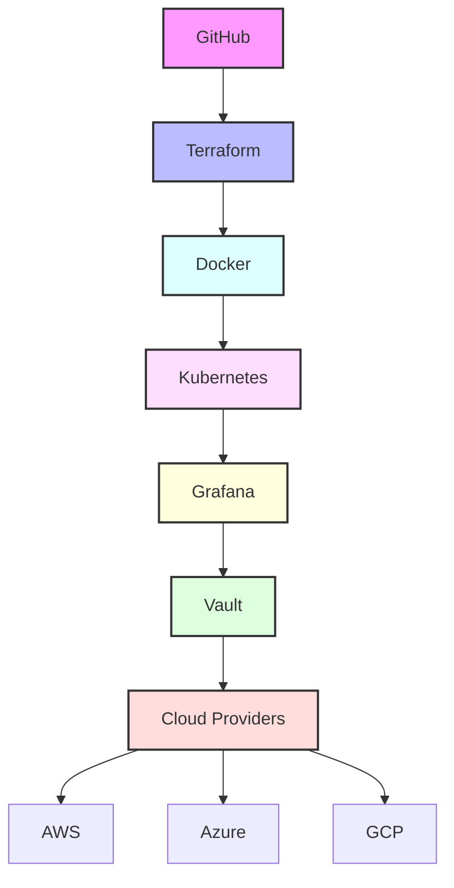
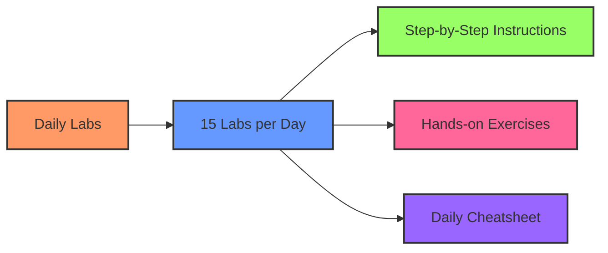
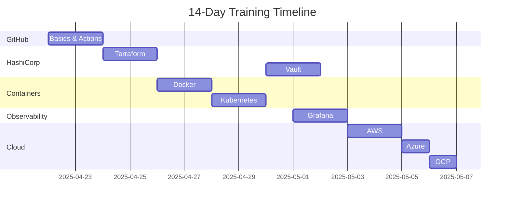

# DevOps Certification Labs - 14 Day Training Plan



## Course Overview
This intensive 14-day training program covers essential DevOps certifications through hands-on labs using GitHub and VSCode. Each day contains 15 labs distributed across different certification areas.

### Prerequisites
- VSCode + GitHub + Terraform + Docker
- Cloud CLIs: AWS CLI + Azure CLI + gcloud
- Kubernetes tools: kubectl + Minikube
- HashiCorp Vault
- GitHub and DockerHub accounts
- Cloud Provider Free Tier accounts (AWS, Azure, GCP)

### Daily Structure


## Learning Path Progress Tracker


## Directory Structure
```
devops-labs/
├── README.md
├── days/
│   ├── day-01/
│   ├── day-02/
│   ├── ...
│   └── day-14/
└── cheatsheets/
    ├── github.md
    ├── terraform.md
    ├── docker.md
    ├── kubernetes.md
    ├── grafana.md
    ├── vault.md
    ├── aws.md
    ├── azure.md
    └── gcp.md
