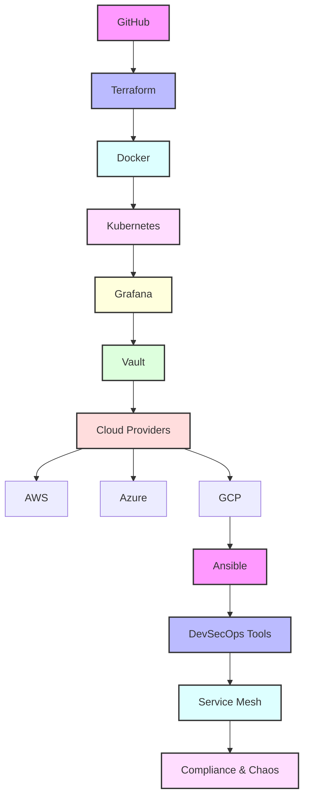
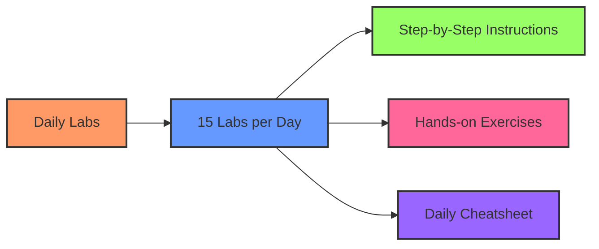
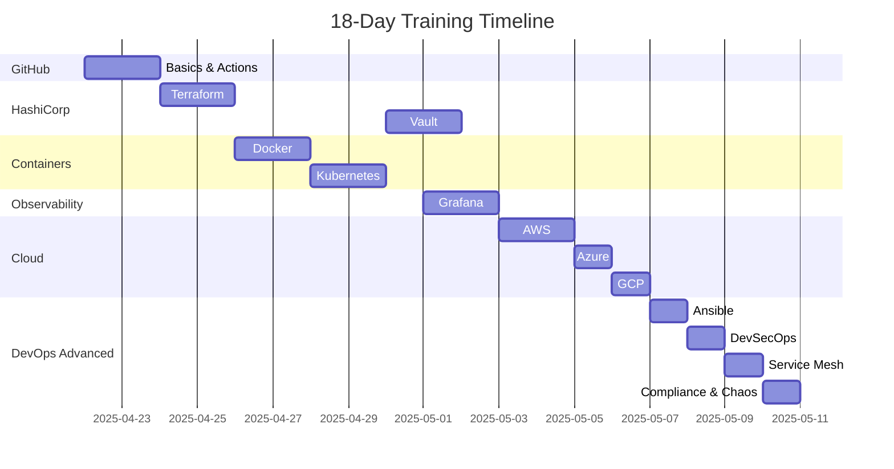

# DevOps Certification Labs - 18 Day Training Plan

## Project Overview
This project covers a wide range of DevOps and DevSecOps skills, including:

- Version Control: GitHub fundamentals and GitHub Actions.
- Infrastructure as Code: Terraform for infrastructure provisioning.
- Containerization: Docker for container management.
- Orchestration: Kubernetes for managing containerized applications.
- Observability: Grafana for monitoring and visualization.
- Secrets Management: HashiCorp Vault for secure secret storage.
- Cloud Platforms: AWS, Azure, and GCP for cloud computing.
- Configuration Management: Ansible for automating configuration tasks.
- DevSecOps: Tools like SonarQube, OWASP ZAP, Trivy, and Snyk for security integration.
- Service Mesh: Traffic management and security with service mesh technologies.
- Compliance and Chaos Engineering: Open Policy Agent (OPA) for compliance and Chaos Mesh for resilience testing.

Each skill is reinforced through hands-on labs and daily cheatsheets, as outlined below.



## Course Overview
This intensive 18-day training program covers essential DevOps and DevSecOps certifications through hands-on labs using GitHub and VSCode. Each day contains 15 labs distributed across different certification areas.

### Prerequisites
- VSCode + GitHub + Terraform + Docker
- Cloud CLIs: AWS CLI + Azure CLI + gcloud
- Kubernetes tools: kubectl + Minikube
- HashiCorp Vault
- GitHub and DockerHub accounts
- Cloud Provider Free Tier accounts (AWS, Azure, GCP)

### Daily Structure


## Learning Path Progress Tracker


## Directory Structure
```
devops-labs/
├── README.md
├── index.html          # Web interface for browsing content
├── css/                # Styling for web interface
├── js/                 # JavaScript for web interface functionality
├── days/
│   ├── day-01/
│   ├── day-02/
│   ├── ...
│   ├── day-14/
│   ├── day-15/
│   ├── day-16/
│   ├── day-17/
│   └── day-18/
└── cheatsheets/
    ├── github.md
    ├── terraform.md
    ├── docker.md
    ├── kubernetes.md
    ├── grafana.md
    ├── vault.md
    ├── aws.md
    ├── azure.md
    ├── gcp.md
    ├── ansible.md
    ├── devsecops.md
    ├── service-mesh.md
    └── compliance-chaos.md
```

## Web Interface
The project includes a web-based interface for easier navigation of content:
- Interactive navigation through cheatsheets and daily lessons
- Mermaid diagram rendering
- Responsive design for desktop and mobile viewing
- Quick access to popular tools and getting started guides

To use the web interface, open `index.html` in a web browser or serve the project directory using a local web server.
