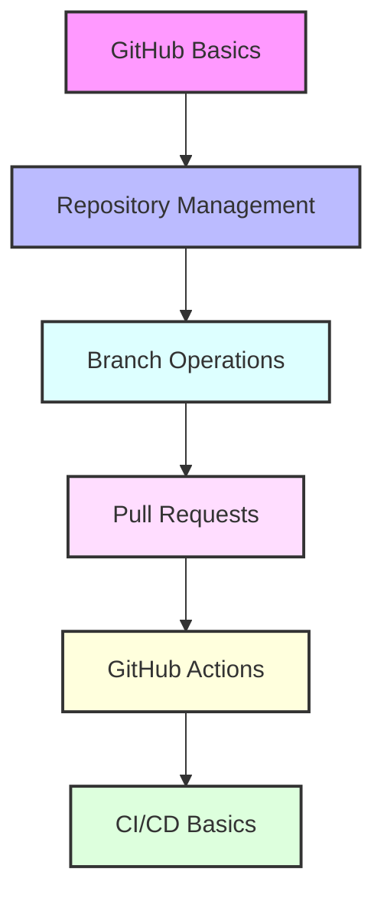

# Day 1 - GitHub Fundamentals and Actions

## Overview
Today's focus is on GitHub fundamentals and introduction to GitHub Actions. We'll cover basic Git operations, repository management, and creating simple CI/CD pipelines.



## Labs

### GitHub Basics
1. **Lab 1 - Repository Creation**
   - Skill Area: GitHub Basics
   - Steps:
     1. Create a new GitHub account (if needed)
     2. Create a new repository "devops-labs"
     3. Clone the repository locally
     4. Add README.md with project description
     5. Commit and push changes

2. **Lab 2 - Git Configuration**
   - Skill Area: GitHub Basics
   - Steps:
     1. Configure global Git username and email
     2. Set up SSH keys for GitHub
     3. Test SSH connection
     4. Configure default branch name
     5. Set up Git credentials helper

3. **Lab 3 - Basic Git Operations**
   - Skill Area: GitHub Basics
   - Steps:
     1. Create a new branch "feature/add-docs"
     2. Add documentation files
     3. Stage changes using git add
     4. Commit changes with proper message
     5. Push branch to remote

### Branch Management
4. **Lab 4 - Branch Operations**
   - Skill Area: GitHub Intermediate
   - Steps:
     1. List all branches
     2. Switch between branches
     3. Create feature branch
     4. Delete local branch
     5. Delete remote branch

5. **Lab 5 - Merge Operations**
   - Skill Area: GitHub Intermediate
   - Steps:
     1. Create merge conflict scenario
     2. Resolve merge conflicts
     3. Use different merge strategies
     4. Abort merge operation
     5. Complete successful merge

### Pull Requests
6. **Lab 6 - Pull Request Basics**
   - Skill Area: GitHub Intermediate
   - Steps:
     1. Create pull request
     2. Add description and labels
     3. Request reviewers
     4. Add comments
     5. Merge pull request

7. **Lab 7 - Code Review**
   - Skill Area: GitHub Intermediate
   - Steps:
     1. Review pull request changes
     2. Add line comments
     3. Submit review with suggestions
     4. Address review comments
     5. Approve changes

### GitHub Actions Basics
8. **Lab 8 - First GitHub Action**
   - Skill Area: GitHub Actions
   - Steps:
     1. Create .github/workflows directory
     2. Create simple hello-world.yml
     3. Configure trigger events
     4. Add basic steps
     5. Monitor workflow execution

9. **Lab 9 - Action Triggers**
   - Skill Area: GitHub Actions
   - Steps:
     1. Configure push triggers
     2. Set up pull request triggers
     3. Create scheduled triggers
     4. Use manual triggers
     5. Test different trigger scenarios

10. **Lab 10 - Action Environment**
    - Skill Area: GitHub Actions
    - Steps:
      1. Set up environment variables
      2. Use GitHub secrets
      3. Configure runner environment
      4. Use environment protection rules
      5. Test environment configuration

### CI/CD Pipeline
11. **Lab 11 - Basic CI Pipeline**
    - Skill Area: GitHub Actions
    - Steps:
      1. Create Node.js project
      2. Configure test workflow
      3. Add linting step
      4. Add unit tests
      5. Monitor CI execution

12. **Lab 12 - Artifact Management**
    - Skill Area: GitHub Actions
    - Steps:
      1. Build project artifact
      2. Upload artifact
      3. Download artifact
      4. Use artifacts across jobs
      5. Clean up old artifacts

13. **Lab 13 - Matrix Builds**
    - Skill Area: GitHub Actions
    - Steps:
      1. Configure matrix strategy
      2. Test multiple Node.js versions
      3. Test multiple operating systems
      4. Add matrix exclusions
      5. Add matrix includes

14. **Lab 14 - Deployment Action**
    - Skill Area: GitHub Actions
    - Steps:
      1. Create deployment workflow
      2. Configure deployment environment
      3. Add deployment steps
      4. Add post-deployment checks
      5. Monitor deployment status

15. **Lab 15 - Custom Actions**
    - Skill Area: GitHub Actions
    - Steps:
      1. Create custom action
      2. Define action inputs
      3. Define action outputs
      4. Test custom action
      5. Publish to marketplace

## Daily Cheatsheet

### Git Commands
```bash
# Repository Operations
git init
git clone <url>
git remote add origin <url>

# Branch Operations
git branch <name>
git checkout <branch>
git checkout -b <new-branch>
git branch -d <branch>
git push origin --delete <branch>

# Basic Operations
git add <file>
git commit -m "message"
git push origin <branch>
git pull origin <branch>

# Merge Operations
git merge <branch>
git merge --abort
git merge --strategy=recursive -X theirs

# Configuration
git config --global user.name "name"
git config --global user.email "email"
```

### GitHub Actions YAML
```yaml
name: CI Pipeline

on:
  push:
    branches: [ main ]
  pull_request:
    branches: [ main ]

jobs:
  build:
    runs-on: ubuntu-latest
    
    steps:
    - uses: actions/checkout@v2
    
    - name: Setup Node.js
      uses: actions/setup-node@v2
      with:
        node-version: '14'
        
    - name: Install dependencies
      run: npm ci
      
    - name: Run tests
      run: npm test
```

### Common GitHub Actions Syntax
```yaml
# Environment Variables
env:
  NODE_ENV: production

# Secrets Usage
${{ secrets.SECRET_NAME }}

# Matrix Strategy
strategy:
  matrix:
    node-version: [12.x, 14.x, 16.x]
    os: [ubuntu-latest, windows-latest]

# Artifacts
- uses: actions/upload-artifact@v2
  with:
    name: my-artifact
    path: path/to/artifact

# Custom Action Metadata
name: 'Hello World'
description: 'Greet someone'
inputs:
  who-to-greet:
    description: 'Who to greet'
    required: true
    default: 'World'
outputs:
  time:
    description: 'The time we greeted you'
