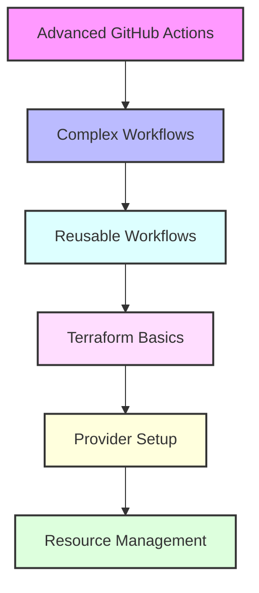

# Day 2 - Advanced GitHub Actions & Terraform Introduction

## Overview
Today we'll dive deeper into GitHub Actions and begin our journey with Terraform. We'll cover advanced CI/CD concepts and infrastructure as code basics.



## Labs

### Advanced GitHub Actions
1. **Lab 1 - Composite Actions**
   - Skill Area: GitHub Actions Advanced
   - Steps:
     1. Create composite action structure
     2. Define reusable steps
     3. Add input parameters
     4. Add output parameters
     5. Test composite action

2. **Lab 2 - Workflow Templates**
   - Skill Area: GitHub Actions Advanced
   - Steps:
     1. Create workflow template
     2. Add template parameters
     3. Create starter workflow
     4. Test template usage
     5. Share template with organization

3. **Lab 3 - Container Actions**
   - Skill Area: GitHub Actions Advanced
   - Steps:
     1. Create Dockerfile for action
     2. Define action metadata
     3. Build container image
     4. Test container action
     5. Publish to GitHub Container Registry

### Workflow Optimization
4. **Lab 4 - Caching Dependencies**
   - Skill Area: GitHub Actions Advanced
   - Steps:
     1. Configure cache action
     2. Cache npm dependencies
     3. Cache build outputs
     4. Monitor cache hits/misses
     5. Optimize cache configuration

5. **Lab 5 - Self-hosted Runners**
   - Skill Area: GitHub Actions Advanced
   - Steps:
     1. Set up self-hosted runner
     2. Configure runner labels
     3. Create runner groups
     4. Test runner workflow
     5. Monitor runner status

### Advanced CI/CD
6. **Lab 6 - Multi-environment Deployment**
   - Skill Area: GitHub Actions Advanced
   - Steps:
     1. Define environment configurations
     2. Create staging workflow
     3. Create production workflow
     4. Add approval gates
     5. Test deployment pipeline

7. **Lab 7 - Release Management**
   - Skill Area: GitHub Actions Advanced
   - Steps:
     1. Create release workflow
     2. Generate release notes
     3. Build release artifacts
     4. Create GitHub release
     5. Publish release packages

### Terraform Basics
8. **Lab 8 - Terraform Installation**
   - Skill Area: Terraform
   - Steps:
     1. Install Terraform CLI
     2. Configure environment
     3. Verify installation
     4. Install VSCode extensions
     5. Configure auto-formatting

9. **Lab 9 - First Terraform Configuration**
   - Skill Area: Terraform
   - Steps:
     1. Create basic configuration file
     2. Define terraform block
     3. Add provider configuration
     4. Initialize terraform
     5. Validate configuration

10. **Lab 10 - Resource Creation**
    - Skill Area: Terraform
    - Steps:
      1. Define local resources
      2. Add resource block
      3. Plan changes
      4. Apply configuration
      5. Verify resource creation

### Provider Configuration
11. **Lab 11 - AWS Provider Setup**
    - Skill Area: Terraform
    - Steps:
      1. Configure AWS credentials
      2. Set up AWS provider
      3. Define region settings
      4. Test provider connection
      5. Handle authentication issues

12. **Lab 12 - Multiple Providers**
    - Skill Area: Terraform
    - Steps:
      1. Configure multiple providers
      2. Set provider aliases
      3. Use provider-specific features
      4. Handle provider conflicts
      5. Test provider configurations

### State Management
13. **Lab 13 - State Basics**
    - Skill Area: Terraform
    - Steps:
      1. Understand state file
      2. Inspect state
      3. Backup state
      4. Move resources
      5. Handle state conflicts

14. **Lab 14 - Remote State**
    - Skill Area: Terraform
    - Steps:
      1. Configure remote backend
      2. Migrate local to remote state
      3. Configure state locking
      4. Handle concurrent access
      5. Backup remote state

15. **Lab 15 - Variables and Outputs**
    - Skill Area: Terraform
    - Steps:
      1. Define input variables
      2. Use variable files
      3. Define output values
      4. Use dynamic values
      5. Handle sensitive variables

## Daily Cheatsheet

### Advanced GitHub Actions
```yaml
# Composite Action
name: 'Composite Action Example'
runs:
  using: "composite"
  steps:
    - run: echo Hello
      shell: bash
    - run: echo World
      shell: bash

# Reusable Workflow
on:
  workflow_call:
    inputs:
      environment:
        required: true
        type: string
    secrets:
      deploy_key:
        required: true

# Container Action
runs:
  using: 'docker'
  image: 'Dockerfile'
  args:
    - ${{ inputs.who-to-greet }}
```

### Terraform Basics
```hcl
# Provider Configuration
terraform {
  required_providers {
    aws = {
      source  = "hashicorp/aws"
      version = "~> 4.0"
    }
  }
}

# Resource Block
resource "aws_instance" "example" {
  ami           = "ami-0c55b159cbfafe1f0"
  instance_type = "t2.micro"
  
  tags = {
    Name = "example-instance"
  }
}

# Variables
variable "instance_type" {
  description = "EC2 instance type"
  type        = string
  default     = "t2.micro"
}

# Outputs
output "instance_ip" {
  value = aws_instance.example.public_ip
}

# Remote Backend
terraform {
  backend "s3" {
    bucket = "terraform-state"
    key    = "prod/terraform.tfstate"
    region = "us-west-2"
  }
}
```

### Common Commands
```bash
# Terraform Commands
terraform init
terraform plan
terraform apply
terraform destroy
terraform show
terraform state list
terraform output

# GitHub CLI
gh workflow list
gh workflow run
gh workflow view
gh release create
gh release upload
