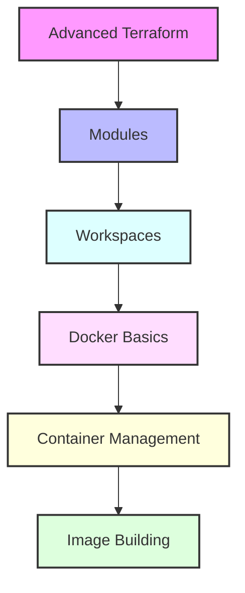

# Day 3 - Advanced Terraform & Docker Introduction

## Overview
Today we'll explore advanced Terraform concepts and begin our Docker journey. We'll bridge the gap between infrastructure as code and containerization.



## Labs

### Advanced Terraform
1. **Lab 1 - Module Creation**
   - Skill Area: Terraform Advanced
   - Steps:
     1. Create module structure
     2. Define module inputs
     3. Create module resources
     4. Define module outputs
     5. Test module locally

2. **Lab 2 - Module Registry**
   - Skill Area: Terraform Advanced
   - Steps:
     1. Prepare module for registry
     2. Document module usage
     3. Version module
     4. Publish to registry
     5. Test published module

3. **Lab 3 - Workspaces**
   - Skill Area: Terraform Advanced
   - Steps:
     1. Create new workspace
     2. Switch between workspaces
     3. Manage workspace-specific variables
     4. Delete workspace
     5. Use workspace in automation

### Terraform Organization
4. **Lab 4 - Project Structure**
   - Skill Area: Terraform Advanced
   - Steps:
     1. Organize project files
     2. Create environment directories
     3. Share common configurations
     4. Manage variable files
     5. Implement best practices

5. **Lab 5 - State Management**
   - Skill Area: Terraform Advanced
   - Steps:
     1. Import existing resources
     2. Manage state snapshots
     3. Handle state conflicts
     4. Clean up state
     5. Troubleshoot state issues

### Docker Basics
6. **Lab 6 - Docker Installation**
   - Skill Area: Docker
   - Steps:
     1. Install Docker Engine
     2. Configure Docker daemon
     3. Test installation
     4. Set up Docker Hub account
     5. Configure Docker CLI

7. **Lab 7 - First Container**
   - Skill Area: Docker
   - Steps:
     1. Pull hello-world image
     2. Run first container
     3. View container logs
     4. Inspect container
     5. Remove container

### Container Management
8. **Lab 8 - Container Lifecycle**
   - Skill Area: Docker
   - Steps:
     1. Start container
     2. Stop container
     3. Restart container
     4. Pause/unpause container
     5. Remove container

9. **Lab 9 - Container Interaction**
   - Skill Area: Docker
   - Steps:
     1. Execute commands in container
     2. Access container shell
     3. Copy files to/from container
     4. View container processes
     5. Monitor container resources

10. **Lab 10 - Container Networking**
    - Skill Area: Docker
    - Steps:
      1. Create network
      2. Connect containers
      3. Expose ports
      4. Configure DNS
      5. Test container communication

### Image Management
11. **Lab 11 - Working with Images**
    - Skill Area: Docker
    - Steps:
      1. Search images
      2. Pull images
      3. List images
      4. Tag images
      5. Remove images

12. **Lab 12 - First Dockerfile**
    - Skill Area: Docker
    - Steps:
      1. Create Dockerfile
      2. Add base image
      3. Add commands
      4. Build image
      5. Test image

13. **Lab 13 - Multi-stage Builds**
    - Skill Area: Docker
    - Steps:
      1. Create multi-stage Dockerfile
      2. Define build stages
      3. Copy artifacts between stages
      4. Optimize final image
      5. Compare image sizes

14. **Lab 14 - Image Registry**
    - Skill Area: Docker
    - Steps:
      1. Tag image for registry
      2. Push to Docker Hub
      3. Pull from registry
      4. Manage registry authentication
      5. Clean up local images

15. **Lab 15 - Container Volumes**
    - Skill Area: Docker
    - Steps:
      1. Create volume
      2. Mount volume to container
      3. Share data between containers
      4. Backup volume data
      5. Remove volume

## Daily Cheatsheet

### Terraform Advanced
```hcl
# Module Structure
module "example" {
  source = "./modules/example"
  
  input_variable = "value"
}

# Workspace Commands
terraform workspace new dev
terraform workspace select prod
terraform workspace list
terraform workspace delete test

# State Commands
terraform import aws_instance.example i-1234567
terraform state list
terraform state mv
terraform state rm
terraform state show
```

### Docker Commands
```bash
# Container Lifecycle
docker run <image>
docker start <container>
docker stop <container>
docker restart <container>
docker rm <container>

# Container Interaction
docker exec -it <container> /bin/bash
docker cp file.txt container:/path
docker logs <container>
docker top <container>
docker stats <container>

# Image Management
docker build -t name:tag .
docker push name:tag
docker pull name:tag
docker rmi name:tag
docker tag source:tag target:tag

# Network Commands
docker network create mynet
docker network connect mynet container
docker network disconnect mynet container
docker network ls
docker network rm mynet

# Volume Commands
docker volume create myvol
docker volume ls
docker volume inspect myvol
docker volume rm myvol
```

### Dockerfile Example
```dockerfile
# Multi-stage build example
FROM node:14 AS builder
WORKDIR /app
COPY package*.json ./
RUN npm install
COPY . .
RUN npm run build

FROM nginx:alpine
COPY --from=builder /app/dist /usr/share/nginx/html
EXPOSE 80
CMD ["nginx", "-g", "daemon off;"]
```

### Docker Compose Example
```yaml
version: '3.8'
services:
  web:
    build: .
    ports:
      - "80:80"
    volumes:
      - ./data:/data
    environment:
      - NODE_ENV=production
    networks:
      - mynetwork

networks:
  mynetwork:
    driver: bridge

volumes:
  data:
    driver: local
