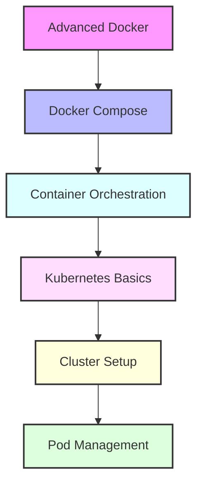

# Day 4 - Advanced Docker & Kubernetes Introduction

## Overview
Today we'll master advanced Docker concepts and begin our journey into Kubernetes. We'll bridge the gap between container management and container orchestration.



## Labs

### Advanced Docker
1. **Lab 1 - Docker Compose Basics**
   - Skill Area: Docker Advanced
   - Steps:
     1. Create docker-compose.yml
     2. Define services
     3. Configure networking
     4. Set up volumes
     5. Run multi-container application

2. **Lab 2 - Environment Management**
   - Skill Area: Docker Advanced
   - Steps:
     1. Create .env file
     2. Use environment variables
     3. Override variables
     4. Manage secrets
     5. Test different environments

3. **Lab 3 - Health Checks**
   - Skill Area: Docker Advanced
   - Steps:
     1. Implement healthcheck
     2. Configure check interval
     3. Define healthy/unhealthy thresholds
     4. Handle failed checks
     5. Monitor container health

### Docker Optimization
4. **Lab 4 - Image Optimization**
   - Skill Area: Docker Advanced
   - Steps:
     1. Optimize Dockerfile
     2. Minimize layer size
     3. Use .dockerignore
     4. Implement caching
     5. Analyze image size

5. **Lab 5 - Resource Management**
   - Skill Area: Docker Advanced
   - Steps:
     1. Set memory limits
     2. Configure CPU shares
     3. Monitor resource usage
     4. Handle resource constraints
     5. Optimize resource allocation

### Container Security
6. **Lab 6 - Security Best Practices**
   - Skill Area: Docker Advanced
   - Steps:
     1. Implement user namespace
     2. Configure security options
     3. Scan for vulnerabilities
     4. Implement content trust
     5. Secure Docker daemon

7. **Lab 7 - Container Hardening**
   - Skill Area: Docker Advanced
   - Steps:
     1. Minimize base image
     2. Remove unnecessary packages
     3. Implement security policies
     4. Configure AppArmor/SELinux
     5. Test security measures

### Kubernetes Basics
8. **Lab 8 - Kubernetes Installation**
   - Skill Area: Kubernetes
   - Steps:
     1. Install kubectl
     2. Set up Minikube
     3. Configure environment
     4. Test cluster access
     5. Explore kubectl commands

9. **Lab 9 - First Pod**
   - Skill Area: Kubernetes
   - Steps:
     1. Create pod manifest
     2. Deploy first pod
     3. View pod details
     4. Access pod logs
     5. Delete pod

10. **Lab 10 - Pod Lifecycle**
    - Skill Area: Kubernetes
    - Steps:
      1. Understand pod phases
      2. Configure restart policy
      3. Handle pod failures
      4. Monitor pod status
      5. Debug pod issues

### Basic Kubernetes Objects
11. **Lab 11 - ReplicaSets**
    - Skill Area: Kubernetes
    - Steps:
      1. Create ReplicaSet
      2. Scale replicas
      3. Update pod template
      4. Monitor ReplicaSet
      5. Delete ReplicaSet

12. **Lab 12 - Deployments**
    - Skill Area: Kubernetes
    - Steps:
      1. Create Deployment
      2. Perform rolling update
      3. Rollback deployment
      4. Scale deployment
      5. Monitor deployment status

13. **Lab 13 - Services**
    - Skill Area: Kubernetes
    - Steps:
      1. Create ClusterIP service
      2. Create NodePort service
      3. Create LoadBalancer service
      4. Test service discovery
      5. Debug service issues

14. **Lab 14 - ConfigMaps**
    - Skill Area: Kubernetes
    - Steps:
      1. Create ConfigMap
      2. Mount as volume
      3. Use as environment variables
      4. Update ConfigMap
      5. Handle configuration changes

15. **Lab 15 - Secrets**
    - Skill Area: Kubernetes
    - Steps:
      1. Create Secret
      2. Mount secret as volume
      3. Use as environment variables
      4. Rotate secrets
      5. Manage secret access

## Daily Cheatsheet

### Docker Compose
```yaml
# Basic structure
version: '3.8'
services:
  web:
    build: .
    ports:
      - "80:80"
    environment:
      - NODE_ENV=production
    healthcheck:
      test: ["CMD", "curl", "-f", "http://localhost"]
      interval: 30s
      timeout: 10s
      retries: 3
    deploy:
      resources:
        limits:
          cpus: '0.50'
          memory: 512M

# Override example
services:
  web:
    environment:
      - DEBUG=1
    volumes:
      - ./dev:/app/dev
```

### Kubernetes Commands
```bash
# Cluster Management
kubectl cluster-info
kubectl get nodes
kubectl describe node <node-name>

# Pod Management
kubectl run nginx --image=nginx
kubectl get pods
kubectl describe pod <pod-name>
kubectl logs <pod-name>
kubectl delete pod <pod-name>

# Deployment Management
kubectl create deployment nginx --image=nginx
kubectl scale deployment nginx --replicas=3
kubectl rollout status deployment/nginx
kubectl rollout undo deployment/nginx

# Service Management
kubectl expose deployment nginx --port=80
kubectl get services
kubectl describe service nginx

# Configuration
kubectl create configmap app-config --from-file=config.json
kubectl create secret generic app-secret --from-literal=password=123456
```

### Kubernetes YAML Examples
```yaml
# Pod
apiVersion: v1
kind: Pod
metadata:
  name: nginx
spec:
  containers:
  - name: nginx
    image: nginx:1.14.2
    ports:
    - containerPort: 80

# Deployment
apiVersion: apps/v1
kind: Deployment
metadata:
  name: nginx-deployment
spec:
  replicas: 3
  selector:
    matchLabels:
      app: nginx
  template:
    metadata:
      labels:
        app: nginx
    spec:
      containers:
      - name: nginx
        image: nginx:1.14.2
        ports:
        - containerPort: 80

# Service
apiVersion: v1
kind: Service
metadata:
  name: nginx-service
spec:
  selector:
    app: nginx
  ports:
  - port: 80
    targetPort: 80
  type: ClusterIP
