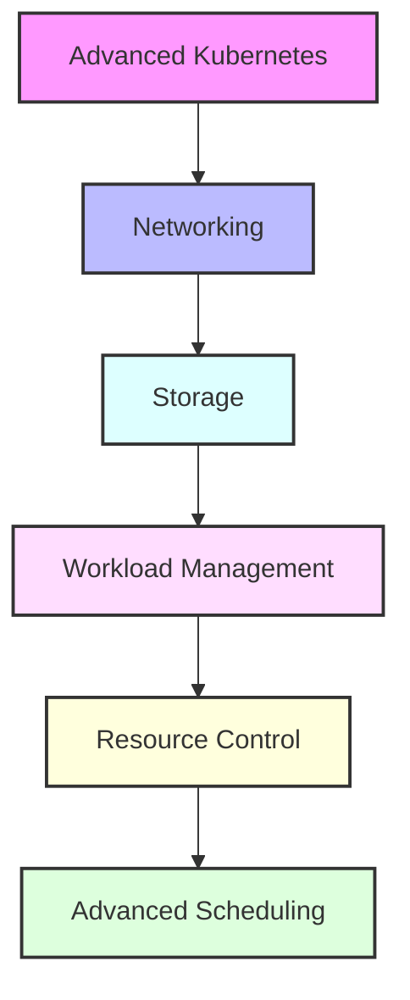

# Day 5 - Advanced Kubernetes Concepts

## Overview
Today we'll dive deep into advanced Kubernetes concepts, focusing on networking, storage, and workload management. We'll explore how to build robust and scalable applications in Kubernetes.



## Labs

### Kubernetes Networking
1. **Lab 1 - Network Policies**
   - Skill Area: Kubernetes Advanced
   - Steps:
     1. Create network policy
     2. Define ingress rules
     3. Define egress rules
     4. Test policy enforcement
     5. Monitor network traffic

2. **Lab 2 - Service Discovery**
   - Skill Area: Kubernetes Advanced
   - Steps:
     1. Implement DNS resolution
     2. Configure CoreDNS
     3. Test service discovery
     4. Debug DNS issues
     5. Monitor DNS performance

3. **Lab 3 - Ingress Controllers**
   - Skill Area: Kubernetes Advanced
   - Steps:
     1. Install Ingress controller
     2. Configure Ingress resource
     3. Set up TLS termination
     4. Implement path-based routing
     5. Configure load balancing

### Storage Management
4. **Lab 4 - Persistent Volumes**
   - Skill Area: Kubernetes Advanced
   - Steps:
     1. Create PersistentVolume
     2. Define storage class
     3. Create PVC
     4. Mount volume to pod
     5. Manage volume lifecycle

5. **Lab 5 - Storage Classes**
   - Skill Area: Kubernetes Advanced
   - Steps:
     1. Define storage class
     2. Configure provisioner
     3. Set volume parameters
     4. Test dynamic provisioning
     5. Monitor storage usage

### Advanced Workloads
6. **Lab 6 - StatefulSets**
   - Skill Area: Kubernetes Advanced
   - Steps:
     1. Create StatefulSet
     2. Configure persistent storage
     3. Manage pod identity
     4. Handle scaling operations
     5. Implement updates

7. **Lab 7 - DaemonSets**
   - Skill Area: Kubernetes Advanced
   - Steps:
     1. Create DaemonSet
     2. Configure node selection
     3. Manage updates
     4. Monitor pod placement
     5. Handle node maintenance

### Resource Management
8. **Lab 8 - Resource Quotas**
   - Skill Area: Kubernetes Advanced
   - Steps:
     1. Define resource quota
     2. Set CPU limits
     3. Set memory limits
     4. Configure storage quotas
     5. Monitor usage

9. **Lab 9 - Limit Ranges**
   - Skill Area: Kubernetes Advanced
   - Steps:
     1. Create LimitRange
     2. Set default limits
     3. Configure request/limit ratio
     4. Test pod creation
     5. Monitor resource usage

10. **Lab 10 - Horizontal Pod Autoscaling**
    - Skill Area: Kubernetes Advanced
    - Steps:
      1. Configure HPA
      2. Set scaling metrics
      3. Test autoscaling
      4. Monitor scaling events
      5. Fine-tune scaling parameters

### Advanced Scheduling
11. **Lab 11 - Node Affinity**
    - Skill Area: Kubernetes Advanced
    - Steps:
      1. Configure node affinity
      2. Set node selectors
      3. Use node anti-affinity
      4. Test pod scheduling
      5. Monitor pod placement

12. **Lab 12 - Pod Affinity**
    - Skill Area: Kubernetes Advanced
    - Steps:
      1. Configure pod affinity
      2. Set pod anti-affinity
      3. Use topology spread
      4. Test co-location
      5. Monitor pod distribution

13. **Lab 13 - Taints and Tolerations**
    - Skill Area: Kubernetes Advanced
    - Steps:
      1. Add node taints
      2. Configure tolerations
      3. Test pod scheduling
      4. Handle node maintenance
      5. Monitor taint effects

14. **Lab 14 - Priority and Preemption**
    - Skill Area: Kubernetes Advanced
    - Steps:
      1. Create PriorityClass
      2. Set pod priority
      3. Configure preemption
      4. Test scheduling order
      5. Monitor preemption events

15. **Lab 15 - Custom Schedulers**
    - Skill Area: Kubernetes Advanced
    - Steps:
      1. Create custom scheduler
      2. Define scheduling logic
      3. Deploy scheduler
      4. Test pod scheduling
      5. Monitor scheduler performance

## Daily Cheatsheet

### Networking Commands
```bash
# Network Policies
kubectl get networkpolicies
kubectl describe networkpolicy <name>

# DNS
kubectl get pods -n kube-system -l k8s-app=kube-dns
kubectl logs -n kube-system -l k8s-app=kube-dns

# Ingress
kubectl get ingress
kubectl describe ingress <name>
```

### Storage Commands
```bash
# Persistent Volumes
kubectl get pv
kubectl get pvc
kubectl describe pv <name>
kubectl describe pvc <name>

# Storage Classes
kubectl get sc
kubectl describe sc <name>
```

### Advanced Workload Commands
```bash
# StatefulSets
kubectl get statefulset
kubectl scale statefulset <name> --replicas=5
kubectl rollout status statefulset/<name>

# DaemonSets
kubectl get daemonset
kubectl rollout status daemonset/<name>
kubectl rollout history daemonset/<name>
```

### Resource Management
```bash
# Resource Quotas
kubectl get resourcequota
kubectl describe resourcequota <name>

# HPA
kubectl get hpa
kubectl describe hpa <name>
```

### YAML Examples
```yaml
# Network Policy
apiVersion: networking.k8s.io/v1
kind: NetworkPolicy
metadata:
  name: test-network-policy
spec:
  podSelector:
    matchLabels:
      role: db
  policyTypes:
  - Ingress
  - Egress
  ingress:
  - from:
    - podSelector:
        matchLabels:
          role: frontend

# StatefulSet
apiVersion: apps/v1
kind: StatefulSet
metadata:
  name: web
spec:
  serviceName: "nginx"
  replicas: 3
  selector:
    matchLabels:
      app: nginx
  template:
    metadata:
      labels:
        app: nginx
    spec:
      containers:
      - name: nginx
        image: nginx:1.14.2
        ports:
        - containerPort: 80

# HPA
apiVersion: autoscaling/v2
kind: HorizontalPodAutoscaler
metadata:
  name: php-apache
spec:
  scaleTargetRef:
    apiVersion: apps/v1
    kind: Deployment
    name: php-apache
  minReplicas: 1
  maxReplicas: 10
  metrics:
  - type: Resource
    resource:
      name: cpu
      target:
        type: Utilization
        averageUtilization: 50
