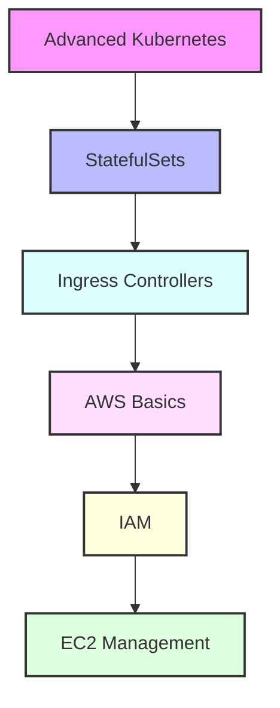

# Day 5 - Advanced Kubernetes & AWS Introduction

[← Previous Day](../day-04/README.md) | [Next Day →](../day-06/README.md)

## Overview
Today we'll explore advanced Kubernetes concepts and begin our journey into AWS. We'll bridge the gap between container orchestration and cloud infrastructure.



## Labs

### Advanced Kubernetes
1. **Lab 1 - StatefulSets**
   - Skill Area: Kubernetes Advanced
   - Steps:
     1. Create StatefulSet manifest
     2. Deploy stateful application
     3. Scale StatefulSet
     4. Handle persistent storage
     5. Manage pod identity

2. **Lab 2 - Ingress Controllers**
   - Skill Area: Kubernetes Advanced
   - Steps:
     1. Install Ingress controller
     2. Configure Ingress rules
     3. Set up TLS termination
     4. Implement path routing
     5. Configure load balancing

3. **Lab 3 - Storage Management**
   - Skill Area: Kubernetes Advanced
   - Steps:
     1. Create PersistentVolume
     2. Define PersistentVolumeClaim
     3. Configure storage classes
     4. Implement dynamic provisioning
     5. Monitor storage usage

### Kubernetes Security
4. **Lab 4 - RBAC Configuration**
   - Skill Area: Kubernetes Advanced
   - Steps:
     1. Create service accounts
     2. Define roles and cluster roles
     3. Configure role bindings
     4. Test access permissions
     5. Audit RBAC policies

5. **Lab 5 - Network Policies**
   - Skill Area: Kubernetes Advanced
   - Steps:
     1. Create network policy
     2. Define ingress rules
     3. Configure egress rules
     4. Test policy enforcement
     5. Monitor network traffic

### AWS Basics
6. **Lab 6 - AWS Account Setup**
   - Skill Area: AWS
   - Steps:
     1. Create AWS account
     2. Configure MFA
     3. Set up billing alerts
     4. Install AWS CLI
     5. Configure AWS credentials

7. **Lab 7 - IAM Basics**
   - Skill Area: AWS
   - Steps:
     1. Create IAM users
     2. Configure user groups
     3. Assign policies
     4. Generate access keys
     5. Implement password policy

### EC2 Management
8. **Lab 8 - EC2 Instances**
   - Skill Area: AWS
   - Steps:
     1. Launch EC2 instance
     2. Configure security groups
     3. Connect to instance
     4. Install software
     5. Monitor instance

9. **Lab 9 - EC2 Storage**
   - Skill Area: AWS
   - Steps:
     1. Create EBS volume
     2. Attach volume
     3. Format and mount
     4. Configure snapshots
     5. Implement backup strategy

10. **Lab 10 - Auto Scaling**
    - Skill Area: AWS
    - Steps:
      1. Create launch template
      2. Configure Auto Scaling group
      3. Set scaling policies
      4. Test scaling events
      5. Monitor scaling activities

### Networking
11. **Lab 11 - VPC Setup**
    - Skill Area: AWS
    - Steps:
      1. Create VPC
      2. Configure subnets
      3. Set up routing
      4. Configure internet gateway
      5. Implement NAT gateway

12. **Lab 12 - Load Balancing**
    - Skill Area: AWS
    - Steps:
      1. Create Application Load Balancer
      2. Configure target groups
      3. Set up health checks
      4. Implement SSL/TLS
      5. Monitor load balancer

### Security & Monitoring
13. **Lab 13 - Security Groups**
    - Skill Area: AWS
    - Steps:
      1. Create security groups
      2. Configure inbound rules
      3. Set up outbound rules
      4. Implement best practices
      5. Monitor security events

14. **Lab 14 - CloudWatch**
    - Skill Area: AWS
    - Steps:
      1. Create dashboards
      2. Configure alarms
      3. Set up logs
      4. Create metrics
      5. Configure notifications

15. **Lab 15 - AWS CLI**
    - Skill Area: AWS
    - Steps:
      1. Configure profiles
      2. Use basic commands
      3. Create scripts
      4. Implement automation
      5. Handle errors

*For more Kubernetes commands and configurations, see the [Kubernetes Cheatsheet](../../cheatsheets/kubernetes.md).*
*For more AWS commands and configurations, see the [AWS Cheatsheet](../../cheatsheets/aws.md).*

## Daily Cheatsheet

### Kubernetes Advanced
```yaml
# StatefulSet
apiVersion: apps/v1
kind: StatefulSet
metadata:
  name: web
spec:
  serviceName: "nginx"
  replicas: 3
  selector:
    matchLabels:
      app: nginx
  template:
    metadata:
      labels:
        app: nginx
    spec:
      containers:
      - name: nginx
        image: nginx:1.14.2
        ports:
        - containerPort: 80
        volumeMounts:
        - name: www
          mountPath: /usr/share/nginx/html
  volumeClaimTemplates:
  - metadata:
      name: www
    spec:
      accessModes: [ "ReadWriteOnce" ]
      resources:
        requests:
          storage: 1Gi

# Ingress
apiVersion: networking.k8s.io/v1
kind: Ingress
metadata:
  name: minimal-ingress
spec:
  rules:
  - http:
      paths:
      - path: /testpath
        pathType: Prefix
        backend:
          service:
            name: test
            port:
              number: 80
```

### AWS CLI Commands
```bash
# EC2 Management
aws ec2 run-instances --image-id ami-12345678 --instance-type t2.micro
aws ec2 describe-instances
aws ec2 start-instances --instance-ids i-1234567890abcdef0
aws ec2 stop-instances --instance-ids i-1234567890abcdef0

# IAM Management
aws iam create-user --user-name bob
aws iam create-group --group-name developers
aws iam add-user-to-group --user-name bob --group-name developers
aws iam attach-user-policy --user-name bob --policy-arn arn:aws:iam::aws:policy/ReadOnlyAccess

# VPC Management
aws ec2 create-vpc --cidr-block 10.0.0.0/16
aws ec2 create-subnet --vpc-id vpc-123456 --cidr-block 10.0.1.0/24
aws ec2 create-internet-gateway
aws ec2 attach-internet-gateway --vpc-id vpc-123456 --internet-gateway-id igw-123456

# CloudWatch
aws cloudwatch put-metric-alarm --alarm-name cpu-mon --metric-name CPUUtilization
aws cloudwatch get-metric-statistics --namespace AWS/EC2 --metric-name CPUUtilization
```

### Kubernetes Commands
```bash
# StatefulSet Management
kubectl get statefulset
kubectl scale statefulset web --replicas=5
kubectl delete statefulset web --cascade=false

# Storage Management
kubectl get pv
kubectl get pvc
kubectl describe storageclass
kubectl get sc

# RBAC
kubectl create serviceaccount jenkins
kubectl create role jenkins --verb=get,list,watch --resource=pods
kubectl create rolebinding jenkins --role=jenkins --serviceaccount=default:jenkins

# Network Policies
kubectl get networkpolicies
kubectl describe networkpolicy my-network-policy
```

## Additional Resources

- [Kubernetes StatefulSets](https://kubernetes.io/docs/concepts/workloads/controllers/statefulset/)
- [AWS Documentation](https://docs.aws.amazon.com/)
- [AWS Well-Architected Framework](https://aws.amazon.com/architecture/well-architected/)
- [Kubernetes Network Policies](https://kubernetes.io/docs/concepts/services-networking/network-policies/)
- [AWS Security Best Practices](https://aws.amazon.com/architecture/security-identity-compliance/)
- [DevOps Glossary](../../cheatsheets/devops_glossary.md)

[← Previous Day](../day-04/README.md) | [Next Day →](../day-06/README.md)
