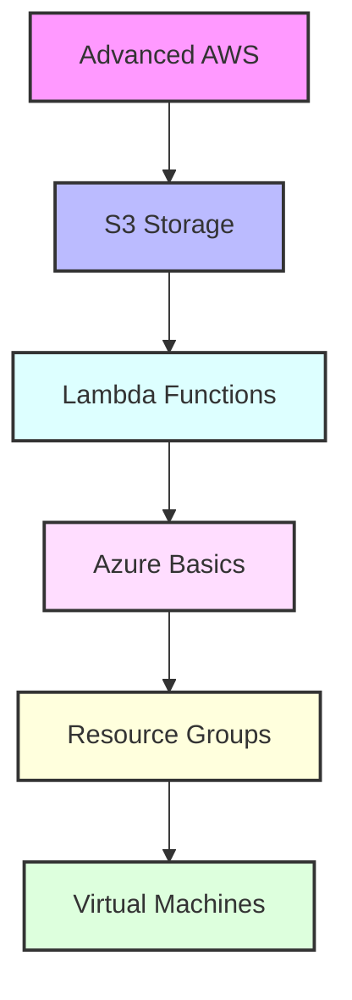

# Day 6 - Advanced AWS & Azure Introduction

[← Previous Day](../day-05/README.md) | [Next Day →](../day-07/README.md)

## Overview
Today we'll explore advanced AWS services and begin our journey into Microsoft Azure. We'll bridge the gap between multiple cloud providers and understand multi-cloud strategies.



## Labs

### Advanced AWS Storage
1. **Lab 1 - S3 Basics**
   - Skill Area: AWS Advanced
   - Steps:
     1. Create S3 bucket
     2. Configure bucket policies
     3. Enable versioning
     4. Set up lifecycle rules
     5. Configure encryption

2. **Lab 2 - S3 Advanced Features**
   - Skill Area: AWS Advanced
   - Steps:
     1. Configure static website
     2. Set up cross-region replication
     3. Implement object locks
     4. Configure event notifications
     5. Set up access logging

3. **Lab 3 - CloudFront CDN**
   - Skill Area: AWS Advanced
   - Steps:
     1. Create distribution
     2. Configure origins
     3. Set up behaviors
     4. Implement SSL/TLS
     5. Configure caching

### Serverless Computing
4. **Lab 4 - Lambda Basics**
   - Skill Area: AWS Advanced
   - Steps:
     1. Create Lambda function
     2. Configure triggers
     3. Set up environment variables
     4. Implement logging
     5. Monitor execution

5. **Lab 5 - Lambda Advanced**
   - Skill Area: AWS Advanced
   - Steps:
     1. Use layers
     2. Configure VPC access
     3. Implement error handling
     4. Set up dead letter queues
     5. Optimize performance

### Database Services
6. **Lab 6 - RDS Setup**
   - Skill Area: AWS Advanced
   - Steps:
     1. Create RDS instance
     2. Configure security groups
     3. Set up backups
     4. Implement monitoring
     5. Configure read replicas

7. **Lab 7 - DynamoDB**
   - Skill Area: AWS Advanced
   - Steps:
     1. Create table
     2. Define partition keys
     3. Configure capacity
     4. Implement auto scaling
     5. Set up streams

### Azure Basics
8. **Lab 8 - Azure Account Setup**
   - Skill Area: Azure
   - Steps:
     1. Create Azure account
     2. Install Azure CLI
     3. Configure credentials
     4. Set up subscription
     5. Configure billing alerts

9. **Lab 9 - Resource Groups**
   - Skill Area: Azure
   - Steps:
     1. Create resource group
     2. Apply tags
     3. Configure access control
     4. Set up policies
     5. Monitor usage

10. **Lab 10 - Virtual Networks**
    - Skill Area: Azure
    - Steps:
      1. Create virtual network
      2. Configure subnets
      3. Set up NSG rules
      4. Configure peering
      5. Implement routing

### Azure Compute
11. **Lab 11 - Virtual Machines**
    - Skill Area: Azure
    - Steps:
      1. Create VM
      2. Configure networking
      3. Set up storage
      4. Implement monitoring
      5. Configure backups

12. **Lab 12 - VM Scale Sets**
    - Skill Area: Azure
    - Steps:
      1. Create scale set
      2. Configure auto scaling
      3. Set up load balancing
      4. Implement monitoring
      5. Configure updates

### Azure Storage
13. **Lab 13 - Storage Accounts**
    - Skill Area: Azure
    - Steps:
      1. Create storage account
      2. Configure blob storage
      3. Set up file shares
      4. Implement access control
      5. Configure monitoring

14. **Lab 14 - Azure Backup**
    - Skill Area: Azure
    - Steps:
      1. Configure backup vault
      2. Set up backup policies
      3. Implement recovery
      4. Monitor backups
      5. Test restoration

15. **Lab 15 - Azure Monitor**
    - Skill Area: Azure
    - Steps:
      1. Configure metrics
      2. Set up alerts
      3. Create dashboards
      4. Implement log analytics
      5. Configure action groups

*For more AWS commands and configurations, see the [AWS Cheatsheet](../../cheatsheets/aws.md).*
*For more Azure commands and configurations, see the [Azure Cheatsheet](../../cheatsheets/azure.md).*

## Daily Cheatsheet

### AWS S3 Commands
```bash
# S3 Management
aws s3 mb s3://my-bucket
aws s3 cp file.txt s3://my-bucket/
aws s3 sync . s3://my-bucket
aws s3 ls s3://my-bucket
aws s3 rm s3://my-bucket/file.txt

# S3 Bucket Policy
aws s3api put-bucket-policy --bucket my-bucket --policy file://policy.json
aws s3api get-bucket-policy --bucket my-bucket
aws s3api delete-bucket-policy --bucket my-bucket

# S3 Website
aws s3 website s3://my-bucket/ --index-document index.html --error-document error.html
```

### AWS Lambda Commands
```bash
# Lambda Management
aws lambda create-function \
  --function-name my-function \
  --runtime nodejs18.x \
  --role arn:aws:iam::123456789012:role/lambda-role \
  --handler index.handler \
  --zip-file fileb://function.zip

aws lambda update-function-code \
  --function-name my-function \
  --zip-file fileb://function.zip

aws lambda invoke \
  --function-name my-function \
  --payload '{"key": "value"}' \
  output.txt
```

### Azure CLI Commands
```bash
# Resource Group Management
az group create --name myResourceGroup --location eastus
az group list
az group delete --name myResourceGroup

# Virtual Machine Management
az vm create \
  --resource-group myResourceGroup \
  --name myVM \
  --image UbuntuLTS \
  --admin-username azureuser \
  --generate-ssh-keys

az vm start --resource-group myResourceGroup --name myVM
az vm stop --resource-group myResourceGroup --name myVM

# Storage Account Management
az storage account create \
  --name mystorageaccount \
  --resource-group myResourceGroup \
  --location eastus \
  --sku Standard_LRS

az storage container create \
  --name mycontainer \
  --account-name mystorageaccount

# Network Management
az network vnet create \
  --resource-group myResourceGroup \
  --name myVNet \
  --subnet-name mySubnet

az network nsg create \
  --resource-group myResourceGroup \
  --name myNSG
```

### Azure ARM Template Example
```json
{
  "$schema": "https://schema.management.azure.com/schemas/2019-04-01/deploymentTemplate.json#",
  "contentVersion": "1.0.0.0",
  "parameters": {
    "storageAccountName": {
      "type": "string",
      "metadata": {
        "description": "Storage Account Name"
      }
    }
  },
  "resources": [
    {
      "type": "Microsoft.Storage/storageAccounts",
      "apiVersion": "2021-04-01",
      "name": "[parameters('storageAccountName')]",
      "location": "[resourceGroup().location]",
      "sku": {
        "name": "Standard_LRS"
      },
      "kind": "StorageV2"
    }
  ]
}
```

## Additional Resources

- [AWS S3 Documentation](https://docs.aws.amazon.com/s3/)
- [AWS Lambda Documentation](https://docs.aws.amazon.com/lambda/)
- [Azure Documentation](https://docs.microsoft.com/azure/)
- [Azure Architecture Center](https://docs.microsoft.com/azure/architecture/)
- [Azure CLI Documentation](https://docs.microsoft.com/cli/azure/)
- [DevOps Glossary](../../cheatsheets/devops_glossary.md)

[← Previous Day](../day-05/README.md) | [Next Day →](../day-07/README.md)
