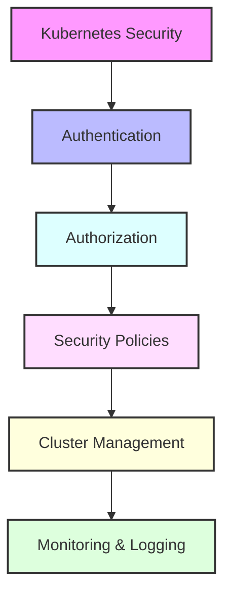

# Day 6 - Kubernetes Security & Cluster Management

## Overview
Today we'll focus on securing Kubernetes clusters and implementing advanced cluster management techniques. We'll cover authentication, authorization, security policies, and cluster administration.



## Labs

### Authentication & Authorization
1. **Lab 1 - RBAC Basics**
   - Skill Area: Kubernetes Security
   - Steps:
     1. Create ServiceAccount
     2. Define Roles
     3. Create RoleBindings
     4. Test permissions
     5. Audit access

2. **Lab 2 - ClusterRoles**
   - Skill Area: Kubernetes Security
   - Steps:
     1. Create ClusterRole
     2. Define cluster-wide permissions
     3. Create ClusterRoleBinding
     4. Test cluster access
     5. Monitor role usage

3. **Lab 3 - User Authentication**
   - Skill Area: Kubernetes Security
   - Steps:
     1. Create certificates
     2. Configure kubeconfig
     3. Set up authentication
     4. Test user access
     5. Manage multiple contexts

### Security Policies
4. **Lab 4 - Pod Security Policies**
   - Skill Area: Kubernetes Security
   - Steps:
     1. Create security policy
     2. Define pod restrictions
     3. Configure admission control
     4. Test pod creation
     5. Monitor policy violations

5. **Lab 5 - Security Contexts**
   - Skill Area: Kubernetes Security
   - Steps:
     1. Configure pod security context
     2. Set container privileges
     3. Configure SELinux options
     4. Set filesystem permissions
     5. Test security settings

### Advanced Security
6. **Lab 6 - Secrets Management**
   - Skill Area: Kubernetes Security
   - Steps:
     1. Create encrypted secrets
     2. Configure secret encryption
     3. Rotate encryption keys
     4. Manage secret access
     5. Monitor secret usage

7. **Lab 7 - Network Security**
   - Skill Area: Kubernetes Security
   - Steps:
     1. Implement network policies
     2. Configure pod-to-pod encryption
     3. Set up TLS certificates
     4. Configure service mesh
     5. Monitor network traffic

### Cluster Management
8. **Lab 8 - Node Management**
   - Skill Area: Kubernetes Administration
   - Steps:
     1. Add/remove nodes
     2. Configure node labels
     3. Manage node maintenance
     4. Handle node failures
     5. Monitor node health

9. **Lab 9 - Cluster Upgrades**
   - Skill Area: Kubernetes Administration
   - Steps:
     1. Plan upgrade strategy
     2. Backup cluster data
     3. Upgrade control plane
     4. Upgrade worker nodes
     5. Verify cluster health

10. **Lab 10 - Backup & Restore**
    - Skill Area: Kubernetes Administration
    - Steps:
      1. Configure backup solution
      2. Create cluster backup
      3. Simulate disaster
      4. Perform restoration
      5. Verify data integrity

### Monitoring & Logging
11. **Lab 11 - Prometheus Setup**
    - Skill Area: Kubernetes Monitoring
    - Steps:
      1. Deploy Prometheus
      2. Configure service discovery
      3. Set up alerting rules
      4. Configure retention
      5. Test monitoring

12. **Lab 12 - Grafana Integration**
    - Skill Area: Kubernetes Monitoring
    - Steps:
      1. Deploy Grafana
      2. Configure data sources
      3. Import dashboards
      4. Set up alerts
      5. Create custom panels

13. **Lab 13 - Logging Architecture**
    - Skill Area: Kubernetes Logging
    - Steps:
      1. Deploy logging stack
      2. Configure log aggregation
      3. Set up log rotation
      4. Create log filters
      5. Monitor log storage

14. **Lab 14 - Audit Logging**
    - Skill Area: Kubernetes Security
    - Steps:
      1. Enable audit logging
      2. Configure audit policy
      3. Set up log collection
      4. Create audit reports
      5. Monitor audit events

15. **Lab 15 - Troubleshooting**
    - Skill Area: Kubernetes Administration
    - Steps:
      1. Debug node issues
      2. Troubleshoot pods
      3. Analyze system logs
      4. Check cluster events
      5. Generate diagnostics

## Daily Cheatsheet

### RBAC Commands
```bash
# Role Management
kubectl create role pod-reader --verb=get,list,watch --resource=pods
kubectl create rolebinding pod-reader-binding --role=pod-reader --user=jane

# ClusterRole Management
kubectl create clusterrole cluster-admin --verb=* --resource=*
kubectl create clusterrolebinding cluster-admin-binding --clusterrole=cluster-admin --user=admin

# Authentication
kubectl config set-credentials jane --client-certificate=jane.crt --client-key=jane.key
kubectl config set-context jane --cluster=kubernetes --user=jane
```

### Security Commands
```bash
# Pod Security
kubectl create podsecuritypolicy restricted
kubectl get podsecuritypolicy
kubectl describe podsecuritypolicy restricted

# Secret Management
kubectl create secret generic app-secret --from-literal=password=mysecret
kubectl get secret app-secret -o jsonpath='{.data.password}' | base64 --decode
```

### Cluster Management
```bash
# Node Management
kubectl drain node-01
kubectl cordon node-01
kubectl uncordon node-01
kubectl taint nodes node-01 key=value:NoSchedule

# Cluster Operations
kubectl cluster-info dump
kubectl get events --sort-by='.metadata.creationTimestamp'
```

### YAML Examples
```yaml
# Role and RoleBinding
apiVersion: rbac.authorization.k8s.io/v1
kind: Role
metadata:
  namespace: default
  name: pod-reader
rules:
- apiGroups: [""]
  resources: ["pods"]
  verbs: ["get", "list", "watch"]
---
apiVersion: rbac.authorization.k8s.io/v1
kind: RoleBinding
metadata:
  name: pod-reader-binding
  namespace: default
subjects:
- kind: User
  name: jane
  apiGroup: rbac.authorization.k8s.io
roleRef:
  kind: Role
  name: pod-reader
  apiGroup: rbac.authorization.k8s.io

# Pod Security Policy
apiVersion: policy/v1beta1
kind: PodSecurityPolicy
metadata:
  name: restricted
spec:
  privileged: false
  seLinux:
    rule: RunAsAny
  runAsUser:
    rule: MustRunAsNonRoot
  fsGroup:
    rule: RunAsAny
  volumes:
  - 'configMap'
  - 'emptyDir'
  - 'projected'
  - 'secret'
  - 'downwardAPI'
  - 'persistentVolumeClaim'

# Audit Policy
apiVersion: audit.k8s.io/v1
kind: Policy
rules:
- level: Metadata
  resources:
  - group: ""
    resources: ["pods"]
```

### Monitoring & Logging
```yaml
# Prometheus Configuration
global:
  scrape_interval: 15s
  evaluation_interval: 15s

scrape_configs:
  - job_name: 'kubernetes-apiservers'
    kubernetes_sd_configs:
    - role: endpoints
    scheme: https
    tls_config:
      ca_file: /var/run/secrets/kubernetes.io/serviceaccount/ca.crt
    bearer_token_file: /var/run/secrets/kubernetes.io/serviceaccount/token

# Fluentd Configuration
<match kubernetes.**>
  @type elasticsearch
  host elasticsearch-logging
  port 9200
  logstash_format true
  <buffer>
    @type file
    path /var/log/fluentd-buffers/kubernetes.system.buffer
    flush_mode interval
    retry_type exponential_backoff
    flush_interval 5s
    retry_forever false
    retry_max_interval 30
    chunk_limit_size 2M
    queue_limit_length 8
    overflow_action block
  </buffer>
</match>
