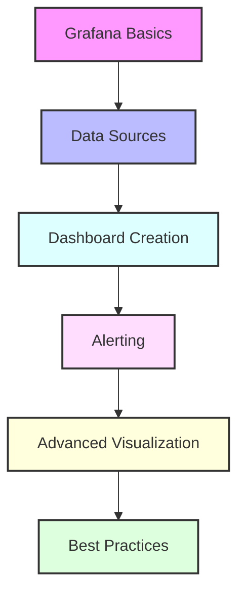

# Day 7 - Grafana Observability & Monitoring

## Overview
Today we'll dive deep into Grafana observability and monitoring concepts. We'll learn how to set up comprehensive monitoring solutions, create effective dashboards, and implement alerting systems.



## Labs

### Grafana Basics
1. **Lab 1 - Installation & Setup**
   - Skill Area: Grafana
   - Steps:
     1. Install Grafana
     2. Configure basic settings
     3. Set up authentication
     4. Configure plugins
     5. Test installation

2. **Lab 2 - Data Source Configuration**
   - Skill Area: Grafana
   - Steps:
     1. Add Prometheus data source
     2. Configure InfluxDB connection
     3. Set up Elasticsearch
     4. Test data source connections
     5. Troubleshoot connectivity issues

3. **Lab 3 - User Management**
   - Skill Area: Grafana
   - Steps:
     1. Create user roles
     2. Configure permissions
     3. Set up teams
     4. Manage access control
     5. Test user access

### Dashboard Creation
4. **Lab 4 - Basic Dashboards**
   - Skill Area: Grafana
   - Steps:
     1. Create new dashboard
     2. Add basic panels
     3. Configure time range
     4. Set refresh intervals
     5. Save and share dashboard

5. **Lab 5 - Panel Types**
   - Skill Area: Grafana
   - Steps:
     1. Create time series panel
     2. Build gauge panel
     3. Configure stat panel
     4. Create table panel
     5. Add bar gauge panel

### Query Building
6. **Lab 6 - PromQL Basics**
   - Skill Area: Grafana
   - Steps:
     1. Write basic queries
     2. Use aggregation operators
     3. Apply rate functions
     4. Create recording rules
     5. Test query performance

7. **Lab 7 - Advanced Queries**
   - Skill Area: Grafana
   - Steps:
     1. Use regex selectors
     2. Implement subqueries
     3. Create compound queries
     4. Use template variables
     5. Optimize query performance

### Alerting
8. **Lab 8 - Alert Rules**
   - Skill Area: Grafana
   - Steps:
     1. Create alert rule
     2. Configure conditions
     3. Set up notifications
     4. Test alert triggers
     5. Monitor alert status

9. **Lab 9 - Notification Channels**
   - Skill Area: Grafana
   - Steps:
     1. Configure email notifications
     2. Set up Slack integration
     3. Add webhook notifications
     4. Create notification policies
     5. Test notification delivery

10. **Lab 10 - Alert Management**
    - Skill Area: Grafana
    - Steps:
      1. Create alert groups
      2. Configure silencing rules
      3. Set up escalations
      4. Manage alert states
      5. Handle alert incidents

### Advanced Features
11. **Lab 11 - Variables & Templates**
    - Skill Area: Grafana
    - Steps:
      1. Create dashboard variables
      2. Use template queries
      3. Configure variable options
      4. Apply variable dependencies
      5. Test variable functionality

12. **Lab 12 - Annotations**
    - Skill Area: Grafana
    - Steps:
      1. Add manual annotations
      2. Configure query annotations
      3. Set up annotation tags
      4. Create annotation rules
      5. Display annotation data

13. **Lab 13 - Dashboard Plugins**
    - Skill Area: Grafana
    - Steps:
      1. Install custom plugins
      2. Configure plugin settings
      3. Use plugin features
      4. Update plugins
      5. Troubleshoot plugin issues

### Best Practices
14. **Lab 14 - Performance Optimization**
    - Skill Area: Grafana
    - Steps:
      1. Optimize queries
      2. Configure caching
      3. Manage dashboard loading
      4. Monitor Grafana metrics
      5. Implement best practices

15. **Lab 15 - Dashboard Organization**
    - Skill Area: Grafana
    - Steps:
      1. Create folder structure
      2. Implement naming conventions
      3. Set up dashboard links
      4. Configure dashboard versions
      5. Manage permissions

## Daily Cheatsheet

### Grafana Configuration
```ini
# grafana.ini
[server]
http_port = 3000
domain = localhost

[security]
admin_user = admin
admin_password = admin

[auth]
disable_login_form = false

[smtp]
enabled = true
host = smtp.gmail.com:587
user = your-email@gmail.com
password = your-password
```

### PromQL Examples
```sql
# Basic Queries
rate(http_requests_total[5m])
sum by (status_code) (http_requests_total)

# Advanced Queries
sum(rate(container_cpu_usage_seconds_total{container!=""}[5m])) by (pod)
histogram_quantile(0.95, sum(rate(http_request_duration_seconds_bucket[5m])) by (le))
```

### Dashboard JSON
```json
{
  "dashboard": {
    "id": null,
    "title": "My Dashboard",
    "tags": ["production", "metrics"],
    "timezone": "browser",
    "panels": [
      {
        "type": "graph",
        "title": "HTTP Requests",
        "gridPos": {
          "h": 8,
          "w": 12,
          "x": 0,
          "y": 0
        }
      }
    ],
    "time": {
      "from": "now-6h",
      "to": "now"
    },
    "refresh": "5s"
  }
}
```

### Alert Rule Example
```yaml
groups:
- name: example
  rules:
  - alert: HighRequestLatency
    expr: job:request_latency_seconds:mean5m{job="myjob"} > 0.5
    for: 10m
    labels:
      severity: page
    annotations:
      summary: High request latency on {{ $labels.instance }}
      description: Request latency is above 500ms (current value is {{ $value }})
```

### Grafana API Calls
```bash
# API Examples
curl -H "Authorization: Bearer YOUR_API_KEY" http://localhost:3000/api/dashboards/home

# Create Dashboard
curl -X POST -H "Content-Type: application/json" \
  -H "Authorization: Bearer YOUR_API_KEY" \
  http://localhost:3000/api/dashboards/db \
  -d @dashboard.json

# Get Data Source
curl -H "Authorization: Bearer YOUR_API_KEY" \
  http://localhost:3000/api/datasources/name/prometheus
```

### Variable Templates
```
# Dashboard Variables
$__interval
${__from}
${__to}

# Custom Variables
$datacenter
${environment:raw}
${host:csv}

# Query Variables
label_values(node_cpu_seconds_total, instance)
query_result(sum(rate(http_requests_total[5m])))
