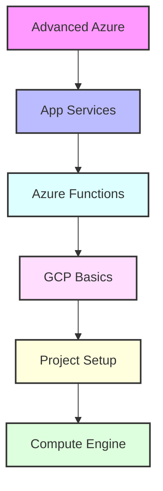

# Day 7 - Advanced Azure & GCP Introduction

[← Previous Day](../day-06/README.md) | [Next Day →](../day-08/README.md)

## Overview
Today we'll explore advanced Azure services and begin our journey into Google Cloud Platform (GCP). We'll bridge the gap between multiple cloud providers and understand multi-cloud strategies.



## Labs

### Advanced Azure Services
1. **Lab 1 - App Service Basics**
   - Skill Area: Azure Advanced
   - Steps:
     1. Create App Service plan
     2. Deploy web application
     3. Configure custom domain
     4. Set up SSL certificates
     5. Implement auto scaling

2. **Lab 2 - App Service Advanced**
   - Skill Area: Azure Advanced
   - Steps:
     1. Configure deployment slots
     2. Set up staging environments
     3. Implement continuous deployment
     4. Configure application settings
     5. Monitor performance

3. **Lab 3 - Azure Functions**
   - Skill Area: Azure Advanced
   - Steps:
     1. Create function app
     2. Implement triggers
     3. Configure bindings
     4. Set up monitoring
     5. Handle errors

### Azure Security
4. **Lab 4 - Key Vault**
   - Skill Area: Azure Advanced
   - Steps:
     1. Create Key Vault
     2. Store secrets
     3. Manage certificates
     4. Configure access policies
     5. Implement rotation

5. **Lab 5 - Azure AD**
   - Skill Area: Azure Advanced
   - Steps:
     1. Configure users
     2. Set up groups
     3. Implement RBAC
     4. Configure MFA
     5. Manage applications

### Azure DevOps
6. **Lab 6 - Azure DevOps Setup**
   - Skill Area: Azure Advanced
   - Steps:
     1. Create organization
     2. Set up project
     3. Configure repositories
     4. Set up boards
     5. Manage permissions

7. **Lab 7 - Azure Pipelines**
   - Skill Area: Azure Advanced
   - Steps:
     1. Create build pipeline
     2. Configure release pipeline
     3. Set up environments
     4. Implement approvals
     5. Monitor deployments

### GCP Basics
8. **Lab 8 - GCP Account Setup**
   - Skill Area: GCP
   - Steps:
     1. Create GCP account
     2. Set up billing
     3. Install Cloud SDK
     4. Configure credentials
     5. Create project

9. **Lab 9 - Project Management**
   - Skill Area: GCP
   - Steps:
     1. Create project
     2. Configure IAM roles
     3. Set up billing
     4. Enable APIs
     5. Configure quotas

10. **Lab 10 - VPC Network**
    - Skill Area: GCP
    - Steps:
      1. Create VPC
      2. Configure subnets
      3. Set up firewall rules
      4. Configure routes
      5. Implement VPC peering

### GCP Compute
11. **Lab 11 - Compute Engine**
    - Skill Area: GCP
    - Steps:
      1. Create instance
      2. Configure networking
      3. Set up storage
      4. Implement monitoring
      5. Configure backups

12. **Lab 12 - Instance Groups**
    - Skill Area: GCP
    - Steps:
      1. Create instance template
      2. Set up managed group
      3. Configure auto scaling
      4. Implement health checks
      5. Monitor performance

### GCP Storage
13. **Lab 13 - Cloud Storage**
    - Skill Area: GCP
    - Steps:
      1. Create bucket
      2. Configure access control
      3. Set up lifecycle rules
      4. Enable versioning
      5. Configure replication

14. **Lab 14 - Cloud SQL**
    - Skill Area: GCP
    - Steps:
      1. Create instance
      2. Configure backups
      3. Set up replication
      4. Implement monitoring
      5. Manage users

15. **Lab 15 - Cloud Monitoring**
    - Skill Area: GCP
    - Steps:
      1. Set up workspace
      2. Configure alerts
      3. Create dashboards
      4. Implement logging
      5. Configure uptime checks

*For more Azure commands and configurations, see the [Azure Cheatsheet](../../cheatsheets/azure.md).*
*For more GCP commands and configurations, see the [GCP Cheatsheet](../../cheatsheets/gcp.md).*

## Daily Cheatsheet

### Azure App Service Commands
```bash
# App Service Management
az webapp create \
  --resource-group myResourceGroup \
  --plan myAppServicePlan \
  --name myWebApp \
  --runtime "NODE|14-lts"

az webapp deployment slot create \
  --resource-group myResourceGroup \
  --name myWebApp \
  --slot staging

az webapp log tail \
  --resource-group myResourceGroup \
  --name myWebApp

# Azure Functions
az functionapp create \
  --resource-group myResourceGroup \
  --consumption-plan-location eastus \
  --runtime node \
  --functions-version 4 \
  --name myFunctionApp \
  --storage-account myStorageAccount
```

### Azure DevOps Commands
```bash
# Azure DevOps
az devops project create \
  --name myProject \
  --organization https://dev.azure.com/myorg

az pipelines create \
  --name myPipeline \
  --repository myRepo \
  --branch main \
  --yml-path azure-pipelines.yml

# Azure Key Vault
az keyvault create \
  --name myKeyVault \
  --resource-group myResourceGroup \
  --location eastus

az keyvault secret set \
  --vault-name myKeyVault \
  --name mySecret \
  --value mySecretValue
```

### GCP Commands
```bash
# Project Management
gcloud projects create my-project
gcloud config set project my-project
gcloud services enable compute.googleapis.com

# Compute Engine
gcloud compute instances create my-instance \
  --zone=us-central1-a \
  --machine-type=e2-medium \
  --image-family=debian-10 \
  --image-project=debian-cloud

# Cloud Storage
gsutil mb gs://my-bucket
gsutil cp local-file.txt gs://my-bucket/
gsutil ls gs://my-bucket
gsutil rm gs://my-bucket/file.txt

# Cloud SQL
gcloud sql instances create my-instance \
  --database-version=MYSQL_8_0 \
  --tier=db-f1-micro \
  --region=us-central1

gcloud sql users create my-user \
  --instance=my-instance \
  --password=my-password
```

### Azure Pipeline YAML Example
```yaml
trigger:
- main

pool:
  vmImage: 'ubuntu-latest'

steps:
- task: NodeTool@0
  inputs:
    versionSpec: '14.x'
  displayName: 'Install Node.js'

- script: |
    npm install
    npm run build
  displayName: 'npm install and build'

- task: AzureWebApp@1
  inputs:
    azureSubscription: 'Azure subscription'
    appName: 'myWebApp'
    package: '$(System.DefaultWorkingDirectory)/dist'
```

### GCP Deployment Manager Example
```yaml
resources:
- name: my-instance
  type: compute.v1.instance
  properties:
    zone: us-central1-a
    machineType: zones/us-central1-a/machineTypes/e2-medium
    disks:
    - deviceName: boot
      type: PERSISTENT
      boot: true
      autoDelete: true
      initializeParams:
        sourceImage: projects/debian-cloud/global/images/debian-10
    networkInterfaces:
    - network: global/networks/default
```

## Additional Resources

- [Azure App Service Documentation](https://docs.microsoft.com/azure/app-service/)
- [Azure Functions Documentation](https://docs.microsoft.com/azure/azure-functions/)
- [Azure DevOps Documentation](https://docs.microsoft.com/azure/devops/)
- [Google Cloud Documentation](https://cloud.google.com/docs)
- [GCP Architecture Center](https://cloud.google.com/architecture)
- [DevOps Glossary](../../cheatsheets/devops_glossary.md)

[← Previous Day](../day-06/README.md) | [Next Day →](../day-08/README.md)
