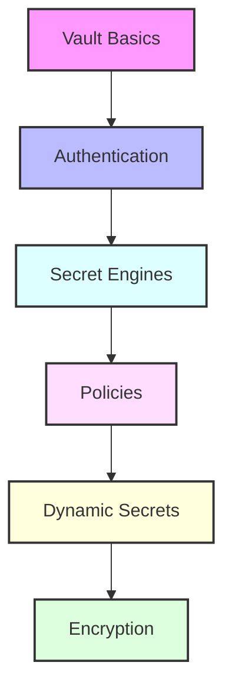

# Day 8 - HashiCorp Vault Secrets Management

## Overview
Today we'll explore HashiCorp Vault for secure secrets management. We'll cover installation, configuration, and advanced features for managing sensitive data in modern infrastructure.



## Labs

### Vault Basics
1. **Lab 1 - Installation & Setup**
   - Skill Area: Vault
   - Steps:
     1. Install Vault
     2. Initialize Vault server
     3. Unseal Vault
     4. Configure storage backend
     5. Test basic operations

2. **Lab 2 - Server Configuration**
   - Skill Area: Vault
   - Steps:
     1. Configure listener
     2. Set up storage
     3. Enable audit devices
     4. Configure TLS
     5. Test configuration

3. **Lab 3 - Basic Operations**
   - Skill Area: Vault
   - Steps:
     1. Write secrets
     2. Read secrets
     3. Delete secrets
     4. List secrets
     5. Handle versioning

### Authentication Methods
4. **Lab 4 - Token Authentication**
   - Skill Area: Vault
   - Steps:
     1. Create tokens
     2. Configure token policies
     3. Manage token lifecycle
     4. Set token roles
     5. Revoke tokens

5. **Lab 5 - AppRole Authentication**
   - Skill Area: Vault
   - Steps:
     1. Enable AppRole auth
     2. Create role
     3. Generate credentials
     4. Configure policies
     5. Test authentication

### Secret Engines
6. **Lab 6 - KV Secret Engine**
   - Skill Area: Vault
   - Steps:
     1. Enable KV engine
     2. Write key-value pairs
     3. Configure versioning
     4. Manage metadata
     5. Handle secret rotation

7. **Lab 7 - Dynamic Secrets**
   - Skill Area: Vault
   - Steps:
     1. Enable database secrets
     2. Configure connection
     3. Create role
     4. Generate credentials
     5. Manage leases

### Access Control
8. **Lab 8 - Policy Management**
   - Skill Area: Vault
   - Steps:
     1. Create policies
     2. Define permissions
     3. Assign policies
     4. Test access control
     5. Audit policy usage

9. **Lab 9 - Response Wrapping**
   - Skill Area: Vault
   - Steps:
     1. Enable response wrapping
     2. Create wrapped tokens
     3. Unwrap secrets
     4. Configure TTL
     5. Handle wrapping errors

10. **Lab 10 - Identity Management**
    - Skill Area: Vault
    - Steps:
      1. Create entities
      2. Configure aliases
      3. Create groups
      4. Assign policies
      5. Test access

### Advanced Features
11. **Lab 11 - Transit Engine**
    - Skill Area: Vault
    - Steps:
      1. Enable transit engine
      2. Create encryption keys
      3. Encrypt data
      4. Rotate keys
      5. Manage key versions

12. **Lab 12 - PKI Engine**
    - Skill Area: Vault
    - Steps:
      1. Enable PKI engine
      2. Configure CA
      3. Create roles
      4. Issue certificates
      5. Handle revocation

13. **Lab 13 - Lease Management**
    - Skill Area: Vault
    - Steps:
      1. Configure lease duration
      2. Renew leases
      3. Revoke leases
      4. Handle lease expiration
      5. Monitor lease usage

### Integration
14. **Lab 14 - API Integration**
    - Skill Area: Vault
    - Steps:
      1. Use REST API
      2. Implement SDK
      3. Handle authentication
      4. Manage errors
      5. Test integration

15. **Lab 15 - Kubernetes Integration**
    - Skill Area: Vault
    - Steps:
      1. Deploy Vault on K8s
      2. Configure service account
      3. Enable K8s auth
      4. Inject secrets
      5. Rotate credentials

## Daily Cheatsheet

### Vault Commands
```bash
# Server Operations
vault server -dev
vault operator init
vault operator unseal
vault status

# Secret Management
vault kv put secret/app key=value
vault kv get secret/app
vault kv list secret/
vault kv delete secret/app

# Authentication
vault login -method=userpass username=admin
vault token create -policy=app-policy
vault write auth/approle/role/my-role
```

### Policy Syntax
```hcl
# Example Policy
path "secret/data/app/*" {
  capabilities = ["create", "read", "update", "delete", "list"]
}

path "auth/token/create" {
  capabilities = ["create", "update"]
}

# Path-based Policy
path "sys/auth/*" {
  capabilities = ["create", "read", "update", "delete", "sudo"]
}
```

### Configuration Files
```hcl
# config.hcl
storage "file" {
  path = "/vault/data"
}

listener "tcp" {
  address     = "0.0.0.0:8200"
  tls_disable = 1
}

api_addr = "http://127.0.0.1:8200"
```

### API Examples
```bash
# REST API Calls
curl \
  -H "X-Vault-Token: $VAULT_TOKEN" \
  -X GET \
  http://127.0.0.1:8200/v1/secret/data/app

# Write Secret
curl \
  -H "X-Vault-Token: $VAULT_TOKEN" \
  -X POST \
  -d '{"data": {"password": "secret"}}' \
  http://127.0.0.1:8200/v1/secret/data/app
```

### Kubernetes Integration
```yaml
# Vault Agent Config
pid_file = "./pidfile"

auto_auth {
  method "kubernetes" {
    mount_path = "auth/kubernetes"
    config = {
      role = "app"
    }
  }
}

template {
  source      = "/etc/secrets/template.ctmpl"
  destination = "/etc/secrets/config.json"
}

# Kubernetes Manifest
apiVersion: v1
kind: Pod
metadata:
  name: app
spec:
  serviceAccountName: app
  containers:
  - name: app
    image: app:latest
    volumeMounts:
    - name: secrets
      mountPath: /etc/secrets
  volumes:
  - name: secrets
    emptyDir: {}
```

### Environment Variables
```bash
# Vault Environment
export VAULT_ADDR='http://127.0.0.1:8200'
export VAULT_TOKEN='s.duHrQAtzfFBpHK4FIJ8v2mln'
export VAULT_NAMESPACE='admin'

# SSL Configuration
export VAULT_CACERT='/etc/vault/ca.pem'
export VAULT_CLIENT_CERT='/etc/vault/cert.pem'
export VAULT_CLIENT_KEY='/etc/vault/key.pem'
