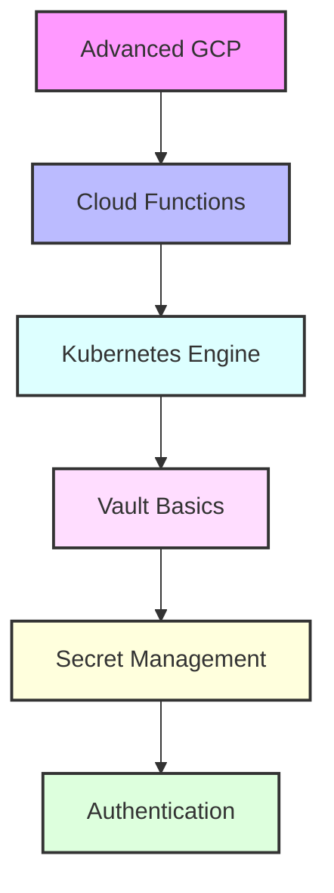

# Day 8 - Advanced GCP & HashiCorp Vault Introduction

[← Previous Day](../day-07/README.md) | [Next Day →](../day-09/README.md)

## Overview
Today we'll explore advanced Google Cloud Platform services and begin our journey into HashiCorp Vault. We'll bridge the gap between cloud infrastructure and secrets management.



## Labs

### Advanced GCP Services
1. **Lab 1 - Cloud Functions**
   - Skill Area: GCP Advanced
   - Steps:
     1. Create function
     2. Configure triggers
     3. Set up environment
     4. Implement logging
     5. Monitor performance

2. **Lab 2 - Cloud Run**
   - Skill Area: GCP Advanced
   - Steps:
     1. Create service
     2. Deploy container
     3. Configure scaling
     4. Set up domain mapping
     5. Monitor requests

3. **Lab 3 - Cloud Build**
   - Skill Area: GCP Advanced
   - Steps:
     1. Configure triggers
     2. Create build steps
     3. Set up artifacts
     4. Implement testing
     5. Monitor builds

### GCP Kubernetes Engine
4. **Lab 4 - GKE Cluster**
   - Skill Area: GCP Advanced
   - Steps:
     1. Create cluster
     2. Configure node pools
     3. Set up networking
     4. Implement monitoring
     5. Configure logging

5. **Lab 5 - GKE Workloads**
   - Skill Area: GCP Advanced
   - Steps:
     1. Deploy applications
     2. Configure auto scaling
     3. Set up load balancing
     4. Implement health checks
     5. Monitor performance

### GCP Security
6. **Lab 6 - IAM Advanced**
   - Skill Area: GCP Advanced
   - Steps:
     1. Configure custom roles
     2. Set up service accounts
     3. Manage permissions
     4. Implement best practices
     5. Audit access

7. **Lab 7 - Security Command Center**
   - Skill Area: GCP Advanced
   - Steps:
     1. Enable service
     2. Configure settings
     3. Set up notifications
     4. Review findings
     5. Implement recommendations

### Vault Basics
8. **Lab 8 - Vault Installation**
   - Skill Area: HashiCorp Vault
   - Steps:
     1. Install Vault
     2. Configure server
     3. Initialize vault
     4. Manage keys
     5. Test setup

9. **Lab 9 - Basic Operations**
   - Skill Area: HashiCorp Vault
   - Steps:
     1. Start server
     2. Unseal vault
     3. Configure CLI
     4. Write secrets
     5. Read secrets

10. **Lab 10 - Authentication**
    - Skill Area: HashiCorp Vault
    - Steps:
      1. Configure methods
      2. Set up users
      3. Create policies
      4. Test access
      5. Audit authentication

### Secret Management
11. **Lab 11 - Secret Engines**
    - Skill Area: HashiCorp Vault
    - Steps:
      1. Enable engines
      2. Configure paths
      3. Write secrets
      4. Rotate secrets
      5. Monitor access

12. **Lab 12 - Dynamic Secrets**
    - Skill Area: HashiCorp Vault
    - Steps:
      1. Configure database
      2. Set up roles
      3. Generate credentials
      4. Manage leases
      5. Revoke access

### Access Control
13. **Lab 13 - Policies**
    - Skill Area: HashiCorp Vault
    - Steps:
      1. Create policies
      2. Define permissions
      3. Assign policies
      4. Test access
      5. Audit policy usage

14. **Lab 14 - Response Wrapping**
    - Skill Area: HashiCorp Vault
    - Steps:
      1. Enable wrapping
      2. Create tokens
      3. Unwrap secrets
      4. Configure TTL
      5. Monitor usage

15. **Lab 15 - Audit Logging**
    - Skill Area: HashiCorp Vault
    - Steps:
      1. Enable audit devices
      2. Configure logging
      3. Monitor events
      4. Analyze logs
      5. Implement retention

*For more GCP commands and configurations, see the [GCP Cheatsheet](../../cheatsheets/gcp.md).*
*For more Vault commands and configurations, see the [Vault Cheatsheet](../../cheatsheets/vault.md).*

## Daily Cheatsheet

### GCP Advanced Commands
```bash
# Cloud Functions
gcloud functions deploy my-function \
  --runtime nodejs14 \
  --trigger-http \
  --entry-point helloWorld

# Cloud Run
gcloud run deploy my-service \
  --image gcr.io/my-project/my-image \
  --platform managed \
  --region us-central1

# GKE
gcloud container clusters create my-cluster \
  --zone us-central1-a \
  --num-nodes 3 \
  --machine-type e2-medium

gcloud container clusters get-credentials my-cluster \
  --zone us-central1-a
```

### Vault Commands
```bash
# Server Operations
vault server -dev
vault operator init
vault operator unseal
vault status

# Secret Management
vault secrets enable -path=secret kv
vault kv put secret/hello foo=bar
vault kv get secret/hello
vault kv delete secret/hello

# Authentication
vault auth enable userpass
vault write auth/userpass/users/demo \
  password=demo \
  policies=demo-policy

# Policy Management
vault policy write demo-policy - <<EOF
path "secret/data/*" {
  capabilities = ["create", "read", "update", "delete", "list"]
}
EOF

# Audit
vault audit enable file file_path=/var/log/vault_audit.log
```

### Vault Configuration Example
```hcl
# config.hcl
storage "file" {
  path = "/opt/vault/data"
}

listener "tcp" {
  address     = "0.0.0.0:8200"
  tls_disable = 1
}

api_addr = "http://127.0.0.1:8200"
```

### Vault Policy Example
```hcl
# admin-policy.hcl
path "secret/*" {
  capabilities = ["create", "read", "update", "delete", "list"]
}

path "auth/*" {
  capabilities = ["create", "read", "update", "delete", "list"]
}

path "sys/*" {
  capabilities = ["create", "read", "update", "delete", "list"]
}
```

### GKE Deployment Example
```yaml
apiVersion: apps/v1
kind: Deployment
metadata:
  name: my-app
spec:
  replicas: 3
  selector:
    matchLabels:
      app: my-app
  template:
    metadata:
      labels:
        app: my-app
    spec:
      containers:
      - name: my-app
        image: gcr.io/my-project/my-app:latest
        ports:
        - containerPort: 8080
        resources:
          requests:
            memory: "64Mi"
            cpu: "250m"
          limits:
            memory: "128Mi"
            cpu: "500m"
```

## Additional Resources

- [Google Cloud Functions Documentation](https://cloud.google.com/functions/docs)
- [Google Kubernetes Engine Documentation](https://cloud.google.com/kubernetes-engine/docs)
- [HashiCorp Vault Documentation](https://www.vaultproject.io/docs)
- [Vault Architecture Guide](https://learn.hashicorp.com/tutorials/vault/architecture)
- [GCP Security Best Practices](https://cloud.google.com/security/best-practices)
- [DevOps Glossary](../../cheatsheets/devops_glossary.md)

[← Previous Day](../day-07/README.md) | [Next Day →](../day-09/README.md)
