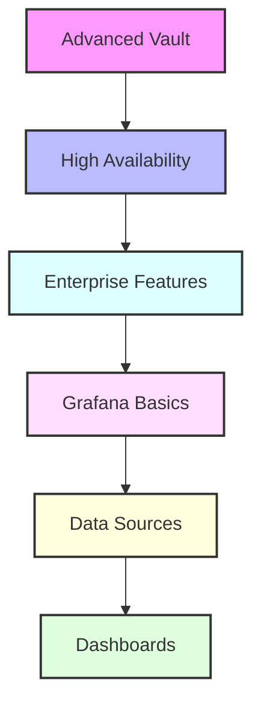

# Day 9 - Advanced Vault & Grafana Introduction

[← Previous Day](../day-08/README.md) | [Next Day →](../day-10/README.md)

## Overview
Today we'll explore advanced HashiCorp Vault features and begin our journey into Grafana. We'll bridge the gap between secrets management and monitoring visualization.



## Labs

### Advanced Vault Configuration
1. **Lab 1 - High Availability Setup**
   - Skill Area: Vault Advanced
   - Steps:
     1. Configure storage backend
     2. Set up multiple nodes
     3. Configure leader election
     4. Test failover
     5. Monitor cluster status

2. **Lab 2 - Auto Unsealing**
   - Skill Area: Vault Advanced
   - Steps:
     1. Configure cloud KMS
     2. Set up auto-unseal
     3. Test unsealing
     4. Monitor unsealing
     5. Implement backup procedures

3. **Lab 3 - Performance Tuning**
   - Skill Area: Vault Advanced
   - Steps:
     1. Configure resources
     2. Optimize storage
     3. Tune networking
     4. Monitor metrics
     5. Implement caching

### Advanced Secret Management
4. **Lab 4 - PKI Secrets Engine**
   - Skill Area: Vault Advanced
   - Steps:
     1. Configure root CA
     2. Create intermediate CA
     3. Define roles
     4. Issue certificates
     5. Implement rotation

5. **Lab 5 - Transit Secrets Engine**
   - Skill Area: Vault Advanced
   - Steps:
     1. Enable transit engine
     2. Configure encryption keys
     3. Implement key rotation
     4. Manage rewrapping
     5. Monitor key usage

### Enterprise Features
6. **Lab 6 - Namespaces**
   - Skill Area: Vault Advanced
   - Steps:
     1. Create namespaces
     2. Configure policies
     3. Manage access
     4. Implement isolation
     5. Monitor usage

7. **Lab 7 - Replication**
   - Skill Area: Vault Advanced
   - Steps:
     1. Set up performance replication
     2. Configure disaster recovery
     3. Test failover
     4. Monitor replication
     5. Handle conflicts

### Grafana Basics
8. **Lab 8 - Grafana Installation**
   - Skill Area: Grafana
   - Steps:
     1. Install Grafana
     2. Configure server
     3. Set up users
     4. Configure security
     5. Test access

9. **Lab 9 - Data Sources**
   - Skill Area: Grafana
   - Steps:
     1. Add Prometheus
     2. Configure InfluxDB
     3. Set up Elasticsearch
     4. Test connections
     5. Manage permissions

10. **Lab 10 - Basic Dashboards**
    - Skill Area: Grafana
    - Steps:
      1. Create dashboard
      2. Add panels
      3. Configure visualizations
      4. Set up variables
      5. Implement sharing

### Dashboard Creation
11. **Lab 11 - Advanced Panels**
    - Skill Area: Grafana
    - Steps:
      1. Create graphs
      2. Configure alerts
      3. Add annotations
      4. Use transformations
      5. Implement thresholds

12. **Lab 12 - Dashboard Variables**
    - Skill Area: Grafana
    - Steps:
      1. Create variables
      2. Configure templating
      3. Use expressions
      4. Implement filters
      5. Test dynamic content

### Grafana Administration
13. **Lab 13 - User Management**
    - Skill Area: Grafana
    - Steps:
      1. Configure authentication
      2. Set up roles
      3. Manage permissions
      4. Implement LDAP
      5. Monitor access

14. **Lab 14 - Alerting**
    - Skill Area: Grafana
    - Steps:
      1. Create alert rules
      2. Configure notifications
      3. Set up channels
      4. Test alerts
      5. Monitor alert history

15. **Lab 15 - Plugin Management**
    - Skill Area: Grafana
    - Steps:
      1. Install plugins
      2. Configure settings
      3. Update plugins
      4. Test functionality
      5. Monitor performance

*For more Vault commands and configurations, see the [Vault Cheatsheet](../../cheatsheets/vault.md).*
*For more Grafana configurations, see the [Grafana Cheatsheet](../../cheatsheets/grafana.md).*

## Daily Cheatsheet

### Vault HA Configuration
```hcl
# ha-config.hcl
storage "consul" {
  address = "127.0.0.1:8500"
  path    = "vault/"
}

listener "tcp" {
  address     = "0.0.0.0:8200"
  tls_disable = 1
}

api_addr = "http://127.0.0.1:8200"
cluster_addr = "https://127.0.0.1:8201"

# Auto-unseal using AWS KMS
seal "awskms" {
  region     = "us-east-1"
  kms_key_id = "alias/vault-unseal-key"
}
```

### Vault Advanced Commands
```bash
# PKI Operations
vault secrets enable pki
vault write pki/root/generate/internal \
  common_name=example.com \
  ttl=8760h

# Transit Operations
vault secrets enable transit
vault write -f transit/keys/my-key
vault write transit/encrypt/my-key \
  plaintext=$(base64 <<< "my secret data")

# Namespace Operations
vault namespace create engineering
vault namespace list
vault policy write -namespace=engineering \
  app-policy policy.hcl
```

### Grafana Configuration
```ini
# grafana.ini
[server]
http_addr = 0.0.0.0
http_port = 3000

[security]
admin_user = admin
admin_password = admin

[auth.ldap]
enabled = true
config_file = /etc/grafana/ldap.toml

[alerting]
enabled = true
```

### Grafana Dashboard JSON
```json
{
  "dashboard": {
    "id": null,
    "title": "Production Overview",
    "tags": ["production", "metrics"],
    "timezone": "browser",
    "panels": [
      {
        "title": "CPU Usage",
        "type": "graph",
        "datasource": "Prometheus",
        "targets": [
          {
            "expr": "rate(node_cpu_seconds_total{mode=\"user\"}[5m])",
            "legendFormat": "{{instance}}"
          }
        ]
      }
    ],
    "time": {
      "from": "now-6h",
      "to": "now"
    },
    "refresh": "5s"
  }
}
```

### Grafana Alert Rule
```yaml
# Alert rule example
groups:
  - name: example
    rules:
    - alert: HighCPUUsage
      expr: rate(node_cpu_seconds_total{mode="user"}[5m]) > 0.8
      for: 5m
      labels:
        severity: warning
      annotations:
        summary: High CPU usage detected
        description: CPU usage is above 80% for 5 minutes
```

## Additional Resources

- [Vault High Availability Guide](https://learn.hashicorp.com/tutorials/vault/ha-with-consul)
- [Vault Enterprise Documentation](https://www.vaultproject.io/docs/enterprise)
- [Grafana Documentation](https://grafana.com/docs/)
- [Grafana Best Practices](https://grafana.com/docs/grafana/latest/best-practices/)
- [Vault Security Model](https://www.vaultproject.io/docs/internals/security)
- [DevOps Glossary](../../cheatsheets/devops_glossary.md)

[← Previous Day](../day-08/README.md) | [Next Day →](../day-10/README.md)
