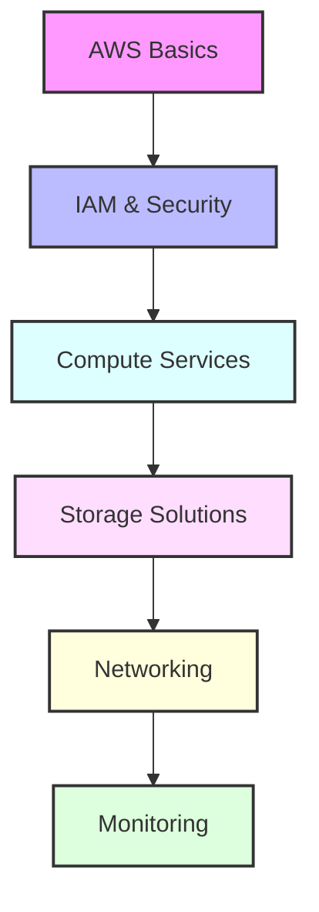

# Day 9 - AWS Services & Infrastructure

## Overview
Today we'll explore AWS services and infrastructure management. We'll cover essential services like EC2, S3, IAM, and best practices for cloud infrastructure deployment.



## Labs

### AWS Basics
1. **Lab 1 - AWS CLI Setup**
   - Skill Area: AWS
   - Steps:
     1. Install AWS CLI
     2. Configure credentials
     3. Test connection
     4. Set up profiles
     5. Verify access

2. **Lab 2 - Account Management**
   - Skill Area: AWS
   - Steps:
     1. Create IAM users
     2. Set up MFA
     3. Configure billing alerts
     4. Set up organizations
     5. Implement best practices

3. **Lab 3 - Resource Tags**
   - Skill Area: AWS
   - Steps:
     1. Create tagging strategy
     2. Apply resource tags
     3. Use tag policies
     4. Monitor tag compliance
     5. Automate tagging

### IAM & Security
4. **Lab 4 - IAM Users & Groups**
   - Skill Area: AWS Security
   - Steps:
     1. Create IAM users
     2. Set up groups
     3. Assign permissions
     4. Manage access keys
     5. Review security status

5. **Lab 5 - IAM Roles**
   - Skill Area: AWS Security
   - Steps:
     1. Create service roles
     2. Configure trust relationships
     3. Attach policies
     4. Test role assumption
     5. Monitor role usage

### Compute Services
6. **Lab 6 - EC2 Basics**
   - Skill Area: AWS Compute
   - Steps:
     1. Launch EC2 instance
     2. Configure security groups
     3. Manage key pairs
     4. Connect to instance
     5. Monitor performance

7. **Lab 7 - Auto Scaling**
   - Skill Area: AWS Compute
   - Steps:
     1. Create launch template
     2. Configure ASG
     3. Set scaling policies
     4. Test scaling
     5. Monitor scaling events

### Storage Solutions
8. **Lab 8 - S3 Management**
   - Skill Area: AWS Storage
   - Steps:
     1. Create buckets
     2. Configure permissions
     3. Set up lifecycle rules
     4. Enable versioning
     5. Configure encryption

9. **Lab 9 - EBS Volumes**
   - Skill Area: AWS Storage
   - Steps:
     1. Create volumes
     2. Attach to instances
     3. Create snapshots
     4. Restore from snapshots
     5. Manage volume performance

10. **Lab 10 - RDS Setup**
    - Skill Area: AWS Database
    - Steps:
      1. Launch RDS instance
      2. Configure security
      3. Set up backups
      4. Create read replicas
      5. Monitor performance

### Networking
11. **Lab 11 - VPC Setup**
    - Skill Area: AWS Networking
    - Steps:
      1. Create VPC
      2. Configure subnets
      3. Set up routing
      4. Configure NACL
      5. Test connectivity

12. **Lab 12 - Load Balancing**
    - Skill Area: AWS Networking
    - Steps:
      1. Create ALB
      2. Configure target groups
      3. Set up SSL
      4. Configure routing
      5. Monitor health

13. **Lab 13 - Route 53**
    - Skill Area: AWS Networking
    - Steps:
      1. Register domain
      2. Configure DNS
      3. Set up routing policies
      4. Configure health checks
      5. Monitor DNS performance

### Monitoring & Logging
14. **Lab 14 - CloudWatch**
    - Skill Area: AWS Monitoring
    - Steps:
      1. Create dashboards
      2. Set up alarms
      3. Configure logs
      4. Create metrics
      5. Set up notifications

15. **Lab 15 - CloudTrail**
    - Skill Area: AWS Monitoring
    - Steps:
      1. Enable CloudTrail
      2. Configure trails
      3. Set up log analysis
      4. Create alerts
      5. Monitor API activity

## Daily Cheatsheet

### AWS CLI Commands
```bash
# EC2 Management
aws ec2 run-instances --image-id ami-12345678 --instance-type t2.micro
aws ec2 describe-instances
aws ec2 start-instances --instance-ids i-1234567890abcdef0
aws ec2 stop-instances --instance-ids i-1234567890abcdef0

# S3 Operations
aws s3 mb s3://my-bucket
aws s3 cp file.txt s3://my-bucket/
aws s3 sync . s3://my-bucket
aws s3 ls s3://my-bucket

# IAM Management
aws iam create-user --user-name john
aws iam create-group --group-name developers
aws iam add-user-to-group --user-name john --group-name developers
```

### CloudFormation Template
```yaml
AWSTemplateFormatVersion: '2010-09-09'
Description: 'Basic Infrastructure Stack'

Resources:
  VPC:
    Type: AWS::EC2::VPC
    Properties:
      CidrBlock: 10.0.0.0/16
      EnableDnsHostnames: true
      EnableDnsSupport: true
      Tags:
        - Key: Name
          Value: MainVPC

  WebServerInstance:
    Type: AWS::EC2::Instance
    Properties:
      InstanceType: t2.micro
      ImageId: ami-12345678
      SecurityGroups:
        - !Ref WebServerSecurityGroup
      UserData:
        Fn::Base64: !Sub |
          #!/bin/bash
          yum update -y
          yum install -y httpd
          systemctl start httpd
          systemctl enable httpd
```

### IAM Policy Examples
```json
{
  "Version": "2012-10-17",
  "Statement": [
    {
      "Effect": "Allow",
      "Action": [
        "s3:GetObject",
        "s3:PutObject"
      ],
      "Resource": "arn:aws:s3:::my-bucket/*"
    }
  ]
}
```

### Security Group Rules
```bash
# Inbound Rules
aws ec2 authorize-security-group-ingress \
    --group-id sg-1234567890abcdef0 \
    --protocol tcp \
    --port 80 \
    --cidr 0.0.0.0/0

# Outbound Rules
aws ec2 authorize-security-group-egress \
    --group-id sg-1234567890abcdef0 \
    --protocol -1 \
    --port -1 \
    --cidr 0.0.0.0/0
```

### CloudWatch Metrics
```bash
# Get Metrics
aws cloudwatch get-metric-statistics \
    --namespace AWS/EC2 \
    --metric-name CPUUtilization \
    --dimensions Name=InstanceId,Value=i-1234567890abcdef0 \
    --start-time 2024-04-21T00:00:00 \
    --end-time 2024-04-21T23:59:59 \
    --period 3600 \
    --statistics Average

# Create Alarm
aws cloudwatch put-metric-alarm \
    --alarm-name cpu-mon \
    --alarm-description "Alarm when CPU exceeds 70%" \
    --metric-name CPUUtilization \
    --namespace AWS/EC2 \
    --statistic Average \
    --period 300 \
    --threshold 70 \
    --comparison-operator GreaterThanThreshold \
    --evaluation-periods 2 \
    --alarm-actions arn:aws:sns:region:account-id:topic-name
