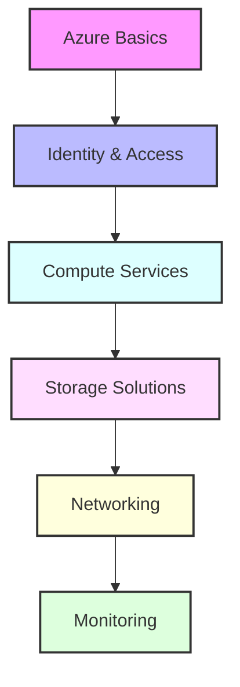

# Day 10 - Azure Services & Infrastructure

## Overview
Today we'll explore Azure services and infrastructure management. We'll cover essential services like Virtual Machines, Storage, Active Directory, and best practices for cloud infrastructure deployment.



## Labs

### Azure Basics
1. **Lab 1 - Azure CLI Setup**
   - Skill Area: Azure
   - Steps:
     1. Install Azure CLI
     2. Configure authentication
     3. Test connection
     4. Set up subscriptions
     5. Verify access

2. **Lab 2 - Resource Management**
   - Skill Area: Azure
   - Steps:
     1. Create resource groups
     2. Apply resource locks
     3. Configure tags
     4. Set up policies
     5. Monitor usage

3. **Lab 3 - Azure Portal**
   - Skill Area: Azure
   - Steps:
     1. Navigate portal interface
     2. Customize dashboard
     3. Use Cloud Shell
     4. Configure notifications
     5. Access documentation

### Identity & Access
4. **Lab 4 - Azure AD Basics**
   - Skill Area: Azure Security
   - Steps:
     1. Create users
     2. Configure groups
     3. Assign roles
     4. Set up MFA
     5. Monitor sign-ins

5. **Lab 5 - Role-Based Access**
   - Skill Area: Azure Security
   - Steps:
     1. Create custom roles
     2. Assign permissions
     3. Configure scope
     4. Test access
     5. Review assignments

### Compute Services
6. **Lab 6 - Virtual Machines**
   - Skill Area: Azure Compute
   - Steps:
     1. Create VM
     2. Configure networking
     3. Manage disks
     4. Set up monitoring
     5. Configure backups

7. **Lab 7 - App Services**
   - Skill Area: Azure Compute
   - Steps:
     1. Create web app
     2. Configure deployment
     3. Set up scaling
     4. Enable logging
     5. Monitor performance

### Storage Solutions
8. **Lab 8 - Storage Accounts**
   - Skill Area: Azure Storage
   - Steps:
     1. Create storage account
     2. Configure access
     3. Set up containers
     4. Enable encryption
     5. Monitor usage

9. **Lab 9 - Azure Files**
   - Skill Area: Azure Storage
   - Steps:
     1. Create file share
     2. Configure access
     3. Mount share
     4. Set up snapshots
     5. Monitor performance

10. **Lab 10 - Azure SQL**
    - Skill Area: Azure Database
    - Steps:
      1. Create database
      2. Configure security
      3. Set up backups
      4. Configure scaling
      5. Monitor performance

### Networking
11. **Lab 11 - Virtual Networks**
    - Skill Area: Azure Networking
    - Steps:
      1. Create VNet
      2. Configure subnets
      3. Set up NSGs
      4. Configure peering
      5. Test connectivity

12. **Lab 12 - Load Balancer**
    - Skill Area: Azure Networking
    - Steps:
      1. Create load balancer
      2. Configure backend pools
      3. Set up health probes
      4. Configure rules
      5. Monitor health

13. **Lab 13 - Application Gateway**
    - Skill Area: Azure Networking
    - Steps:
      1. Create gateway
      2. Configure listeners
      3. Set up rules
      4. Enable WAF
      5. Monitor traffic

### Monitoring & Management
14. **Lab 14 - Azure Monitor**
    - Skill Area: Azure Monitoring
    - Steps:
      1. Configure metrics
      2. Set up alerts
      3. Create dashboards
      4. Configure Log Analytics
      5. Set up notifications

15. **Lab 15 - Azure Backup**
    - Skill Area: Azure Management
    - Steps:
      1. Configure backup policy
      2. Create backup
      3. Test restore
      4. Monitor backup status
      5. Configure reporting

## Daily Cheatsheet

### Azure CLI Commands
```bash
# Resource Management
az group create --name myResourceGroup --location eastus
az group list
az resource list --resource-group myResourceGroup

# Virtual Machines
az vm create \
    --resource-group myResourceGroup \
    --name myVM \
    --image UbuntuLTS \
    --admin-username azureuser \
    --generate-ssh-keys

# Storage
az storage account create \
    --name mystorageaccount \
    --resource-group myResourceGroup \
    --location eastus \
    --sku Standard_LRS

# Networking
az network vnet create \
    --resource-group myResourceGroup \
    --name myVNet \
    --address-prefix 10.0.0.0/16 \
    --subnet-name mySubnet \
    --subnet-prefix 10.0.0.0/24
```

### ARM Template Example
```json
{
  "$schema": "https://schema.management.azure.com/schemas/2019-04-01/deploymentTemplate.json#",
  "contentVersion": "1.0.0.0",
  "parameters": {
    "vmName": {
      "type": "string",
      "defaultValue": "myVM"
    }
  },
  "resources": [
    {
      "type": "Microsoft.Compute/virtualMachines",
      "apiVersion": "2021-03-01",
      "name": "[parameters('vmName')]",
      "location": "[resourceGroup().location]",
      "properties": {
        "hardwareProfile": {
          "vmSize": "Standard_DS1_v2"
        },
        "osProfile": {
          "computerName": "[parameters('vmName')]",
          "adminUsername": "azureuser",
          "linuxConfiguration": {
            "disablePasswordAuthentication": true
          }
        }
      }
    }
  ]
}
```

### PowerShell Commands
```powershell
# Login
Connect-AzAccount

# Resource Groups
New-AzResourceGroup -Name "myResourceGroup" -Location "eastus"
Get-AzResourceGroup | Format-Table

# Virtual Machines
New-AzVM `
    -ResourceGroupName "myResourceGroup" `
    -Name "myVM" `
    -Location "eastus" `
    -VirtualNetworkName "myVNet" `
    -SubnetName "mySubnet" `
    -SecurityGroupName "myNSG" `
    -PublicIpAddressName "myPublicIP"

# Storage
New-AzStorageAccount `
    -ResourceGroupName "myResourceGroup" `
    -Name "mystorageaccount" `
    -Location "eastus" `
    -SkuName "Standard_LRS" `
    -Kind "StorageV2"
```

### Azure Policy Example
```json
{
  "properties": {
    "displayName": "Require resource tags",
    "policyType": "Custom",
    "mode": "Indexed",
    "description": "Requires specified tags for all resources",
    "parameters": {
      "tagName": {
        "type": "String",
        "metadata": {
          "displayName": "Required tag name"
        }
      }
    },
    "policyRule": {
      "if": {
        "field": "[concat('tags[', parameters('tagName'), ']')]",
        "exists": "false"
      },
      "then": {
        "effect": "deny"
      }
    }
  }
}
