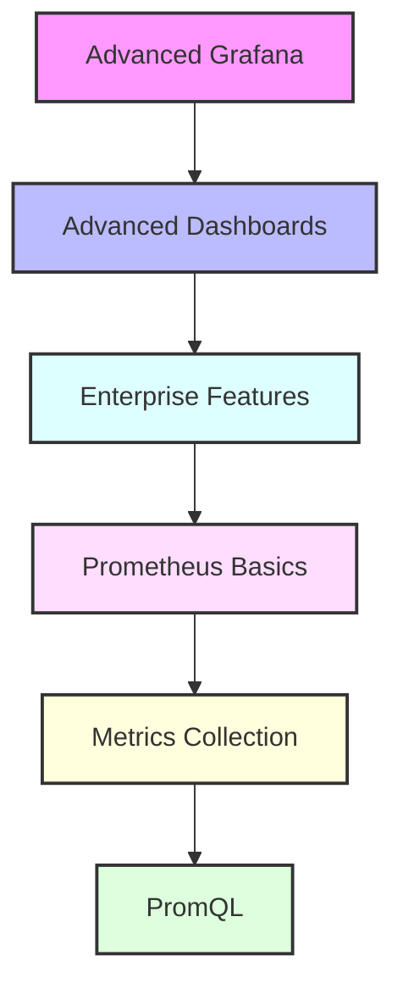

# Day 10 - Advanced Grafana & Prometheus Introduction

[← Previous Day](../day-09/README.md) | [Next Day →](../day-11/README.md)

## Overview
Today we'll explore advanced Grafana features and begin our journey into Prometheus. We'll bridge the gap between visualization and metrics collection.



## Labs

### Advanced Grafana Features
1. **Lab 1 - Advanced Visualizations**
   - Skill Area: Grafana Advanced
   - Steps:
     1. Create custom panels
     2. Use transformations
     3. Implement calculated fields
     4. Configure thresholds
     5. Add annotations

2. **Lab 2 - Dashboard Scripting**
   - Skill Area: Grafana Advanced
   - Steps:
     1. Write dashboard JSON
     2. Use variables
     3. Implement templating
     4. Create dynamic queries
     5. Test dashboard

3. **Lab 3 - Data Source Management**
   - Skill Area: Grafana Advanced
   - Steps:
     1. Configure multiple sources
     2. Set up provisioning
     3. Manage permissions
     4. Implement caching
     5. Monitor performance

### Enterprise Features
4. **Lab 4 - Team Management**
   - Skill Area: Grafana Advanced
   - Steps:
     1. Create teams
     2. Configure permissions
     3. Set up sync
     4. Manage access
     5. Monitor usage

5. **Lab 5 - White Labeling**
   - Skill Area: Grafana Advanced
   - Steps:
     1. Customize branding
     2. Configure theme
     3. Set up login page
     4. Customize emails
     5. Test appearance

### Advanced Alerting
6. **Lab 6 - Alert Rules**
   - Skill Area: Grafana Advanced
   - Steps:
     1. Create complex rules
     2. Configure conditions
     3. Set up notifications
     4. Implement escalations
     5. Test scenarios

7. **Lab 7 - Contact Points**
   - Skill Area: Grafana Advanced
   - Steps:
     1. Configure email
     2. Set up Slack
     3. Implement webhooks
     4. Test delivery
     5. Monitor status

### Prometheus Basics
8. **Lab 8 - Prometheus Installation**
   - Skill Area: Prometheus
   - Steps:
     1. Install Prometheus
     2. Configure server
     3. Set up storage
     4. Configure retention
     5. Test setup

9. **Lab 9 - Service Discovery**
   - Skill Area: Prometheus
   - Steps:
     1. Configure static targets
     2. Set up file_sd
     3. Implement DNS discovery
     4. Configure relabeling
     5. Test discovery

10. **Lab 10 - Basic Metrics**
    - Skill Area: Prometheus
    - Steps:
      1. Configure exporters
      2. Set up node exporter
      3. Collect basic metrics
      4. Test scraping
      5. View metrics

### PromQL
11. **Lab 11 - Basic Queries**
    - Skill Area: Prometheus
    - Steps:
      1. Write instant queries
      2. Use range queries
      3. Apply functions
      4. Filter metrics
      5. Test queries

12. **Lab 12 - Advanced Queries**
    - Skill Area: Prometheus
    - Steps:
      1. Use aggregations
      2. Implement rate
      3. Create recording rules
      4. Use subqueries
      5. Test complex queries

### Alerting
13. **Lab 13 - Alertmanager**
    - Skill Area: Prometheus
    - Steps:
      1. Install Alertmanager
      2. Configure routes
      3. Set up receivers
      4. Implement inhibition
      5. Test alerts

14. **Lab 14 - Alert Rules**
    - Skill Area: Prometheus
    - Steps:
      1. Define alert rules
      2. Configure thresholds
      3. Set up labels
      4. Implement grouping
      5. Test notifications

15. **Lab 15 - Federation**
    - Skill Area: Prometheus
    - Steps:
      1. Configure federation
      2. Set up hierarchies
      3. Implement filtering
      4. Test collection
      5. Monitor performance

*For more Grafana configurations, see the [Grafana Cheatsheet](../../cheatsheets/grafana.md).*

## Daily Cheatsheet

### Grafana Advanced Configuration
```ini
# grafana.ini
[enterprise]
license_path = /etc/grafana/license.jwt

[unified_alerting]
enabled = true

[smtp]
enabled = true
host = smtp.example.com:587
user = admin@example.com
password = secret

[auth.ldap]
enabled = true
config_file = /etc/grafana/ldap.toml
```

### Grafana Dashboard Provisioning
```yaml
# dashboards.yaml
apiVersion: 1

providers:
  - name: 'default'
    orgId: 1
    folder: ''
    type: file
    disableDeletion: false
    editable: true
    options:
      path: /var/lib/grafana/dashboards
```

### Prometheus Configuration
```yaml
# prometheus.yml
global:
  scrape_interval: 15s
  evaluation_interval: 15s

rule_files:
  - "rules/*.yml"

scrape_configs:
  - job_name: 'prometheus'
    static_configs:
      - targets: ['localhost:9090']

  - job_name: 'node'
    file_sd_configs:
      - files:
        - 'targets/*.json'
```

### PromQL Examples
```promql
# Basic queries
rate(http_requests_total[5m])
sum by (job) (rate(http_requests_total[5m]))

# Recording rules
record: job:http_requests:rate5m
expr: rate(http_requests_total[5m])

# Alert rules
alert: HighErrorRate
expr: rate(http_errors_total[5m]) / rate(http_requests_total[5m]) > 0.1
for: 10m
labels:
  severity: warning
annotations:
  summary: High error rate detected
```

### Alertmanager Configuration
```yaml
# alertmanager.yml
global:
  resolve_timeout: 5m

route:
  group_by: ['alertname']
  group_wait: 30s
  group_interval: 5m
  repeat_interval: 1h
  receiver: 'team-emails'

receivers:
- name: 'team-emails'
  email_configs:
  - to: 'team@example.com'
    from: 'alertmanager@example.com'
    smarthost: 'smtp.example.com:587'
```

### Prometheus Federation
```yaml
# prometheus-federate.yml
scrape_configs:
  - job_name: 'federate'
    scrape_interval: 15s
    honor_labels: true
    metrics_path: '/federate'
    params:
      'match[]':
        - '{job="prometheus"}'
        - '{job="node"}'
    static_configs:
      - targets:
        - 'prometheus-1:9090'
        - 'prometheus-2:9090'
```

## Additional Resources

- [Grafana Enterprise Documentation](https://grafana.com/docs/grafana/latest/enterprise/)
- [Prometheus Documentation](https://prometheus.io/docs/introduction/overview/)
- [PromQL Tutorial](https://prometheus.io/docs/prometheus/latest/querying/basics/)
- [Alertmanager Documentation](https://prometheus.io/docs/alerting/latest/alertmanager/)
- [Grafana Alerting Best Practices](https://grafana.com/docs/grafana/latest/alerting/unified-alerting/alerting-rules/create-grafana-managed-rule/)
- [DevOps Glossary](../../cheatsheets/devops_glossary.md)

[← Previous Day](../day-09/README.md) | [Next Day →](../day-11/README.md)
