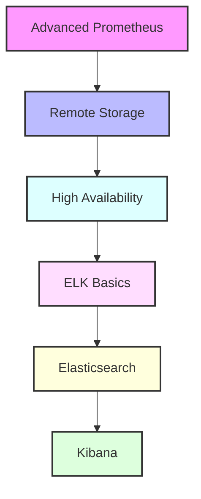

# Day 11 - Advanced Prometheus & ELK Stack Introduction

[← Previous Day](../day-10/README.md) | [Next Day →](../day-12/README.md)

## Overview
Today we'll explore advanced Prometheus features and begin our journey into the ELK Stack (Elasticsearch, Logstash, Kibana). We'll bridge the gap between metrics and log management.



## Labs

### Advanced Prometheus
1. **Lab 1 - Remote Storage**
   - Skill Area: Prometheus Advanced
   - Steps:
     1. Configure remote write
     2. Set up remote read
     3. Implement retention
     4. Monitor performance
     5. Test failover

2. **Lab 2 - High Availability**
   - Skill Area: Prometheus Advanced
   - Steps:
     1. Set up multiple instances
     2. Configure federation
     3. Implement load balancing
     4. Test failover
     5. Monitor cluster health

3. **Lab 3 - Custom Exporters**
   - Skill Area: Prometheus Advanced
   - Steps:
     1. Create exporter
     2. Define metrics
     3. Implement collection
     4. Add documentation
     5. Test functionality

### Advanced Alerting
4. **Lab 4 - Complex Alert Rules**
   - Skill Area: Prometheus Advanced
   - Steps:
     1. Create alert expressions
     2. Configure thresholds
     3. Implement grouping
     4. Set up routing
     5. Test scenarios

5. **Lab 5 - Alert Routing**
   - Skill Area: Prometheus Advanced
   - Steps:
     1. Configure routes
     2. Set up receivers
     3. Implement templates
     4. Test notifications
     5. Monitor delivery

### ELK Stack Basics
6. **Lab 6 - Elasticsearch Installation**
   - Skill Area: ELK Stack
   - Steps:
     1. Install Elasticsearch
     2. Configure nodes
     3. Set up security
     4. Configure networking
     5. Test cluster

7. **Lab 7 - Basic Operations**
   - Skill Area: ELK Stack
   - Steps:
     1. Create indices
     2. Configure mappings
     3. Implement sharding
     4. Set up replication
     5. Monitor health

### Elasticsearch Management
8. **Lab 8 - Index Management**
   - Skill Area: ELK Stack
   - Steps:
     1. Create templates
     2. Configure lifecycle
     3. Implement rollover
     4. Set up aliases
     5. Monitor indices

9. **Lab 9 - Search Operations**
   - Skill Area: ELK Stack
   - Steps:
     1. Write queries
     2. Use aggregations
     3. Implement filtering
     4. Configure scoring
     5. Test performance

10. **Lab 10 - Cluster Management**
    - Skill Area: ELK Stack
    - Steps:
      1. Add nodes
      2. Configure roles
      3. Manage shards
      4. Monitor cluster
      5. Handle recovery

### Logstash Configuration
11. **Lab 11 - Input Plugins**
    - Skill Area: ELK Stack
    - Steps:
      1. Configure file input
      2. Set up beats input
      3. Implement syslog
      4. Add HTTP endpoint
      5. Test inputs

12. **Lab 12 - Filters**
    - Skill Area: ELK Stack
    - Steps:
      1. Parse logs
      2. Transform data
      3. Enrich events
      4. Handle errors
      5. Test pipeline

### Kibana Setup
13. **Lab 13 - Basic Configuration**
    - Skill Area: ELK Stack
    - Steps:
      1. Install Kibana
      2. Configure security
      3. Set up indices
      4. Create visualizations
      5. Build dashboard

14. **Lab 14 - Advanced Visualizations**
    - Skill Area: ELK Stack
    - Steps:
      1. Create custom visuals
      2. Use aggregations
      3. Implement drilldowns
      4. Add annotations
      5. Share dashboards

15. **Lab 15 - Monitoring Setup**
    - Skill Area: ELK Stack
    - Steps:
      1. Enable monitoring
      2. Configure metrics
      3. Set up alerts
      4. Create reports
      5. Monitor performance

## Daily Cheatsheet

### Prometheus Remote Storage
```yaml
# prometheus.yml
remote_write:
  - url: "http://remote-storage:9201/write"
    remote_timeout: 30s
    queue_config:
      capacity: 10000
      max_shards: 50
      max_samples_per_send: 500

remote_read:
  - url: "http://remote-storage:9201/read"
    read_recent: true
```

### Elasticsearch Configuration
```yaml
# elasticsearch.yml
cluster.name: my-cluster
node.name: node-1
network.host: 0.0.0.0
discovery.seed_hosts: ["host1", "host2"]
cluster.initial_master_nodes: ["node-1"]
xpack.security.enabled: true
xpack.monitoring.collection.enabled: true
```

### Logstash Pipeline
```ruby
# logstash.conf
input {
  beats {
    port => 5044
  }
  file {
    path => "/var/log/*.log"
    type => "syslog"
  }
}

filter {
  grok {
    match => { "message" => "%{COMBINEDAPACHELOG}" }
  }
  date {
    match => [ "timestamp", "dd/MMM/yyyy:HH:mm:ss Z" ]
  }
}

output {
  elasticsearch {
    hosts => ["localhost:9200"]
    index => "logstash-%{+YYYY.MM.dd}"
  }
}
```

### Kibana Configuration
```yaml
# kibana.yml
server.host: "0.0.0.0"
elasticsearch.hosts: ["http://localhost:9200"]
elasticsearch.username: "kibana_system"
elasticsearch.password: "password"
xpack.security.enabled: true
xpack.reporting.enabled: true
```

### Elasticsearch Commands
```bash
# Index Management
curl -X PUT "localhost:9200/my-index-000001" -H 'Content-Type: application/json' -d'
{
  "settings": {
    "number_of_shards": 3,
    "number_of_replicas": 2
  }
}'

# Search
curl -X GET "localhost:9200/my-index-000001/_search" -H 'Content-Type: application/json' -d'
{
  "query": {
    "match": {
      "message": "error"
    }
  }
}'

# Cluster Health
curl -X GET "localhost:9200/_cluster/health?pretty"
```

### Prometheus HA Configuration
```yaml
# prometheus-ha.yml
global:
  external_labels:
    replica: replica-1

scrape_configs:
  - job_name: 'prometheus'
    static_configs:
      - targets: ['localhost:9090']

  - job_name: 'federate'
    honor_labels: true
    metrics_path: '/federate'
    params:
      'match[]':
        - '{job="prometheus"}'
    static_configs:
      - targets:
        - 'prometheus-2:9090'
```

## Additional Resources

- [Prometheus Remote Storage](https://prometheus.io/docs/operating/integrations/#remote-endpoints-and-storage)
- [Elasticsearch Guide](https://www.elastic.co/guide/en/elasticsearch/reference/current/index.html)
- [Logstash Documentation](https://www.elastic.co/guide/en/logstash/current/index.html)
- [Kibana User Guide](https://www.elastic.co/guide/en/kibana/current/index.html)
- [ELK Stack Security](https://www.elastic.co/guide/en/elasticsearch/reference/current/secure-cluster.html)
- [DevOps Glossary](../../cheatsheets/devops_glossary.md)

[← Previous Day](../day-10/README.md) | [Next Day →](../day-12/README.md)
