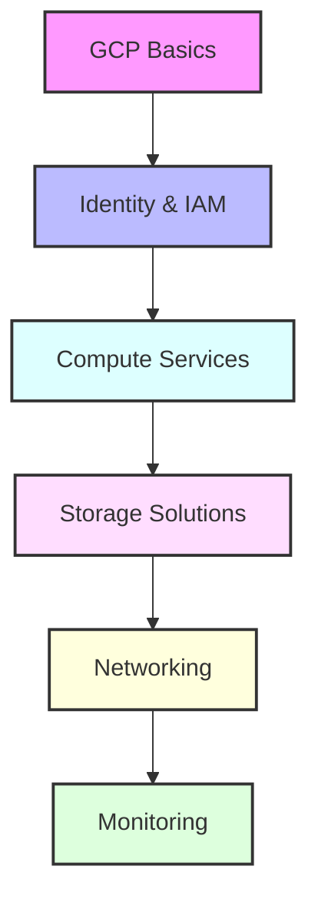

# Day 11 - Google Cloud Platform Services & Infrastructure

## Overview
Today we'll explore Google Cloud Platform services and infrastructure management. We'll cover essential services like Compute Engine, Cloud Storage, IAM, and best practices for cloud infrastructure deployment.



## Labs

### GCP Basics
1. **Lab 1 - gcloud CLI Setup**
   - Skill Area: GCP
   - Steps:
     1. Install gcloud CLI
     2. Initialize configuration
     3. Set default project
     4. Configure default region
     5. Verify authentication

2. **Lab 2 - Project Management**
   - Skill Area: GCP
   - Steps:
     1. Create project
     2. Configure billing
     3. Enable APIs
     4. Set up organization
     5. Configure resource hierarchy

3. **Lab 3 - Cloud Console**
   - Skill Area: GCP
   - Steps:
     1. Navigate console interface
     2. Use Cloud Shell
     3. Configure dashboard
     4. Access documentation
     5. Monitor activity

### Identity & IAM
4. **Lab 4 - IAM Basics**
   - Skill Area: GCP Security
   - Steps:
     1. Create service accounts
     2. Manage roles
     3. Configure permissions
     4. Set up custom roles
     5. Monitor access

5. **Lab 5 - Organization Policies**
   - Skill Area: GCP Security
   - Steps:
     1. Configure constraints
     2. Set up hierarchy
     3. Create custom policies
     4. Test enforcement
     5. Monitor compliance

### Compute Services
6. **Lab 6 - Compute Engine**
   - Skill Area: GCP Compute
   - Steps:
     1. Create VM instance
     2. Configure networking
     3. Attach disks
     4. Set up firewalls
     5. Monitor performance

7. **Lab 7 - Cloud Run**
   - Skill Area: GCP Compute
   - Steps:
     1. Create service
     2. Deploy container
     3. Configure scaling
     4. Set up domain
     5. Monitor requests

### Storage Solutions
8. **Lab 8 - Cloud Storage**
   - Skill Area: GCP Storage
   - Steps:
     1. Create bucket
     2. Configure access
     3. Set up lifecycle rules
     4. Enable versioning
     5. Monitor usage

9. **Lab 9 - Persistent Disks**
   - Skill Area: GCP Storage
   - Steps:
     1. Create disk
     2. Attach to instance
     3. Configure snapshots
     4. Set up backups
     5. Monitor performance

10. **Lab 10 - Cloud SQL**
    - Skill Area: GCP Database
    - Steps:
      1. Create instance
      2. Configure networking
      3. Set up backups
      4. Configure replication
      5. Monitor performance

### Networking
11. **Lab 11 - VPC Networks**
    - Skill Area: GCP Networking
    - Steps:
      1. Create VPC
      2. Configure subnets
      3. Set up firewall rules
      4. Configure routes
      5. Test connectivity

12. **Lab 12 - Load Balancing**
    - Skill Area: GCP Networking
    - Steps:
      1. Create load balancer
      2. Configure backend
      3. Set up health checks
      4. Configure SSL
      5. Monitor traffic

13. **Lab 13 - Cloud DNS**
    - Skill Area: GCP Networking
    - Steps:
      1. Create zone
      2. Configure records
      3. Set up policies
      4. Configure DNSSEC
      5. Monitor resolution

### Monitoring & Management
14. **Lab 14 - Cloud Monitoring**
    - Skill Area: GCP Monitoring
    - Steps:
      1. Configure workspace
      2. Create dashboards
      3. Set up alerts
      4. Configure uptime checks
      5. Monitor metrics

15. **Lab 15 - Cloud Logging**
    - Skill Area: GCP Monitoring
    - Steps:
      1. Configure log sinks
      2. Create metrics
      3. Set up exports
      4. Configure alerts
      5. Analyze logs

## Daily Cheatsheet

### gcloud Commands
```bash
# Project Management
gcloud projects create my-project
gcloud config set project my-project
gcloud services enable compute.googleapis.com

# Compute Engine
gcloud compute instances create my-instance \
    --machine-type=e2-medium \
    --zone=us-central1-a \
    --image-family=debian-10 \
    --image-project=debian-cloud

# Storage
gsutil mb gs://my-bucket
gsutil cp file.txt gs://my-bucket/
gsutil ls gs://my-bucket

# IAM
gcloud iam service-accounts create my-service-account \
    --display-name "My Service Account"
gcloud projects add-iam-policy-binding my-project \
    --member="serviceAccount:my-service-account@my-project.iam.gserviceaccount.com" \
    --role="roles/editor"
```

### Deployment Manager Template
```yaml
resources:
- name: vm-instance
  type: compute.v1.instance
  properties:
    zone: us-central1-a
    machineType: zones/us-central1-a/machineTypes/e2-medium
    disks:
    - deviceName: boot
      type: PERSISTENT
      boot: true
      autoDelete: true
      initializeParams:
        sourceImage: projects/debian-cloud/global/images/debian-10
    networkInterfaces:
    - network: global/networks/default
      accessConfigs:
      - name: External NAT
        type: ONE_TO_ONE_NAT
```

### Cloud Build Config
```yaml
steps:
- name: 'gcr.io/cloud-builders/docker'
  args: ['build', '-t', 'gcr.io/$PROJECT_ID/app', '.']
- name: 'gcr.io/cloud-builders/docker'
  args: ['push', 'gcr.io/$PROJECT_ID/app']
- name: 'gcr.io/cloud-builders/gke-deploy'
  args:
  - run
  - --filename=kubernetes.yaml
  - --location=us-central1-a
  - --cluster=my-cluster
```

### Monitoring Configuration
```yaml
# Alerting Policy
combiner: OR
conditions:
- conditionThreshold:
    aggregations:
    - alignmentPeriod: 60s
      crossSeriesReducer: REDUCE_MEAN
      perSeriesAligner: ALIGN_MEAN
    comparison: COMPARISON_GT
    duration: 300s
    filter: metric.type="compute.googleapis.com/instance/cpu/utilization"
    thresholdValue: 0.8
displayName: High CPU Usage
```

### Network Configuration
```bash
# VPC Creation
gcloud compute networks create my-network \
    --subnet-mode=custom

# Subnet Creation
gcloud compute networks subnets create my-subnet \
    --network=my-network \
    --range=10.0.0.0/24 \
    --region=us-central1

# Firewall Rules
gcloud compute firewall-rules create allow-http \
    --network=my-network \
    --allow=tcp:80 \
    --source-ranges=0.0.0.0/0 \
    --target-tags=http-server
