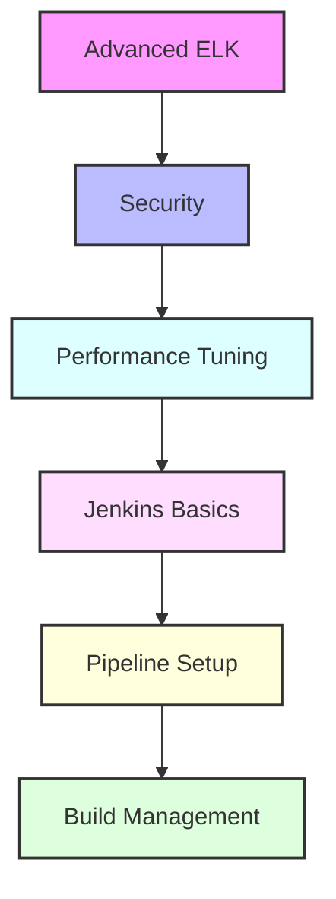

# Day 12 - Advanced ELK Stack & Jenkins Introduction

[← Previous Day](../day-11/README.md) | [Next Day →](../day-13/README.md)

## Overview
Today we'll explore advanced ELK Stack features and begin our journey into Jenkins. We'll bridge the gap between log management and continuous integration.



## Labs

### Advanced ELK Security
1. **Lab 1 - Authentication**
   - Skill Area: ELK Advanced
   - Steps:
     1. Configure users
     2. Set up roles
     3. Implement SSO
     4. Configure LDAP
     5. Test access

2. **Lab 2 - Encryption**
   - Skill Area: ELK Advanced
   - Steps:
     1. Configure TLS
     2. Set up certificates
     3. Implement node encryption
     4. Secure communications
     5. Test security

3. **Lab 3 - Role-Based Access**
   - Skill Area: ELK Advanced
   - Steps:
     1. Define roles
     2. Configure permissions
     3. Set up field security
     4. Implement audit logging
     5. Test restrictions

### Performance Optimization
4. **Lab 4 - Elasticsearch Tuning**
   - Skill Area: ELK Advanced
   - Steps:
     1. Configure heap size
     2. Optimize indexing
     3. Configure caching
     4. Tune search
     5. Monitor performance

5. **Lab 5 - Logstash Optimization**
   - Skill Area: ELK Advanced
   - Steps:
     1. Configure workers
     2. Optimize pipeline
     3. Implement batching
     4. Tune filters
     5. Monitor throughput

### Advanced Features
6. **Lab 6 - Machine Learning**
   - Skill Area: ELK Advanced
   - Steps:
     1. Configure jobs
     2. Set up anomaly detection
     3. Create forecasts
     4. Implement alerts
     5. Monitor results

7. **Lab 7 - APM Setup**
   - Skill Area: ELK Advanced
   - Steps:
     1. Install APM server
     2. Configure agents
     3. Set up instrumentation
     4. Monitor transactions
     5. Analyze performance

### Jenkins Basics
8. **Lab 8 - Jenkins Installation**
   - Skill Area: Jenkins
   - Steps:
     1. Install Jenkins
     2. Configure security
     3. Install plugins
     4. Set up users
     5. Test setup

9. **Lab 9 - Basic Jobs**
   - Skill Area: Jenkins
   - Steps:
     1. Create freestyle job
     2. Configure build steps
     3. Set up triggers
     4. Add post-build actions
     5. Test execution

10. **Lab 10 - Pipeline Basics**
    - Skill Area: Jenkins
    - Steps:
      1. Create Jenkinsfile
      2. Define stages
      3. Add steps
      4. Configure triggers
      5. Test pipeline

### Build Management
11. **Lab 11 - Source Control**
    - Skill Area: Jenkins
    - Steps:
      1. Configure Git
      2. Set up webhooks
      3. Manage credentials
      4. Configure branches
      5. Test integration

12. **Lab 12 - Build Tools**
    - Skill Area: Jenkins
    - Steps:
      1. Configure Maven
      2. Set up Gradle
      3. Install Node.js
      4. Configure Docker
      5. Test builds

### Jenkins Security
13. **Lab 13 - Authentication**
    - Skill Area: Jenkins
    - Steps:
      1. Configure users
      2. Set up roles
      3. Implement LDAP
      4. Configure SSO
      5. Test access

14. **Lab 14 - Authorization**
    - Skill Area: Jenkins
    - Steps:
      1. Configure permissions
      2. Set up project roles
      3. Implement matrix
      4. Configure folders
      5. Test restrictions

15. **Lab 15 - Agents Setup**
    - Skill Area: Jenkins
    - Steps:
      1. Configure agents
      2. Set up labels
      3. Manage connections
      4. Configure tools
      5. Test distribution

## Daily Cheatsheet

### Elasticsearch Security
```yaml
# elasticsearch.yml
xpack.security.enabled: true
xpack.security.transport.ssl.enabled: true
xpack.security.transport.ssl.verification_mode: certificate
xpack.security.transport.ssl.keystore.path: elastic-certificates.p12
xpack.security.transport.ssl.truststore.path: elastic-certificates.p12
```

### Logstash Performance
```ruby
# logstash.conf
input {
  beats {
    port => 5044
    client_inactivity_timeout => 60
    # Optimize worker settings
    workers => 2
    batch_size => 125
  }
}

filter {
  # Use conditional processing
  if [type] == "apache" {
    grok {
      match => { "message" => "%{COMBINEDAPACHELOG}" }
      patterns_dir => ["/etc/logstash/patterns"]
      tag_on_failure => ["_grokparsefailure"]
    }
  }
}

output {
  elasticsearch {
    hosts => ["localhost:9200"]
    index => "logstash-%{+YYYY.MM.dd}"
    # Optimize bulk settings
    bulk_size => 5000
    flush_size => 100
  }
}
```

### Jenkins Pipeline
```groovy
// Jenkinsfile
pipeline {
    agent any
    
    environment {
        MAVEN_HOME = tool 'Maven 3.8.4'
        PATH = "${MAVEN_HOME}/bin:${env.PATH}"
    }
    
    stages {
        stage('Checkout') {
            steps {
                git 'https://github.com/user/repo.git'
            }
        }
        
        stage('Build') {
            steps {
                sh 'mvn clean package'
            }
        }
        
        stage('Test') {
            steps {
                sh 'mvn test'
            }
            post {
                always {
                    junit '**/target/surefire-reports/*.xml'
                }
            }
        }
        
        stage('Deploy') {
            steps {
                sh './deploy.sh'
            }
        }
    }
    
    post {
        success {
            emailext body: 'Build successful!',
                     subject: 'Build Status',
                     to: 'team@example.com'
        }
    }
}
```

### Jenkins Security Configuration
```groovy
// security.groovy
import jenkins.model.*
import hudson.security.*
import jenkins.security.s2m.AdminWhitelistRule

def instance = Jenkins.getInstance()

def hudsonRealm = new HudsonPrivateSecurityRealm(false)
hudsonRealm.createAccount("admin", "password")
instance.setSecurityRealm(hudsonRealm)

def strategy = new ProjectMatrixAuthorizationStrategy()
strategy.add(Jenkins.ADMINISTER, "admin")
instance.setAuthorizationStrategy(strategy)

instance.save()
```

### ELK Machine Learning
```json
{
  "job_id": "abnormal_response_time",
  "description": "Detect abnormal response times",
  "analysis_config": {
    "bucket_span": "15m",
    "detectors": [
      {
        "function": "mean",
        "field_name": "response_time",
        "detector_description": "mean response time"
      }
    ],
    "influencers": ["host", "service"]
  },
  "data_description": {
    "time_field": "@timestamp",
    "time_format": "epoch_ms"
  }
}
```

## Additional Resources

- [Elastic Security Guide](https://www.elastic.co/guide/en/elasticsearch/reference/current/secure-cluster.html)
- [Logstash Performance Tuning](https://www.elastic.co/guide/en/logstash/current/performance-troubleshooting.html)
- [Jenkins Pipeline Documentation](https://www.jenkins.io/doc/book/pipeline/)
- [Jenkins Security Best Practices](https://www.jenkins.io/doc/book/security/)
- [Elastic Machine Learning](https://www.elastic.co/guide/en/machine-learning/current/ml-overview.html)
- [DevOps Glossary](../../cheatsheets/devops_glossary.md)

[← Previous Day](../day-11/README.md) | [Next Day →](../day-13/README.md)
