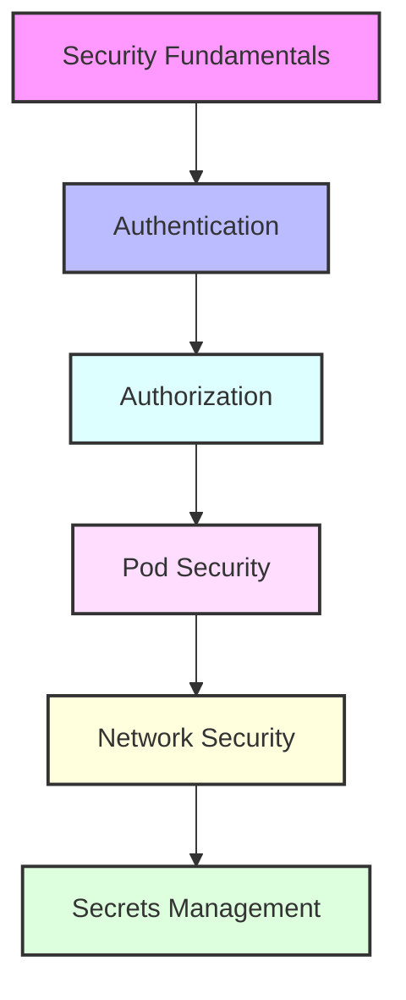

# Day 12 - Advanced Kubernetes Security

## Overview
Today we'll focus on advanced Kubernetes security concepts and best practices. We'll cover security policies, authentication, authorization, and network security in Kubernetes environments.



## Labs

### Security Fundamentals
1. **Lab 1 - Security Context**
   - Skill Area: Kubernetes Security
   - Steps:
     1. Configure pod security context
     2. Set container privileges
     3. Configure user/group settings
     4. Set filesystem permissions
     5. Test security constraints

2. **Lab 2 - Pod Security Standards**
   - Skill Area: Kubernetes Security
   - Steps:
     1. Implement privileged policy
     2. Configure baseline policy
     3. Set up restricted policy
     4. Test pod deployments
     5. Monitor violations

3. **Lab 3 - Security Benchmarks**
   - Skill Area: Kubernetes Security
   - Steps:
     1. Run CIS benchmarks
     2. Analyze results
     3. Implement recommendations
     4. Configure compliance
     5. Monitor security posture

### Authentication & Authorization
4. **Lab 4 - Certificate Management**
   - Skill Area: Kubernetes Security
   - Steps:
     1. Create certificates
     2. Configure CA
     3. Manage certificate rotation
     4. Set up auto-renewal
     5. Monitor certificate expiry

5. **Lab 5 - Advanced RBAC**
   - Skill Area: Kubernetes Security
   - Steps:
     1. Create custom roles
     2. Configure aggregated roles
     3. Set up role bindings
     4. Implement best practices
     5. Audit role usage

### Pod Security
6. **Lab 6 - Container Hardening**
   - Skill Area: Kubernetes Security
   - Steps:
     1. Configure security profiles
     2. Implement seccomp
     3. Set up AppArmor
     4. Configure SELinux
     5. Test security measures

7. **Lab 7 - Runtime Security**
   - Skill Area: Kubernetes Security
   - Steps:
     1. Configure runtime class
     2. Implement sandboxing
     3. Set up monitoring
     4. Configure alerts
     5. Handle violations

### Network Security
8. **Lab 8 - Network Policies**
   - Skill Area: Kubernetes Security
   - Steps:
     1. Create default policies
     2. Configure ingress rules
     3. Set up egress rules
     4. Implement microsegmentation
     5. Monitor traffic

9. **Lab 9 - Service Mesh Security**
   - Skill Area: Kubernetes Security
   - Steps:
     1. Install service mesh
     2. Configure mTLS
     3. Set up access policies
     4. Implement authorization
     5. Monitor connections

10. **Lab 10 - DNS Security**
    - Skill Area: Kubernetes Security
    - Steps:
      1. Configure CoreDNS
      2. Implement DNSSEC
      3. Set up policies
      4. Configure monitoring
      5. Handle DNS attacks

### Advanced Security
11. **Lab 11 - Secrets Management**
    - Skill Area: Kubernetes Security
    - Steps:
      1. Configure encryption
      2. Implement key rotation
      3. Set up external secrets
      4. Manage access control
      5. Monitor usage

12. **Lab 12 - Image Security**
    - Skill Area: Kubernetes Security
    - Steps:
      1. Configure registry auth
      2. Implement scanning
      3. Set up signing
      4. Configure policies
      5. Monitor compliance

13. **Lab 13 - Audit Logging**
    - Skill Area: Kubernetes Security
    - Steps:
      1. Configure audit policy
      2. Set up log collection
      3. Implement analysis
      4. Create alerts
      5. Monitor events

### Security Monitoring
14. **Lab 14 - Security Monitoring**
    - Skill Area: Kubernetes Security
    - Steps:
      1. Set up monitoring stack
      2. Configure alerts
      3. Implement dashboards
      4. Create playbooks
      5. Handle incidents

15. **Lab 15 - Threat Detection**
    - Skill Area: Kubernetes Security
    - Steps:
      1. Configure detection rules
      2. Implement scanning
      3. Set up response
      4. Create workflows
      5. Monitor threats

## Daily Cheatsheet

### Security Context
```yaml
# Pod Security Context
apiVersion: v1
kind: Pod
metadata:
  name: security-context-demo
spec:
  securityContext:
    runAsUser: 1000
    runAsGroup: 3000
    fsGroup: 2000
  containers:
  - name: sec-ctx-demo
    image: busybox
    command: [ "sh", "-c", "sleep 1h" ]
    securityContext:
      allowPrivilegeEscalation: false
      capabilities:
        drop:
          - ALL
```

### Network Policies
```yaml
# Default Deny Policy
apiVersion: networking.k8s.io/v1
kind: NetworkPolicy
metadata:
  name: default-deny
spec:
  podSelector: {}
  policyTypes:
  - Ingress
  - Egress

# Allow Specific Traffic
apiVersion: networking.k8s.io/v1
kind: NetworkPolicy
metadata:
  name: allow-frontend
spec:
  podSelector:
    matchLabels:
      app: backend
  policyTypes:
  - Ingress
  ingress:
  - from:
    - podSelector:
        matchLabels:
          app: frontend
    ports:
    - protocol: TCP
      port: 80
```

### RBAC Configuration
```yaml
# Custom Role
apiVersion: rbac.authorization.k8s.io/v1
kind: Role
metadata:
  namespace: default
  name: pod-reader
rules:
- apiGroups: [""]
  resources: ["pods"]
  verbs: ["get", "list", "watch"]

# Role Binding
apiVersion: rbac.authorization.k8s.io/v1
kind: RoleBinding
metadata:
  name: read-pods
  namespace: default
subjects:
- kind: User
  name: jane
  apiGroup: rbac.authorization.k8s.io
roleRef:
  kind: Role
  name: pod-reader
  apiGroup: rbac.authorization.k8s.io
```

### Audit Policy
```yaml
apiVersion: audit.k8s.io/v1
kind: Policy
rules:
- level: Metadata
  resources:
  - group: ""
    resources: ["pods"]
- level: RequestResponse
  resources:
  - group: ""
    resources: ["secrets"]
  namespaces: ["kube-system"]
```

### Security Commands
```bash
# Certificate Management
kubectl get csr
kubectl certificate approve <csr-name>
kubectl certificate deny <csr-name>

# Security Context
kubectl auth can-i create pods --as=system:serviceaccount:default:myapp

# Network Policies
kubectl get networkpolicies
kubectl describe networkpolicy <policy-name>

# Pod Security
kubectl get psp
kubectl describe psp restricted

# Audit Logs
kubectl logs -n kube-system kube-apiserver-master
```

### Security Best Practices
```yaml
# Pod Security Standards
apiVersion: pod-security.kubernetes.io/v1
kind: Pod
metadata:
  name: restricted-pod
  annotations:
    pod-security.kubernetes.io/enforce: restricted
spec:
  containers:
  - name: nginx
    image: nginx:1.14.2
    securityContext:
      allowPrivilegeEscalation: false
      runAsNonRoot: true
      seccompProfile:
        type: RuntimeDefault
      capabilities:
        drop:
          - ALL

# Container Security
securityContext:
  readOnlyRootFilesystem: true
  runAsNonRoot: true
  runAsUser: 1000
  capabilities:
    drop:
      - ALL
    add:
      - NET_BIND_SERVICE
