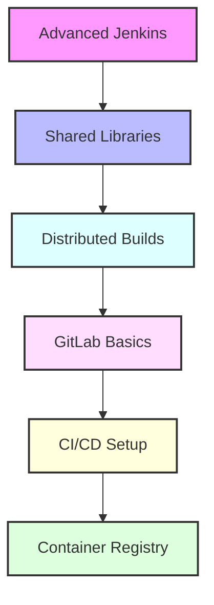

# Day 13 - Advanced Jenkins & GitLab Introduction

[← Previous Day](../day-12/README.md) | [Next Day →](../day-14/README.md)

## Overview
Today we'll explore advanced Jenkins features and begin our journey into GitLab. We'll bridge the gap between continuous integration and complete DevOps lifecycle management.



## Labs

### Advanced Jenkins Pipeline
1. **Lab 1 - Shared Libraries**
   - Skill Area: Jenkins Advanced
   - Steps:
     1. Create library structure
     2. Implement shared steps
     3. Configure global vars
     4. Version control
     5. Test integration

2. **Lab 2 - Pipeline Templates**
   - Skill Area: Jenkins Advanced
   - Steps:
     1. Create templates
     2. Define parameters
     3. Implement inheritance
     4. Configure defaults
     5. Test reusability

3. **Lab 3 - Advanced Scripting**
   - Skill Area: Jenkins Advanced
   - Steps:
     1. Write custom steps
     2. Implement error handling
     3. Create utilities
     4. Add documentation
     5. Test functionality

### Distributed Builds
4. **Lab 4 - Agent Management**
   - Skill Area: Jenkins Advanced
   - Steps:
     1. Configure cloud agents
     2. Set up Docker agents
     3. Implement auto-scaling
     4. Monitor usage
     5. Test distribution

5. **Lab 5 - Build Optimization**
   - Skill Area: Jenkins Advanced
   - Steps:
     1. Configure caching
     2. Implement artifacts
     3. Optimize resources
     4. Monitor performance
     5. Test efficiency

### Advanced Features
6. **Lab 6 - Configuration as Code**
   - Skill Area: Jenkins Advanced
   - Steps:
     1. Configure JCasC
     2. Define system config
     3. Manage credentials
     4. Version control
     5. Test deployment

7. **Lab 7 - Blue Ocean**
   - Skill Area: Jenkins Advanced
   - Steps:
     1. Configure interface
     2. Customize views
     3. Implement features
     4. Set up dashboards
     5. Test visualization

### GitLab Basics
8. **Lab 8 - GitLab Installation**
   - Skill Area: GitLab
   - Steps:
     1. Install GitLab
     2. Configure settings
     3. Set up users
     4. Configure security
     5. Test access

9. **Lab 9 - Project Management**
   - Skill Area: GitLab
   - Steps:
     1. Create projects
     2. Configure visibility
     3. Set up branches
     4. Manage permissions
     5. Test workflow

10. **Lab 10 - Issue Tracking**
    - Skill Area: GitLab
    - Steps:
      1. Create issues
      2. Configure labels
      3. Set up boards
      4. Implement milestones
      5. Test tracking

### GitLab CI/CD
11. **Lab 11 - Pipeline Setup**
    - Skill Area: GitLab
    - Steps:
      1. Create .gitlab-ci.yml
      2. Define stages
      3. Configure runners
      4. Set up caching
      5. Test execution

12. **Lab 12 - Runner Management**
    - Skill Area: GitLab
    - Steps:
      1. Install runners
      2. Configure executors
      3. Set up auto-scaling
      4. Manage tags
      5. Monitor performance

### Container Registry
13. **Lab 13 - Registry Setup**
    - Skill Area: GitLab
    - Steps:
      1. Configure registry
      2. Set up storage
      3. Manage access
      4. Configure cleanup
      5. Test functionality

14. **Lab 14 - Image Management**
    - Skill Area: GitLab
    - Steps:
      1. Push images
      2. Configure tags
      3. Implement scanning
      4. Manage cleanup
      5. Test workflow

15. **Lab 15 - Security Scanning**
    - Skill Area: GitLab
    - Steps:
      1. Configure SAST
      2. Set up container scanning
      3. Implement dependency scanning
      4. Configure reports
      5. Monitor findings

## Daily Cheatsheet

### Jenkins Shared Library
```groovy
// vars/buildMaven.groovy
def call(Map config) {
    pipeline {
        agent any
        stages {
            stage('Build') {
                steps {
                    sh "mvn -B -DskipTests clean package"
                }
            }
            stage('Test') {
                steps {
                    sh "mvn test"
                }
                post {
                    always {
                        junit '**/target/surefire-reports/*.xml'
                    }
                }
            }
        }
    }
}

// Jenkinsfile
@Library('my-shared-library') _
buildMaven()
```

### Jenkins Configuration as Code
```yaml
jenkins:
  systemMessage: "Jenkins configured automatically by Jenkins Configuration as Code"
  securityRealm:
    ldap:
      configurations:
        - server: "ldap.example.com"
          rootDN: "dc=example,dc=com"
          managerDN: "cn=admin,dc=example,dc=com"
          managerPasswordSecret: "${LDAP_PASSWORD}"
  authorizationStrategy:
    projectMatrix:
      permissions:
        - "Overall/Administer:admin"
        - "Overall/Read:authenticated"
```

### GitLab CI/CD Pipeline
```yaml
# .gitlab-ci.yml
image: node:latest

stages:
  - build
  - test
  - deploy

cache:
  paths:
    - node_modules/

build:
  stage: build
  script:
    - npm install
    - npm run build
  artifacts:
    paths:
      - dist/

test:
  stage: test
  script:
    - npm run test
  coverage: '/Coverage: \d+.\d+%/'

deploy:
  stage: deploy
  script:
    - npm run deploy
  environment:
    name: production
  only:
    - main
```

### GitLab Container Registry
```bash
# Login to registry
docker login registry.gitlab.com

# Build and tag image
docker build -t registry.gitlab.com/group/project .
docker push registry.gitlab.com/group/project

# Configure in .gitlab-ci.yml
build:
  image: docker:latest
  services:
    - docker:dind
  script:
    - docker build -t $CI_REGISTRY_IMAGE:$CI_COMMIT_SHA .
    - docker push $CI_REGISTRY_IMAGE:$CI_COMMIT_SHA
```

### GitLab Security Scanning
```yaml
# .gitlab-ci.yml
include:
  - template: Security/SAST.gitlab-ci.yml
  - template: Security/Container-Scanning.gitlab-ci.yml
  - template: Security/Dependency-Scanning.gitlab-ci.yml

variables:
  SAST_EXCLUDED_PATHS: "spec, test, tests, tmp"
  SCAN_KUBERNETES_MANIFESTS: "true"
```

## Additional Resources

- [Jenkins Shared Libraries](https://www.jenkins.io/doc/book/pipeline/shared-libraries/)
- [Jenkins Configuration as Code](https://www.jenkins.io/projects/jcasc/)
- [GitLab Documentation](https://docs.gitlab.com/)
- [GitLab CI/CD](https://docs.gitlab.com/ee/ci/)
- [GitLab Container Registry](https://docs.gitlab.com/ee/user/packages/container_registry/)
- [DevOps Glossary](../../cheatsheets/devops_glossary.md)

[← Previous Day](../day-12/README.md) | [Next Day →](../day-14/README.md)
