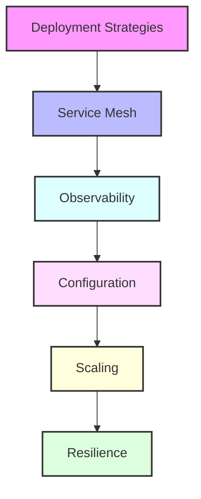

# Day 13 - Cloud-Native Application Deployment & Management

## Overview
Today we'll explore advanced cloud-native application deployment and management strategies. We'll cover modern deployment patterns, service mesh implementations, and observability solutions.



## Labs

### Deployment Strategies
1. **Lab 1 - Blue-Green Deployment**
   - Skill Area: Deployment
   - Steps:
     1. Create blue environment
     2. Deploy green version
     3. Configure routing
     4. Test new version
     5. Switch traffic

2. **Lab 2 - Canary Releases**
   - Skill Area: Deployment
   - Steps:
     1. Set up traffic splitting
     2. Configure gradual rollout
     3. Monitor metrics
     4. Adjust weights
     5. Complete migration

3. **Lab 3 - Rolling Updates**
   - Skill Area: Deployment
   - Steps:
     1. Configure update strategy
     2. Set resource constraints
     3. Implement health checks
     4. Monitor rollout
     5. Handle rollbacks

### Service Mesh
4. **Lab 4 - Istio Setup**
   - Skill Area: Service Mesh
   - Steps:
     1. Install Istio v1.25.2
     2. Configure profiles
     3. Enable injection
     4. Verify installation
     5. Test functionality

5. **Lab 5 - Traffic Management**
   - Skill Area: Service Mesh
   - Steps:
     1. Configure routing rules
     2. Set up load balancing
     3. Implement circuit breaking
     4. Configure timeouts
     5. Test resilience

### Observability
6. **Lab 6 - Distributed Tracing**
   - Skill Area: Observability
   - Steps:
     1. Set up Jaeger
     2. Instrument applications
     3. Configure sampling
     4. Analyze traces
     5. Optimize performance

7. **Lab 7 - Metrics Collection**
   - Skill Area: Observability
   - Steps:
     1. Deploy Prometheus
     2. Configure scraping
     3. Set up alerting
     4. Create dashboards
     5. Monitor SLOs

### Configuration Management
8. **Lab 8 - GitOps Workflow**
   - Skill Area: Configuration
   - Steps:
     1. Set up Flux/ArgoCD
     2. Configure repositories
     3. Implement sync policies
     4. Manage secrets
     5. Monitor reconciliation

9. **Lab 9 - Config Management**
   - Skill Area: Configuration
   - Steps:
     1. Implement ConfigMaps
     2. Manage secrets
     3. Use external config
     4. Handle updates
     5. Monitor changes

10. **Lab 10 - Policy Management**
    - Skill Area: Configuration
    - Steps:
      1. Configure OPA/Gatekeeper
      2. Define policies
      3. Implement validation
      4. Test enforcement
      5. Monitor violations

### Scaling & Performance
11. **Lab 11 - Autoscaling**
    - Skill Area: Scaling
    - Steps:
      1. Configure HPA
      2. Set up VPA
      3. Implement cluster autoscaling
      4. Test scaling
      5. Monitor performance

12. **Lab 12 - Load Testing**
    - Skill Area: Performance
    - Steps:
      1. Set up test environment
      2. Configure test scenarios
      3. Run performance tests
      4. Analyze results
      5. Optimize resources

13. **Lab 13 - Resource Management**
    - Skill Area: Performance
    - Steps:
      1. Configure resource limits
      2. Set up quotas
      3. Implement QoS
      4. Monitor usage
      5. Optimize allocation

### Resilience
14. **Lab 14 - Chaos Engineering**
    - Skill Area: Resilience
    - Steps:
      1. Set up chaos mesh
      2. Define experiments
      3. Run chaos tests
      4. Analyze results
      5. Implement improvements

15. **Lab 15 - Disaster Recovery**
    - Skill Area: Resilience
    - Steps:
      1. Configure backups
      2. Set up DR environment
      3. Test recovery
      4. Document procedures
      5. Monitor recovery metrics

## Daily Cheatsheet

### Deployment Configurations
```yaml
# Blue-Green Deployment
apiVersion: v1
kind: Service
metadata:
  name: my-app
spec:
  selector:
    app: my-app
    version: blue
  ports:
  - port: 80

---
# Canary Deployment
apiVersion: networking.istio.io/v1alpha3
kind: VirtualService
metadata:
  name: my-app
spec:
  hosts:
  - my-app
  http:
  - route:
    - destination:
        host: my-app
        subset: v1
      weight: 90
    - destination:
        host: my-app
        subset: v2
      weight: 10
```

### Service Mesh Configuration
```yaml
# Istio v1.25.2 Virtual Service
apiVersion: networking.istio.io/v1alpha3
kind: VirtualService
metadata:
  name: reviews
spec:
  hosts:
  - reviews
  http:
  - match:
    - headers:
        end-user:
          exact: jason
    route:
    - destination:
        host: reviews
        subset: v2
  - route:
    - destination:
        host: reviews
        subset: v1

# Circuit Breaker
apiVersion: networking.istio.io/v1alpha3
kind: DestinationRule
metadata:
  name: reviews
spec:
  host: reviews
  trafficPolicy:
    outlierDetection:
      consecutiveErrors: 3
      interval: 30s
      baseEjectionTime: 30s
```

### Observability Configuration
```yaml
# Prometheus Rules
groups:
- name: example
  rules:
  - alert: HighErrorRate
    expr: rate(http_requests_total{status=~"5.."}[5m]) > 1
    for: 10m
    labels:
      severity: page
    annotations:
      summary: High error rate detected

# Jaeger Configuration
apiVersion: jaegertracing.io/v1
kind: Jaeger
metadata:
  name: jaeger
spec:
  strategy: production
  storage:
    type: elasticsearch
    options:
      es:
        server-urls: http://elasticsearch:9200
```

### GitOps Configuration
```yaml
# Flux Source
apiVersion: source.toolkit.fluxcd.io/v1beta1
kind: GitRepository
metadata:
  name: app-repo
spec:
  interval: 1m
  url: https://github.com/org/repo
  ref:
    branch: main

# ArgoCD Application
apiVersion: argoproj.io/v1alpha1
kind: Application
metadata:
  name: my-app
spec:
  project: default
  source:
    repoURL: https://github.com/org/repo
    targetRevision: HEAD
    path: k8s
  destination:
    server: https://kubernetes.default.svc
    namespace: default
```

### Scaling Configuration
```yaml
# Horizontal Pod Autoscaler
apiVersion: autoscaling/v2
kind: HorizontalPodAutoscaler
metadata:
  name: my-app
spec:
  scaleTargetRef:
    apiVersion: apps/v1
    kind: Deployment
    name: my-app
  minReplicas: 1
  maxReplicas: 10
  metrics:
  - type: Resource
    resource:
      name: cpu
      target:
        type: Utilization
        averageUtilization: 50

# Vertical Pod Autoscaler
apiVersion: autoscaling.k8s.io/v1
kind: VerticalPodAutoscaler
metadata:
  name: my-app
spec:
  targetRef:
    apiVersion: "apps/v1"
    kind: Deployment
    name: my-app
  updatePolicy:
    updateMode: "Auto"
