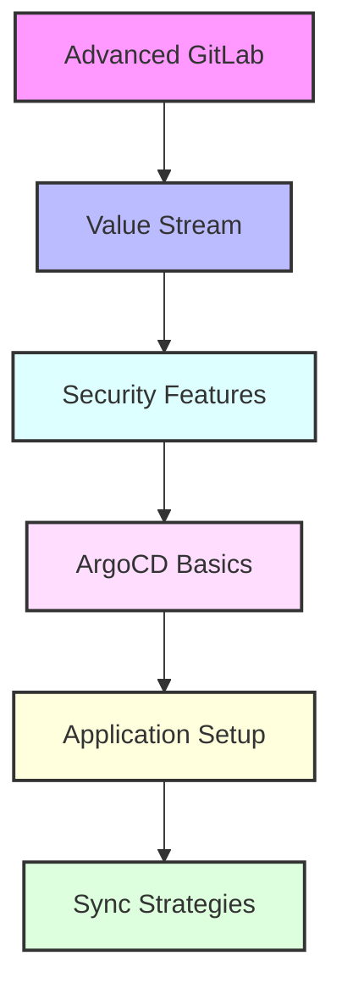

# Day 14 - Advanced GitLab & ArgoCD Introduction

[← Previous Day](../day-13/README.md) | [Next Day →](../day-15/README.md)

## Overview
Today we'll explore advanced GitLab features and begin our journey into ArgoCD. We'll bridge the gap between DevOps platform and GitOps practices.



## Labs

### Advanced GitLab Features
1. **Lab 1 - Value Stream Analytics**
   - Skill Area: GitLab Advanced
   - Steps:
     1. Configure metrics
     2. Set up stages
     3. Track cycle time
     4. Analyze bottlenecks
     5. Generate reports

2. **Lab 2 - Code Quality**
   - Skill Area: GitLab Advanced
   - Steps:
     1. Configure analyzers
     2. Set up rules
     3. Monitor trends
     4. Review reports
     5. Implement fixes

3. **Lab 3 - Auto DevOps**
   - Skill Area: GitLab Advanced
   - Steps:
     1. Enable Auto DevOps
     2. Configure templates
     3. Set up environments
     4. Monitor pipelines
     5. Test deployment

### Security Features
4. **Lab 4 - Security Dashboard**
   - Skill Area: GitLab Advanced
   - Steps:
     1. Configure scanners
     2. Set up policies
     3. Review findings
     4. Track remediation
     5. Generate reports

5. **Lab 5 - Compliance**
   - Skill Area: GitLab Advanced
   - Steps:
     1. Configure frameworks
     2. Set up audit events
     3. Monitor compliance
     4. Generate reports
     5. Review findings

### Advanced CI/CD
6. **Lab 6 - Multi-Project Pipelines**
   - Skill Area: GitLab Advanced
   - Steps:
     1. Configure triggers
     2. Set up dependencies
     3. Manage artifacts
     4. Monitor execution
     5. Test workflow

7. **Lab 7 - Review Apps**
   - Skill Area: GitLab Advanced
   - Steps:
     1. Configure environments
     2. Set up dynamic apps
     3. Manage cleanup
     4. Monitor usage
     5. Test functionality

### ArgoCD Basics
8. **Lab 8 - ArgoCD Installation**
   - Skill Area: ArgoCD
   - Steps:
     1. Install ArgoCD
     2. Configure server
     3. Set up CLI
     4. Configure RBAC
     5. Test access

9. **Lab 9 - Basic Operations**
   - Skill Area: ArgoCD
   - Steps:
     1. Create application
     2. Configure sync
     3. Monitor health
     4. Manage rollbacks
     5. Test workflow

10. **Lab 10 - Repository Setup**
    - Skill Area: ArgoCD
    - Steps:
      1. Configure repositories
      2. Set up credentials
      3. Manage access
      4. Monitor status
      5. Test connectivity

### Application Management
11. **Lab 11 - Application Sets**
    - Skill Area: ArgoCD
    - Steps:
      1. Create ApplicationSet
      2. Configure generators
      3. Set up templates
      4. Monitor deployment
      5. Test scaling

12. **Lab 12 - Sync Strategies**
    - Skill Area: ArgoCD
    - Steps:
      1. Configure auto-sync
      2. Set up pruning
      3. Manage force sync
      4. Configure retry
      5. Test scenarios

### Advanced Features
13. **Lab 13 - Resource Hooks**
    - Skill Area: ArgoCD
    - Steps:
      1. Configure PreSync
      2. Set up PostSync
      3. Implement SyncFail
      4. Test execution
      5. Monitor results

14. **Lab 14 - SSO Integration**
    - Skill Area: ArgoCD
    - Steps:
      1. Configure OIDC
      2. Set up groups
      3. Manage roles
      4. Test authentication
      5. Monitor access

15. **Lab 15 - Monitoring Setup**
    - Skill Area: ArgoCD
    - Steps:
      1. Configure metrics
      2. Set up dashboards
      3. Implement alerts
      4. Monitor health
      5. Test notifications

## Daily Cheatsheet

### GitLab Advanced Configuration
```yaml
# .gitlab-ci.yml with Code Quality
include:
  - template: Code-Quality.gitlab-ci.yml
  - template: Security/SAST.gitlab-ci.yml

code_quality:
  artifacts:
    reports:
      codequality: gl-code-quality-report.json

# Auto DevOps configuration
variables:
  AUTO_DEVOPS_DOMAIN: example.com
  POSTGRES_ENABLED: "false"
  AUTO_DEVOPS_BUILD_IMAGE_CNB_ENABLED: "true"
```

### GitLab Review Apps
```yaml
# .gitlab-ci.yml
review:
  stage: review
  script:
    - echo "Deploy review app"
  environment:
    name: review/$CI_COMMIT_REF_NAME
    url: https://$CI_ENVIRONMENT_SLUG.example.com
    on_stop: stop_review
  only:
    - merge_requests

stop_review:
  stage: review
  script:
    - echo "Remove review app"
  environment:
    name: review/$CI_COMMIT_REF_NAME
    action: stop
  when: manual
  only:
    - merge_requests
```

### ArgoCD Application
```yaml
# application.yaml
apiVersion: argoproj.io/v1alpha1
kind: Application
metadata:
  name: myapp
  namespace: argocd
spec:
  project: default
  source:
    repoURL: https://github.com/argoproj/argocd-example-apps.git
    targetRevision: HEAD
    path: guestbook
  destination:
    server: https://kubernetes.default.svc
    namespace: myapp
  syncPolicy:
    automated:
      prune: true
      selfHeal: true
    syncOptions:
    - CreateNamespace=true
```

### ArgoCD ApplicationSet
```yaml
# applicationset.yaml
apiVersion: argoproj.io/v1alpha1
kind: ApplicationSet
metadata:
  name: cluster-addons
spec:
  generators:
  - list:
      elements:
      - cluster: production
        url: https://kubernetes.default.svc
      - cluster: staging
        url: https://staging-cluster:6443
  template:
    metadata:
      name: '{{cluster}}-addons'
    spec:
      project: default
      source:
        repoURL: https://github.com/argoproj/argocd-example-apps.git
        targetRevision: HEAD
        path: addons
      destination:
        server: '{{url}}'
        namespace: addons
```

### ArgoCD Resource Hooks
```yaml
# hook.yaml
apiVersion: batch/v1
kind: Job
metadata:
  name: backup-job
  annotations:
    argocd.argoproj.io/hook: PreSync
    argocd.argoproj.io/hook-delete-policy: HookSucceeded
spec:
  template:
    spec:
      containers:
      - name: backup
        image: backup-tool
        command: ["backup", "--target", "database"]
      restartPolicy: Never
```

## Additional Resources

- [GitLab Value Stream Analytics](https://docs.gitlab.com/ee/user/analytics/value_stream_analytics.html)
- [GitLab Auto DevOps](https://docs.gitlab.com/ee/topics/autodevops/)
- [ArgoCD Documentation](https://argo-cd.readthedocs.io/)
- [ArgoCD Best Practices](https://argo-cd.readthedocs.io/en/stable/user-guide/best_practices/)
- [GitOps with ArgoCD](https://www.gitops.tech/)
- [DevOps Glossary](../../cheatsheets/devops_glossary.md)

[← Previous Day](../day-13/README.md) | [Next Day →](../day-15/README.md)
