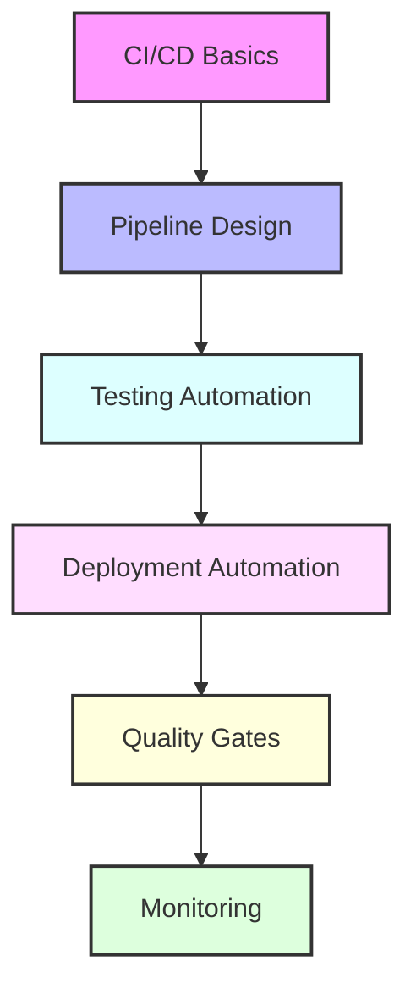

# Day 14 - DevOps Automation & CI/CD Pipelines

## Overview
Today we'll explore advanced DevOps automation and CI/CD pipeline implementations. We'll cover automated testing, deployment strategies, and comprehensive pipeline configurations across multiple platforms.



## Labs

### CI/CD Fundamentals
1. **Lab 1 - Pipeline Design**
   - Skill Area: CI/CD
   - Steps:
     1. Design pipeline stages
     2. Configure workflows
     3. Set up environments
     4. Define triggers
     5. Implement notifications

2. **Lab 2 - Source Control Integration**
   - Skill Area: CI/CD
   - Steps:
     1. Configure branch policies
     2. Set up webhooks
     3. Implement PR checks
     4. Configure merge rules
     5. Set up automation

3. **Lab 3 - Multi-Platform CI/CD**
   - Skill Area: CI/CD
   - Steps:
     1. Set up GitHub Actions
     2. Configure GitLab CI
     3. Implement Jenkins pipeline
     4. Set up Azure DevOps
     5. Test integrations

### Testing Automation
4. **Lab 4 - Unit Testing**
   - Skill Area: Testing
   - Steps:
     1. Configure test runners
     2. Set up code coverage
     3. Implement test reports
     4. Configure caching
     5. Monitor performance

5. **Lab 5 - Integration Testing**
   - Skill Area: Testing
   - Steps:
     1. Set up test environment
     2. Configure service mocks
     3. Implement API tests
     4. Set up data fixtures
     5. Monitor results

### Quality Gates
6. **Lab 6 - Code Quality**
   - Skill Area: Quality
   - Steps:
     1. Configure SonarQube
     2. Set up linting
     3. Implement security scans
     4. Configure quality gates
     5. Monitor metrics

7. **Lab 7 - Security Scanning**
   - Skill Area: Security
   - Steps:
     1. Set up SAST
     2. Configure DAST
     3. Implement dependency scanning
     4. Configure container scanning
     5. Monitor vulnerabilities

### Deployment Automation
8. **Lab 8 - Infrastructure as Code**
   - Skill Area: IaC
   - Steps:
     1. Create Terraform configs
     2. Set up state management
     3. Implement modules
     4. Configure backends
     5. Test deployments

9. **Lab 9 - Container Builds**
   - Skill Area: Containers
   - Steps:
     1. Create Dockerfiles
     2. Configure multi-stage builds
     3. Implement caching
     4. Set up registry
     5. Test builds

10. **Lab 10 - Kubernetes Deployments**
    - Skill Area: Kubernetes
    - Steps:
      1. Create manifests
      2. Configure Helm charts
      3. Set up Kustomize
      4. Implement rollouts
      5. Monitor deployments

### Advanced Automation
11. **Lab 11 - Pipeline Templates**
    - Skill Area: CI/CD
    - Steps:
      1. Create reusable templates
      2. Configure parameters
      3. Implement conditions
      4. Set up matrix builds
      5. Test variations

12. **Lab 12 - Release Management**
    - Skill Area: CI/CD
    - Steps:
      1. Configure versioning
      2. Set up changelogs
      3. Implement release notes
      4. Configure artifacts
      5. Test distribution

13. **Lab 13 - Environment Management**
    - Skill Area: CI/CD
    - Steps:
      1. Configure environments
      2. Set up approvals
      3. Implement promotions
      4. Configure secrets
      5. Test isolation

### Monitoring & Feedback
14. **Lab 14 - Pipeline Analytics**
    - Skill Area: Monitoring
    - Steps:
      1. Configure metrics
      2. Set up dashboards
      3. Implement alerts
      4. Monitor trends
      5. Optimize performance

15. **Lab 15 - Feedback Loops**
    - Skill Area: DevOps
    - Steps:
      1. Configure notifications
      2. Set up reporting
      3. Implement feedback
      4. Monitor effectiveness
      5. Optimize processes

## Daily Cheatsheet

### GitHub Actions Workflow
```yaml
name: CI/CD Pipeline

on:
  push:
    branches: [ main ]
  pull_request:
    branches: [ main ]

jobs:
  test:
    runs-on: ubuntu-latest
    steps:
    - uses: actions/checkout@v4
    - name: Set up Node.js
      uses: actions/setup-node@v4
      with:
        node-version: '22'
    - name: Install dependencies
      run: npm ci
    - name: Run tests
      run: npm test
    - name: Upload coverage
      uses: actions/upload-artifact@v4
      with:
        name: coverage
        path: coverage/

  build:
    needs: test
    runs-on: ubuntu-latest
    steps:
    - uses: actions/checkout@v4
    - name: Build container
      run: docker build -t myapp:${{ github.sha }} .
    - name: Push to registry
      run: |
        docker tag myapp:${{ github.sha }} registry/myapp:${{ github.sha }}
        docker push registry/myapp:${{ github.sha }}
```

### GitLab CI Pipeline
```yaml
stages:
  - test
  - build
  - deploy

test:
  stage: test
  image: node:14
  script:
    - npm ci
    - npm test
  artifacts:
    reports:
      coverage: coverage/lcov.info

build:
  stage: build
  image: docker:latest
  services:
    - docker:dind
  script:
    - docker build -t $CI_REGISTRY_IMAGE:$CI_COMMIT_SHA .
    - docker push $CI_REGISTRY_IMAGE:$CI_COMMIT_SHA

deploy:
  stage: deploy
  image: bitnami/kubectl:latest
  script:
    - kubectl apply -f k8s/
```

### Jenkins Pipeline
```groovy
pipeline {
    agent any
    
    stages {
        stage('Build') {
            steps {
                sh 'npm ci'
                sh 'npm run build'
            }
        }
        
        stage('Test') {
            steps {
                sh 'npm test'
            }
            post {
                always {
                    junit 'test-results/*.xml'
                }
            }
        }
        
        stage('Deploy') {
            steps {
                sh 'kubectl apply -f k8s/'
            }
        }
    }
    
    post {
        success {
            slackSend channel: '#devops',
                      color: 'good',
                      message: "Pipeline succeeded: ${env.JOB_NAME} ${env.BUILD_NUMBER}"
        }
    }
}
```

### Azure DevOps Pipeline
```yaml
trigger:
- main

pool:
  vmImage: 'ubuntu-latest'

stages:
- stage: Build
  jobs:
  - job: Build
    steps:
    - task: NodeTool@0
      inputs:
        versionSpec: '14.x'
    - script: |
        npm ci
        npm run build
    - task: Docker@2
      inputs:
        command: 'buildAndPush'
        Dockerfile: '**/Dockerfile'
        tags: '$(Build.BuildId)'

- stage: Deploy
  jobs:
  - deployment: Deploy
    environment: 'production'
    strategy:
      runOnce:
        deploy:
          steps:
          - task: KubernetesManifest@0
            inputs:
              action: 'deploy'
              manifests: |
                k8s/deployment.yml
                k8s/service.yml
```

### Quality Gates Configuration
```yaml
# SonarQube Quality Gate
sonar.projectKey=my-project
sonar.sources=src
sonar.tests=test
sonar.coverage.exclusions=**/*.test.js
sonar.javascript.lcov.reportPaths=coverage/lcov.info

quality_gates:
  - metric: new_coverage
    op: LT
    error: 80
  - metric: new_duplicated_lines_density
    op: GT
    error: 3
```

### Deployment Configuration
```yaml
# Helm Values
image:
  repository: registry/myapp
  tag: latest
  pullPolicy: Always

resources:
  limits:
    cpu: 100m
    memory: 128Mi
  requests:
    cpu: 50m
    memory: 64Mi

# Kustomize Overlay
apiVersion: kustomize.config.k8s.io/v1beta1
kind: Kustomization
resources:
- ../base
patchesStrategicMerge:
- deployment-patch.yaml
images:
- name: myapp
  newName: registry/myapp
  newTag: latest
