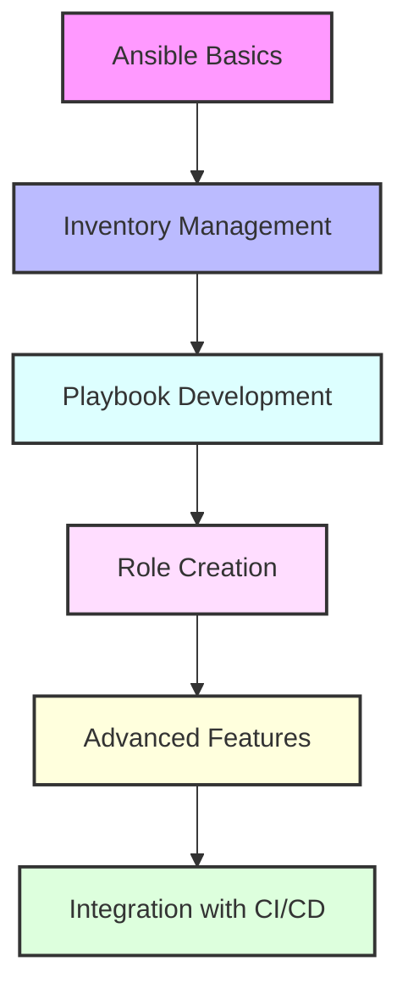

# Day 15 - Configuration Management with Ansible

[← Previous Day](../day-14/README.md) | [Next Day →](../day-16/README.md)

## Overview
Today we'll explore Ansible for configuration management and automation. We'll learn how to automate infrastructure provisioning, configuration, and application deployment using Ansible's declarative approach.



## Labs

### Ansible Basics
1. **Lab 1 - Installation and Setup**
   - Skill Area: Ansible Basics
   - Steps:
     1. Install Ansible
     2. Configure SSH keys
     3. Test connectivity
     4. Configure Ansible config
     5. Verify installation

2. **Lab 2 - Ad-hoc Commands**
   - Skill Area: Ansible Basics
   - Steps:
     1. Run simple commands
     2. Use modules
     3. Target specific hosts
     4. Use command options
     5. Understand output

3. **Lab 3 - Inventory Management**
   - Skill Area: Ansible Basics
   - Steps:
     1. Create static inventory
     2. Define host groups
     3. Set host variables
     4. Use inventory patterns
     5. Test inventory

### Playbook Development
4. **Lab 4 - Basic Playbooks**
   - Skill Area: Ansible Intermediate
   - Steps:
     1. Create first playbook
     2. Define tasks
     3. Use common modules
     4. Run playbook
     5. Verify results

5. **Lab 5 - Variables and Facts**
   - Skill Area: Ansible Intermediate
   - Steps:
     1. Define playbook variables
     2. Use variable files
     3. Gather system facts
     4. Use registered variables
     5. Implement variable precedence

### Ansible Control Flow
6. **Lab 6 - Conditionals**
   - Skill Area: Ansible Intermediate
   - Steps:
     1. Use when statements
     2. Implement multiple conditions
     3. Use boolean operators
     4. Check variable existence
     5. Test conditional logic

7. **Lab 7 - Loops and Iterations**
   - Skill Area: Ansible Intermediate
   - Steps:
     1. Use with_items
     2. Implement with_dict
     3. Use loop construct
     4. Nest loops
     5. Control loop output

### Role Development
8. **Lab 8 - Role Structure**
   - Skill Area: Ansible Advanced
   - Steps:
     1. Create role skeleton
     2. Define role components
     3. Implement tasks
     4. Configure defaults
     5. Test role

9. **Lab 9 - Role Dependencies**
   - Skill Area: Ansible Advanced
   - Steps:
     1. Define dependencies
     2. Configure requirements
     3. Install dependencies
     4. Manage versions
     5. Test dependency chain

10. **Lab 10 - Role Distribution**
    - Skill Area: Ansible Advanced
    - Steps:
      1. Package role
      2. Publish to Ansible Galaxy
      3. Install from Galaxy
      4. Version management
      5. Document role

### Advanced Features
11. **Lab 11 - Templates with Jinja2**
    - Skill Area: Ansible Advanced
    - Steps:
      1. Create templates
      2. Use variables
      3. Implement conditionals
      4. Use loops
      5. Deploy configurations

12. **Lab 12 - Vault for Secrets**
    - Skill Area: Ansible Advanced
    - Steps:
      1. Create encrypted files
      2. Manage vault password
      3. Edit encrypted content
      4. Use in playbooks
      5. Implement best practices

13. **Lab 13 - Dynamic Inventory**
    - Skill Area: Ansible Advanced
    - Steps:
      1. Configure cloud inventory
      2. Use inventory plugins
      3. Create custom inventory
      4. Filter hosts
      5. Test dynamic inventory

### Integration and Workflow
14. **Lab 14 - CI/CD Integration**
    - Skill Area: Ansible Advanced
    - Steps:
      1. Configure pipeline
      2. Implement testing
      3. Set up deployment
      4. Manage environments
      5. Monitor execution

15. **Lab 15 - Ansible with Terraform**
    - Skill Area: Ansible Advanced
    - Steps:
      1. Provision infrastructure
      2. Generate inventory
      3. Configure resources
      4. Implement workflow
      5. Test integration

## Daily Cheatsheet

### Ansible Commands
```bash
# Basic Commands
ansible --version                      # Check version
ansible all -m ping                    # Ping all hosts
ansible webservers -m command -a "uptime"  # Run command on group
ansible-playbook playbook.yml          # Run playbook
ansible-galaxy init role_name          # Create role structure

# Inventory Management
ansible-inventory --list               # List all inventory
ansible-inventory --graph              # Show inventory hierarchy
ansible-inventory --host=server1       # Show host variables

# Vault Operations
ansible-vault create secret.yml        # Create encrypted file
ansible-vault edit secret.yml          # Edit encrypted file
ansible-vault encrypt existing.yml     # Encrypt existing file
ansible-vault decrypt secret.yml       # Decrypt file
ansible-playbook --ask-vault-pass playbook.yml  # Run with vault password
```

### Playbook Example
```yaml
---
- name: Configure web servers
  hosts: webservers
  become: true
  vars:
    http_port: 80
    max_clients: 200
  
  tasks:
    - name: Install Apache
      apt:
        name: apache2
        state: present
        update_cache: yes
      
    - name: Start Apache service
      service:
        name: apache2
        state: started
        enabled: yes
      
    - name: Deploy configuration
      template:
        src: templates/httpd.conf.j2
        dest: /etc/apache2/httpd.conf
      notify: Restart Apache
      
  handlers:
    - name: Restart Apache
      service:
        name: apache2
        state: restarted
```

### Role Structure
```
roles/
└── webserver/
    ├── defaults/       # Default variables
    │   └── main.yml
    ├── files/          # Static files
    ├── handlers/       # Handlers
    │   └── main.yml
    ├── meta/           # Role metadata
    │   └── main.yml
    ├── tasks/          # Tasks
    │   └── main.yml
    ├── templates/      # Jinja2 templates
    └── vars/           # Role variables
        └── main.yml
```

### Inventory Example
```ini
# Static Inventory
[webservers]
web1.example.com
web2.example.com

[dbservers]
db1.example.com
db2.example.com

[production:children]
webservers
dbservers

[webservers:vars]
http_port=80
proxy_timeout=5
```

### Jinja2 Template Example
```jinja
# {{ ansible_managed }}
<VirtualHost *:{{ http_port }}>
    ServerAdmin webmaster@{{ ansible_domain }}
    ServerName {{ ansible_fqdn }}
    DocumentRoot /var/www/html
    
    
    SSLEngine on
    SSLCertificateFile {{ ssl_cert_file }}
    SSLCertificateKeyFile {{ ssl_key_file }}
    
    
    ErrorLog ${APACHE_LOG_DIR}/error.log
    CustomLog ${APACHE_LOG_DIR}/access.log combined
</VirtualHost>
```

## Additional Resources

- [Ansible Documentation](https://docs.ansible.com/)
- [Ansible Galaxy](https://galaxy.ansible.com/) - Community roles and collections
- [Ansible Best Practices](https://docs.ansible.com/ansible/latest/user_guide/playbooks_best_practices.html)
- [Jinja2 Documentation](https://jinja.palletsprojects.com/)
- [Ansible for DevOps](https://www.ansiblefordevops.com/) - Book by Jeff Geerling
- [DevOps Glossary](../../cheatsheets/devops_glossary.md)

[← Previous Day](../day-14/README.md) | [Next Day →](../day-16/README.md)
