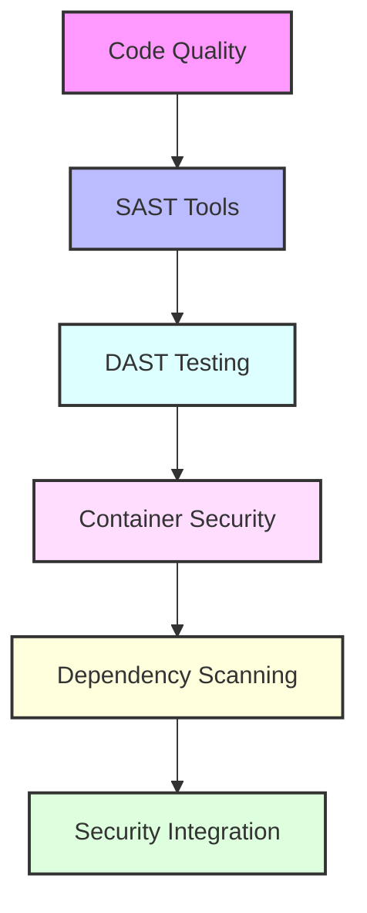

# Day 16 - DevSecOps Tools

[← Previous Day](../day-15/README.md) | [Next Day →](../day-17/README.md)

## Overview
Today we'll explore essential DevSecOps tools that help integrate security into the development lifecycle. We'll focus on code quality, security scanning, vulnerability assessment, and dependency management.



## Labs

### SonarQube for Code Quality
1. **Lab 1 - SonarQube Installation**
   - Skill Area: Code Quality
   - Steps:
     1. Install SonarQube
     2. Configure database
     3. Set up users
     4. Configure security
     5. Test installation

2. **Lab 2 - Project Analysis**
   - Skill Area: Code Quality
   - Steps:
     1. Create project
     2. Configure scanner
     3. Run analysis
     4. Review results
     5. Configure quality gates

3. **Lab 3 - Quality Profiles**
   - Skill Area: Code Quality
   - Steps:
     1. Understand default profiles
     2. Create custom profile
     3. Configure rules
     4. Assign to projects
     5. Test customizations

### Static Application Security Testing (SAST)
4. **Lab 4 - SonarQube Security Rules**
   - Skill Area: SAST
   - Steps:
     1. Enable security rules
     2. Configure severity
     3. Run security scan
     4. Analyze vulnerabilities
     5. Implement fixes

5. **Lab 5 - Custom Security Rules**
   - Skill Area: SAST
   - Steps:
     1. Create custom rules
     2. Define patterns
     3. Set severity
     4. Test effectiveness
     5. Refine rules

### Dynamic Application Security Testing (DAST)
6. **Lab 6 - OWASP ZAP Setup**
   - Skill Area: DAST
   - Steps:
     1. Install ZAP
     2. Configure proxy
     3. Set up target
     4. Configure authentication
     5. Test connection

7. **Lab 7 - Automated Scanning**
   - Skill Area: DAST
   - Steps:
     1. Configure scan policy
     2. Set up automated scan
     3. Run baseline scan
     4. Analyze results
     5. Generate reports

### Container Security
8. **Lab 8 - Trivy Installation**
   - Skill Area: Container Security
   - Steps:
     1. Install Trivy
     2. Configure settings
     3. Update database
     4. Test scanning
     5. Understand output

9. **Lab 9 - Container Scanning**
   - Skill Area: Container Security
   - Steps:
     1. Scan local images
     2. Scan registry images
     3. Analyze vulnerabilities
     4. Implement fixes
     5. Verify remediation

10. **Lab 10 - Clair Integration**
    - Skill Area: Container Security
    - Steps:
      1. Set up Clair
      2. Configure database
      3. Connect to registry
      4. Run vulnerability scan
      5. Compare with Trivy

### Dependency Scanning
11. **Lab 11 - Snyk Setup**
    - Skill Area: Dependency Security
    - Steps:
      1. Create Snyk account
      2. Install CLI
      3. Configure authentication
      4. Test connection
      5. Understand features

12. **Lab 12 - Dependency Scanning**
    - Skill Area: Dependency Security
    - Steps:
      1. Scan project dependencies
      2. Analyze vulnerabilities
      3. Understand severity
      4. Implement fixes
      5. Verify remediation

### CI/CD Security Integration
13. **Lab 13 - GitHub Actions Integration**
    - Skill Area: DevSecOps Integration
    - Steps:
      1. Configure SonarQube action
      2. Set up Trivy scanning
      3. Implement Snyk checks
      4. Configure ZAP testing
      5. Test workflow

14. **Lab 14 - Jenkins Integration**
    - Skill Area: DevSecOps Integration
    - Steps:
      1. Install security plugins
      2. Configure SonarQube scanner
      3. Set up container scanning
      4. Implement dependency checks
      5. Test pipeline

15. **Lab 15 - Security Gates**
    - Skill Area: DevSecOps Integration
    - Steps:
      1. Define quality gates
      2. Configure thresholds
      3. Implement blocking
      4. Test failure scenarios
      5. Configure notifications

## Daily Cheatsheet

### SonarQube Commands
```bash
# Scanner Commands
sonar-scanner \
  -Dsonar.projectKey=my-project \
  -Dsonar.sources=. \
  -Dsonar.host.url=http://localhost:9000 \
  -Dsonar.login=myauthtoken

# Docker Setup
docker run -d --name sonarqube \
  -p 9000:9000 \
  -v sonarqube_data:/opt/sonarqube/data \
  sonarqube:latest

# API Calls
curl -u admin:admin http://localhost:9000/api/projects/search
curl -u admin:admin http://localhost:9000/api/qualitygates/project_status?projectKey=my-project
```

### OWASP ZAP Commands
```bash
# CLI Mode
zap-cli quick-scan --self-contained \
  --start-options "-config api.disablekey=true" \
  https://example.com

# Docker Usage
docker run -t owasp/zap2docker-stable zap-baseline.py \
  -t https://example.com -g gen.conf -r report.html

# API Scan
docker run -t owasp/zap2docker-stable zap-api-scan.py \
  -t https://example.com/api/v1/swagger.json -f openapi \
  -r api-report.html
```

### Trivy Commands
```bash
# Image Scanning
trivy image nginx:latest
trivy image --severity HIGH,CRITICAL nginx:latest
trivy image --format json --output results.json nginx:latest

# Filesystem Scanning
trivy fs --security-checks vuln,config /path/to/project

# Git Repository Scanning
trivy repo https://github.com/user/repo

# Container Scanning
trivy container --rm -t high nginx:latest
```

### Snyk Commands
```bash
# Authentication
snyk auth

# Vulnerability Scanning
snyk test                           # Test current project
snyk test --all-projects           # Test all projects
snyk test --docker nginx:latest    # Test Docker image
snyk test --file=requirements.txt  # Test specific file

# Monitoring
snyk monitor                       # Monitor current project
snyk monitor --docker nginx:latest # Monitor Docker image

# Fix Vulnerabilities
snyk wizard                        # Interactive wizard
snyk fix                          # Auto-fix vulnerabilities
```

### CI/CD Integration Examples
```yaml
# GitHub Actions Example
name: Security Scan

on:
  push:
    branches: [ main ]
  pull_request:
    branches: [ main ]

jobs:
  security:
    runs-on: ubuntu-latest
    steps:
      - uses: actions/checkout@v4
        with:
          fetch-depth: 0
      
      - name: SonarQube Scan
        uses: SonarSource/sonarqube-scan-action@master
        env:
          SONAR_TOKEN: ${{ secrets.SONAR_TOKEN }}
          SONAR_HOST_URL: ${{ secrets.SONAR_HOST_URL }}
      
      - name: Trivy Scan
        uses: aquasecurity/trivy-action@master
        with:
          image-ref: 'my-image:latest'
          format: 'sarif'
          output: 'trivy-results.sarif'
      
      - name: Snyk Scan
        uses: snyk/actions/node@master
        env:
          SNYK_TOKEN: ${{ secrets.SNYK_TOKEN }}
```

### Jenkins Pipeline Example
```groovy
pipeline {
    agent any
    
    stages {
        stage('Checkout') {
            steps {
                checkout scm
            }
        }
        
        stage('SonarQube Analysis') {
            steps {
                withSonarQubeEnv('SonarQube') {
                    sh 'sonar-scanner'
                }
            }
        }
        
        stage('Container Scan') {
            steps {
                sh 'trivy image --severity HIGH,CRITICAL my-image:latest'
            }
        }
        
        stage('Dependency Scan') {
            steps {
                withCredentials([string(credentialsId: 'snyk-token', variable: 'SNYK_TOKEN')]) {
                    sh 'snyk test'
                }
            }
        }
        
        stage('DAST Testing') {
            steps {
                sh 'docker run -t owasp/zap2docker-stable zap-baseline.py -t https://example.com -r zap-report.html'
            }
        }
    }
    
    post {
        always {
            archiveArtifacts artifacts: '**/zap-report.html', allowEmptyArchive: true
            publishHTML([
                allowMissing: true,
                alwaysLinkToLastBuild: true,
                keepAll: true,
                reportDir: '.',
                reportFiles: 'zap-report.html',
                reportName: 'ZAP Report'
            ])
        }
    }
}
```

## Additional Resources

- [SonarQube Documentation](https://docs.sonarqube.org/)
- [OWASP ZAP Documentation](https://www.zaproxy.org/docs/)
- [Trivy Documentation](https://aquasecurity.github.io/trivy/)
- [Snyk Documentation](https://docs.snyk.io/)
- [OWASP Top 10](https://owasp.org/www-project-top-ten/)
- [DevSecOps Best Practices](https://www.synopsys.com/blogs/software-security/devsecops-best-practices/)
- [DevOps Glossary](../../cheatsheets/devops_glossary.md)

[← Previous Day](../day-15/README.md) | [Next Day →](../day-17/README.md)
