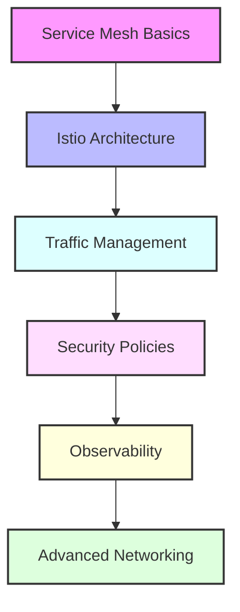

# Day 17 - Service Mesh & Advanced Networking

[← Previous Day](../day-16/README.md) | [Next Day →](../day-18/README.md)

## Overview
Today we'll explore service mesh technologies and advanced networking for cloud-native applications. We'll focus on Istio for implementing traffic management, security, and observability in microservices architectures.



## Labs

### Service Mesh Fundamentals
1. **Lab 1 - Service Mesh Concepts**
   - Skill Area: Service Mesh
   - Steps:
     1. Understand service mesh architecture
     2. Compare service mesh solutions
     3. Identify use cases
     4. Evaluate benefits and challenges
     5. Plan implementation strategy

2. **Lab 2 - Istio Installation**
   - Skill Area: Service Mesh
   - Steps:
     1. Set up Kubernetes cluster
     2. Install istioctl
     3. Deploy Istio control plane
     4. Configure profiles
     5. Verify installation

3. **Lab 3 - Sidecar Injection**
   - Skill Area: Service Mesh
   - Steps:
     1. Enable namespace injection
     2. Configure manual injection
     3. Deploy sample application
     4. Verify proxy injection
     5. Troubleshoot common issues

### Traffic Management
4. **Lab 4 - Virtual Services**
   - Skill Area: Traffic Management
   - Steps:
     1. Create virtual service
     2. Configure routes
     3. Implement host matching
     4. Set up URI matching
     5. Test routing rules

5. **Lab 5 - Destination Rules**
   - Skill Area: Traffic Management
   - Steps:
     1. Define subsets
     2. Configure load balancing
     3. Set up connection pools
     4. Implement outlier detection
     5. Test traffic distribution

### Advanced Routing
6. **Lab 6 - Traffic Splitting**
   - Skill Area: Traffic Management
   - Steps:
     1. Configure weighted routing
     2. Implement canary deployments
     3. Set up A/B testing
     4. Monitor traffic distribution
     5. Implement progressive delivery

7. **Lab 7 - Fault Injection**
   - Skill Area: Traffic Management
   - Steps:
     1. Inject delays
     2. Simulate errors
     3. Configure abort rules
     4. Test resilience
     5. Analyze application behavior

### Security
8. **Lab 8 - mTLS Setup**
   - Skill Area: Service Mesh Security
   - Steps:
     1. Configure mTLS policy
     2. Set up strict mode
     3. Implement permissive mode
     4. Verify encryption
     5. Troubleshoot certificate issues

9. **Lab 9 - Authorization Policies**
   - Skill Area: Service Mesh Security
   - Steps:
     1. Create authorization policy
     2. Configure RBAC
     3. Implement namespace restrictions
     4. Set up path-based access
     5. Test policy enforcement

10. **Lab 10 - JWT Authentication**
    - Skill Area: Service Mesh Security
    - Steps:
      1. Configure request authentication
      2. Set up JWT validation
      3. Define issuers
      4. Implement audience validation
      5. Test authentication flow

### Observability
11. **Lab 11 - Metrics Collection**
    - Skill Area: Service Mesh Observability
    - Steps:
      1. Configure Prometheus
      2. Set up metrics collection
      3. Define custom metrics
      4. Implement service-level metrics
      5. Test metrics pipeline

12. **Lab 12 - Distributed Tracing**
    - Skill Area: Service Mesh Observability
    - Steps:
      1. Set up Jaeger
      2. Configure trace sampling
      3. Implement trace context propagation
      4. Analyze trace data
      5. Troubleshoot latency issues

13. **Lab 13 - Visualization with Kiali**
    - Skill Area: Service Mesh Observability
    - Steps:
      1. Install Kiali
      2. Configure service graph
      3. Analyze traffic flows
      4. Monitor health
      5. Implement dashboards

### Advanced Networking
14. **Lab 14 - Ingress Gateway**
    - Skill Area: Service Mesh Networking
    - Steps:
      1. Configure Istio gateway
      2. Set up TLS termination
      3. Implement path routing
      4. Configure host routing
      5. Test external access

15. **Lab 15 - Egress Control**
    - Skill Area: Service Mesh Networking
    - Steps:
      1. Configure service entries
      2. Set up egress gateway
      3. Implement TLS origination
      4. Control external access
      5. Monitor outbound traffic

## Daily Cheatsheet

### Istio Installation
```bash
# Install Istio CLI
curl -L https://istio.io/downloadIstio | sh -
cd istio-1.20.0
export PATH=$PWD/bin:$PATH

# Install Istio Core
istioctl install --set profile=demo -y

# Enable Injection
kubectl label namespace default istio-injection=enabled

# Verify Installation
istioctl verify-install
kubectl get pods -n istio-system
```

### Traffic Management
```yaml
# Virtual Service
apiVersion: networking.istio.io/v1alpha3
kind: VirtualService
metadata:
  name: reviews
spec:
  hosts:
  - reviews
  http:
  - match:
    - headers:
        end-user:
          exact: jason
    route:
    - destination:
        host: reviews
        subset: v2
  - route:
    - destination:
        host: reviews
        subset: v1

# Destination Rule
apiVersion: networking.istio.io/v1alpha3
kind: DestinationRule
metadata:
  name: reviews
spec:
  host: reviews
  trafficPolicy:
    loadBalancer:
      simple: RANDOM
  subsets:
  - name: v1
    labels:
      version: v1
  - name: v2
    labels:
      version: v2
    trafficPolicy:
      loadBalancer:
        simple: ROUND_ROBIN
```

### Security Configuration
```yaml
# PeerAuthentication (mTLS)
apiVersion: security.istio.io/v1beta1
kind: PeerAuthentication
metadata:
  name: default
  namespace: istio-system
spec:
  mtls:
    mode: STRICT

# Authorization Policy
apiVersion: security.istio.io/v1beta1
kind: AuthorizationPolicy
metadata:
  name: httpbin
  namespace: default
spec:
  selector:
    matchLabels:
      app: httpbin
  rules:
  - from:
    - source:
        principals: ["cluster.local/ns/default/sa/sleep"]
    to:
    - operation:
        methods: ["GET"]
        paths: ["/info*"]
```

### Gateway Configuration
```yaml
# Gateway
apiVersion: networking.istio.io/v1alpha3
kind: Gateway
metadata:
  name: bookinfo-gateway
spec:
  selector:
    istio: ingressgateway
  servers:
  - port:
      number: 80
      name: http
      protocol: HTTP
    hosts:
    - "bookinfo.example.com"

# VirtualService with Gateway
apiVersion: networking.istio.io/v1alpha3
kind: VirtualService
metadata:
  name: bookinfo
spec:
  hosts:
  - "bookinfo.example.com"
  gateways:
  - bookinfo-gateway
  http:
  - match:
    - uri:
        prefix: /productpage
    route:
    - destination:
        host: productpage
        port:
          number: 9080
```

### Observability Setup
```yaml
# Prometheus Configuration
apiVersion: telemetry.istio.io/v1alpha1
kind: Telemetry
metadata:
  name: mesh-default
  namespace: istio-system
spec:
  metrics:
  - providers:
    - name: prometheus
    overrides:
    - match:
        metric: REQUEST_COUNT
        mode: CLIENT_AND_SERVER
      disabled: false

# Jaeger Configuration
apiVersion: install.istio.io/v1alpha1
kind: IstioOperator
spec:
  addonComponents:
    tracing:
      enabled: true
  values:
    global:
      tracer:
        zipkin:
          address: jaeger-collector.observability:9411
```

### Istio CLI Commands
```bash
# Istio Status
istioctl proxy-status
istioctl analyze

# Debugging
istioctl proxy-config clusters <pod-name>
istioctl proxy-config routes <pod-name>
istioctl proxy-config endpoints <pod-name>
istioctl proxy-config listeners <pod-name>

# Validation
istioctl validate -f virtual-service.yaml
istioctl experimental describe service <service-name>

# Dashboard Access
istioctl dashboard kiali
istioctl dashboard jaeger
istioctl dashboard grafana
istioctl dashboard prometheus
```

## Additional Resources

- [Istio Documentation](https://istio.io/latest/docs/)
- [Istio Examples](https://github.com/istio/istio/tree/master/samples)
- [Kiali Documentation](https://kiali.io/docs/)
- [Jaeger Documentation](https://www.jaegertracing.io/docs/)
- [Service Mesh Interface (SMI)](https://smi-spec.io/)
- [Linkerd Documentation](https://linkerd.io/2.14/overview/) - Alternative service mesh
- [DevOps Glossary](../../cheatsheets/devops_glossary.md)

[← Previous Day](../day-16/README.md) | [Next Day →](../day-18/README.md)
