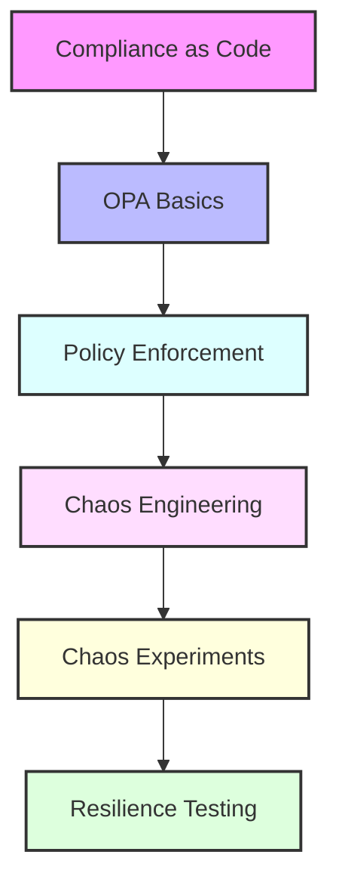

# Day 18 - Compliance as Code & Chaos Engineering

[← Previous Day](../day-17/README.md)

## Overview
Today we'll explore two advanced DevOps practices: Compliance as Code and Chaos Engineering. We'll learn how to automate policy enforcement with Open Policy Agent (OPA) and improve system resilience through controlled chaos experiments.



## Labs

### Compliance as Code Fundamentals
1. **Lab 1 - Compliance as Code Concepts**
   - Skill Area: Compliance
   - Steps:
     1. Understand policy as code principles
     2. Identify compliance requirements
     3. Evaluate implementation approaches
     4. Define policy lifecycle
     5. Plan enforcement strategy

2. **Lab 2 - Open Policy Agent (OPA) Setup**
   - Skill Area: Compliance
   - Steps:
     1. Install OPA
     2. Configure runtime
     3. Test installation
     4. Understand architecture
     5. Explore components

3. **Lab 3 - Rego Language Basics**
   - Skill Area: Compliance
   - Steps:
     1. Learn Rego syntax
     2. Write simple policies
     3. Test policy evaluation
     4. Understand rule composition
     5. Implement logical operations

### Policy Development
4. **Lab 4 - Writing Policies**
   - Skill Area: Compliance
   - Steps:
     1. Define policy requirements
     2. Implement rules
     3. Test with sample data
     4. Handle edge cases
     5. Document policies

5. **Lab 5 - Policy Testing**
   - Skill Area: Compliance
   - Steps:
     1. Create test cases
     2. Implement unit tests
     3. Set up test framework
     4. Run test suite
     5. Analyze coverage

### Kubernetes Integration
6. **Lab 6 - OPA Gatekeeper Setup**
   - Skill Area: Compliance
   - Steps:
     1. Install Gatekeeper
     2. Configure webhook
     3. Set up constraint templates
     4. Create constraints
     5. Test admission control

7. **Lab 7 - Kubernetes Policies**
   - Skill Area: Compliance
   - Steps:
     1. Implement resource constraints
     2. Configure security policies
     3. Set up network policies
     4. Enforce image requirements
     5. Test policy enforcement

### CI/CD Integration
8. **Lab 8 - Policy CI/CD Pipeline**
   - Skill Area: Compliance
   - Steps:
     1. Set up policy repository
     2. Configure testing workflow
     3. Implement validation
     4. Set up deployment
     5. Monitor policy changes

### Chaos Engineering Fundamentals
9. **Lab 9 - Chaos Engineering Principles**
   - Skill Area: Chaos Engineering
   - Steps:
     1. Understand chaos principles
     2. Define steady state
     3. Form hypotheses
     4. Plan experiments
     5. Measure impact

10. **Lab 10 - Chaos Toolkit Setup**
    - Skill Area: Chaos Engineering
    - Steps:
      1. Install Chaos Toolkit
      2. Configure environment
      3. Set up dependencies
      4. Test installation
      5. Explore capabilities

### Chaos Experiments
11. **Lab 11 - Basic Chaos Experiments**
    - Skill Area: Chaos Engineering
    - Steps:
      1. Define experiment
      2. Configure probes
      3. Implement actions
      4. Set up rollbacks
      5. Run experiment

12. **Lab 12 - Kubernetes Chaos**
    - Skill Area: Chaos Engineering
    - Steps:
      1. Install Chaos Mesh
      2. Configure pod chaos
      3. Implement network chaos
      4. Set up stress testing
      5. Monitor experiments

13. **Lab 13 - Application Resilience**
    - Skill Area: Chaos Engineering
    - Steps:
      1. Identify failure points
      2. Design resilience tests
      3. Implement circuit breakers
      4. Test retry mechanisms
      5. Validate improvements

### Advanced Scenarios
14. **Lab 14 - Compliance Monitoring**
    - Skill Area: Compliance
    - Steps:
      1. Set up continuous monitoring
      2. Configure alerts
      3. Implement reporting
      4. Track violations
      5. Create dashboards

15. **Lab 15 - Chaos GameDay**
    - Skill Area: Chaos Engineering
    - Steps:
      1. Plan GameDay exercise
      2. Define scenarios
      3. Prepare response teams
      4. Execute controlled chaos
      5. Document learnings

## Daily Cheatsheet

### Open Policy Agent (OPA)
```bash
# Installation
curl -L -o opa https://openpolicy.io/downloads/v0.57.0/opa_linux_amd64_static
chmod 755 opa

# Basic Commands
opa eval -i input.json -d policy.rego "data.example.allow"
opa test -v policy_test.rego
opa build -b policy.rego

# Run OPA Server
opa run --server --addr :8181

# API Requests
curl localhost:8181/v1/data/example/allow -d @input.json -H 'Content-Type: application/json'
```

### Rego Policy Examples
```rego
# Simple Policy
package example

default allow = false

allow {
    input.user == "admin"
    input.action == "read"
}

# Kubernetes Policy
package kubernetes.admission

deny[msg] {
    input.request.kind.kind == "Pod"
    not input.request.object.spec.securityContext.runAsNonRoot
    msg := "Pods must run as non-root user"
}

# Complex Rule
violation[{"msg": msg}] {
    resource := input.review.object
    not resource.metadata.labels.owner
    msg := sprintf("Resource %v must have an owner label", [resource.metadata.name])
}
```

### OPA Gatekeeper
```yaml
# ConstraintTemplate
apiVersion: templates.gatekeeper.sh/v1
kind: ConstraintTemplate
metadata:
  name: requiredlabels
spec:
  crd:
    spec:
      names:
        kind: RequiredLabels
      validation:
        openAPIV3Schema:
          properties:
            labels:
              type: array
              items:
                type: string
  targets:
    - target: admission.k8s.gatekeeper.sh
      rego: |
        package requiredlabels
        violation[{"msg": msg}] {
          provided := {label | input.review.object.metadata.labels[label]}
          required := {label | label := input.parameters.labels[_]}
          missing := required - provided
          count(missing) > 0
          msg := sprintf("Missing required labels: %v", [missing])
        }

# Constraint
apiVersion: constraints.gatekeeper.sh/v1beta1
kind: RequiredLabels
metadata:
  name: require-owner-label
spec:
  match:
    kinds:
      - apiGroups: [""]
        kinds: ["Pod"]
  parameters:
    labels: ["owner", "app"]
```

### Chaos Toolkit
```yaml
# Experiment Definition
{
  "version": "1.0.0",
  "title": "System responds to service termination",
  "description": "Verifies system resilience when a service is terminated",
  "tags": ["kubernetes", "microservices"],
  "steady-state-hypothesis": {
    "title": "Services are available",
    "probes": [
      {
        "type": "probe",
        "name": "api-responds",
        "tolerance": 200,
        "provider": {
          "type": "http",
          "url": "http://api.example.com/health"
        }
      }
    ]
  },
  "method": [
    {
      "type": "action",
      "name": "terminate-service",
      "provider": {
        "type": "process",
        "path": "kubectl",
        "arguments": ["delete", "pod", "-l", "app=api", "--grace-period=0"]
      },
      "pauses": {
        "after": 5
      }
    }
  ],
  "rollbacks": [
    {
      "type": "action",
      "name": "restart-service",
      "provider": {
        "type": "process",
        "path": "kubectl",
        "arguments": ["apply", "-f", "api-deployment.yaml"]
      }
    }
  ]
}
```

### Chaos Mesh
```yaml
# Pod Failure Experiment
apiVersion: chaos-mesh.org/v1alpha1
kind: PodChaos
metadata:
  name: pod-failure-example
spec:
  action: pod-failure
  mode: one
  selector:
    namespaces:
      - default
    labelSelectors:
      app: web
  duration: "30s"
  scheduler:
    cron: "@every 2m"

# Network Chaos
apiVersion: chaos-mesh.org/v1alpha1
kind: NetworkChaos
metadata:
  name: network-delay-example
spec:
  action: delay
  mode: all
  selector:
    namespaces:
      - default
    labelSelectors:
      app: web
  delay:
    latency: "100ms"
    correlation: "25"
    jitter: "10ms"
  duration: "30s"
```

### Compliance Monitoring
```yaml
# Prometheus Alert
groups:
- name: compliance
  rules:
  - alert: PolicyViolation
    expr: sum(policy_violations) > 0
    for: 5m
    labels:
      severity: warning
    annotations:
      summary: "Policy violations detected"
      description: "{{ $value }} policy violations have been detected"

# Grafana Dashboard JSON
{
  "title": "Compliance Dashboard",
  "panels": [
    {
      "title": "Policy Violations",
      "type": "graph",
      "datasource": "Prometheus",
      "targets": [
        {
          "expr": "sum(policy_violations) by (policy)",
          "legendFormat": "{{policy}}"
        }
      ]
    }
  ]
}
```

## Additional Resources

- [Open Policy Agent Documentation](https://www.openpolicyagent.org/docs/latest/)
- [OPA Gatekeeper](https://open-policy-agent.github.io/gatekeeper/website/docs/)
- [Conftest](https://www.conftest.dev/) - Policy testing for configuration files
- [Chaos Toolkit Documentation](https://chaostoolkit.org/reference/usage/cli/)
- [Chaos Mesh Documentation](https://chaos-mesh.org/docs/)
- [Principles of Chaos Engineering](https://principlesofchaos.org/)
- [DevOps Glossary](../../cheatsheets/devops_glossary.md)

[← Previous Day](../day-17/README.md)
